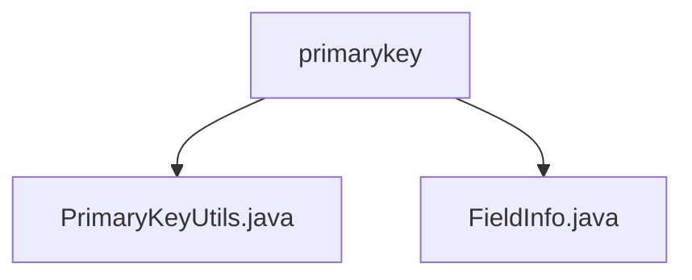

# Basic Information

|      |      |
|------|------|
| Name | primarykey |
| Language | .java |
| Code Path | WeFe/fusion/fusion-service/src/main/java/com/welab/wefe/data/fusion/service/utils/primarykey |
| Package Name | docs.fusion.fusion-service.src.main.java.com.welab.wefe.data.fusion.service.utils.primarykey |
| Brief Description | The `PrimaryKeyUtils` class provides primary key generation functionality, supporting four processing methods. The `FieldInfo` class manages field information, including attributes such as column names, options, and indexes. The two work together to process data and generate primary keys. |

# Description

## Overview  
The core responsibility of this module is to provide primary key generation and field information management functionalities, supporting multiple hash algorithm processing. The PrimaryKeyUtils class implements four primary key generation methods: MD5/SHA1/SUBSTRING/NONE, which involve concatenating specified column values and then applying the algorithm. The FieldInfo class manages metadata such as field column names, indexes, and processing options. Key data structures include the columns string list and algorithm option objects in FieldInfo. The only external dependency is the Java standard library's hash algorithm implementation. For example, the create method can extract values by column names from JObject data and generate an MD5 hash primary key.  

## Main Business Scenarios  
A typical application is generating unique primary keys during data integration, similar to key-value transformation in ETL processes. The business workflow is as follows: configure FieldInfo's column names and algorithm type → PrimaryKeyUtils processes the data according to rules → outputs a hash string or substring. The interaction mode retrieves the column name list via getColumnList and combines it with hashFunction to generate rule descriptions. For example, concatenating user name and ID card columns and applying SHA1 hashing to generate a primary key for integrated data.

### Package Internal Structure View

This flowchart illustrates the file structure relationship under the primarykey directory. The primarykey serves as the parent node, containing two child file nodes: PrimaryKeyUtils.java and FieldInfo.java. These two Java files reside at the same level and collectively form the core functional components of this utility package, designed to handle primary key-related operations in the data fusion service.

# File List

| Name   | Type  | Description |
|-------|------|-------------|
| [PrimaryKeyUtils.java](PrimaryKeyUtils.md) | file | The PrimaryKeyUtils class provides primary key generation functionality, supporting four methods: MD5, SHA1, substring extraction, and raw concatenation, processing data according to field configurations to generate primary keys. |
| [FieldInfo.java](FieldInfo.md) | file | The FieldInfo class includes fields such as columns, options, firstIndex, endIndex, and position, providing getter and setter methods, and supports converting columns into a list. |

