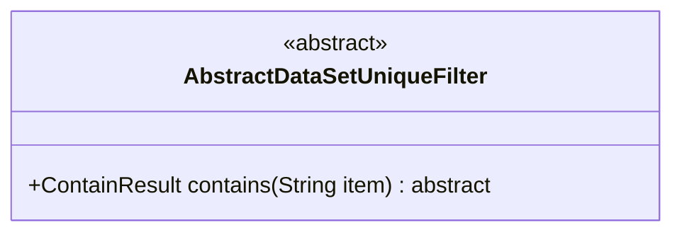
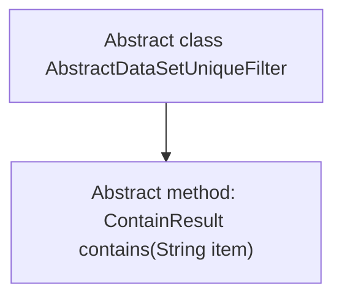

# Basic Information

|      |      |
|------|------|
| Name | AbstractDataSetUniqueFilter |
| Language | .java |
| Code Path | WeFe/fusion/fusion-service/src/main/java/com/welab/wefe/data/fusion/service/utils/unique/AbstractDataSetUniqueFilter.java |
| Package Name | com.welab.wefe.data.fusion.service.utils.unique |
| Dependencies | [] |
| Brief Description | The abstract class AbstractDataSetUniqueFilter defines an abstract method called contains to determine whether an element exists, with a string parameter item and a return type of ContainResult. |

# Description

This is an abstract class named AbstractDataSetUniqueFilter, which defines an abstract method for determining the existence of an element. The class includes an abstract method called contains, which accepts a string-type parameter item and returns a result of type ContainResult. This method is used to determine whether the filter contains the specified element. The abstract class provides a foundational framework for dataset uniqueness filtering, with specific implementations to be completed by subclasses.

# Class Summary

| Name   | Type  | Description |
|-------|------|-------------|
| AbstractDataSetUniqueFilter | class | The abstract class AbstractDataSetUniqueFilter defines an abstract method called contains to check whether an element exists, with a string parameter item and a return type of ContainResult. |

## Class AbstractDataSetUniqueFilter

|      |      |
|------|------|
| Access Modifier | public abstract |
| Type | class |
| Name | AbstractDataSetUniqueFilter |
| Description | The abstract class AbstractDataSetUniqueFilter defines an abstract method called contains to check whether an element exists, with a string parameter item and a return type of ContainResult. |

### UML Class Diagram

This class diagram illustrates an abstract class `AbstractDataSetUniqueFilter`, which defines an abstract method `contains()` to check whether the filter includes a specified element. The class is marked with `<<abstract>>`, indicating it cannot be instantiated directly and must be implemented by subclasses. The method returns a `ContainResult` type (though this type is not shown in the diagram) and takes a parameter `item` of type `String`. This design provides a foundational framework for dataset uniqueness filtering, with concrete implementations to be completed by subclasses.

### Internal Method Call Graph

This code defines an abstract class named `AbstractDataSetUniqueFilter`, which contains an abstract method `contains` used to determine whether the filter includes a specified element. The flowchart clearly illustrates the hierarchical relationship between the class and its method, with the abstract class as the parent node and the abstract method as its child node. This design provides a unified interface specification for subsequent concrete filter implementations, mandating that subclasses must implement the `contains` method.

### Field List

| Name  | Type  | Description |
|-------|-------|------|

### Method List

| Name  | Type  | Description |
|-------|-------|------|
| contains | ContainResult | The abstract method checks whether the string contains the specified item and returns the result object. |

