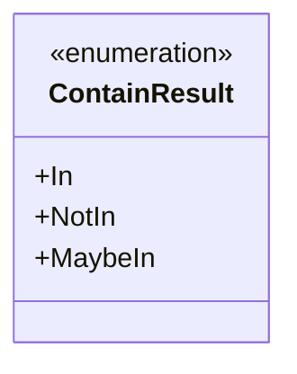
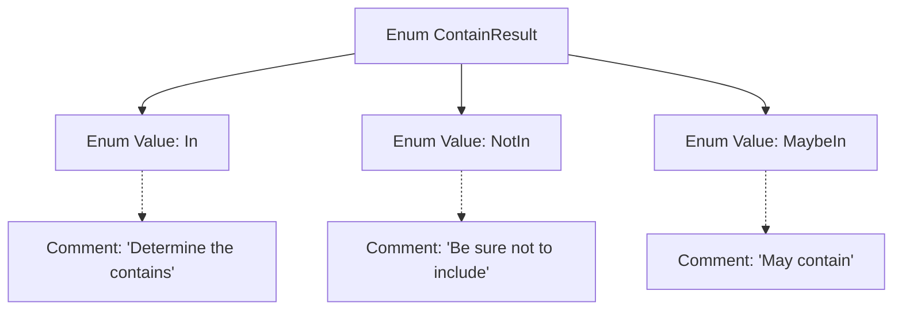

# Basic Information

|      |      |
|------|------|
| Name | ContainResult |
| Language | .java |
| Code Path | WeFe/fusion/fusion-service/src/main/java/com/welab/wefe/data/fusion/service/utils/unique/ContainResult.java |
| Package Name | com.welab.wefe.data.fusion.service.utils.unique |
| Dependencies | [] |
| Brief Description | The enumeration ContainResult defines three states: In indicates inclusion, NotIn indicates exclusion, and MaybeIn indicates possible inclusion. |

# Description

This is an enumeration type named ContainResult, which defines three possible states: In indicates definite inclusion, NotIn indicates definite exclusion, and MaybeIn indicates possible inclusion. Each state has corresponding comments explaining its meaning.

# Class Summary

| Name   | Type  | Description |
|-------|------|-------------|
| ContainResult | enum | The enumeration ContainResult defines three states: In indicates inclusion, NotIn indicates exclusion, and MaybeIn indicates possible inclusion. |

## Class ContainResult

|      |      |
|------|------|
| Access Modifier | public |
| Type | enum |
| Name | ContainResult |
| Description | The enumeration ContainResult defines three states: In indicates inclusion, NotIn indicates exclusion, and MaybeIn indicates possible inclusion. |

### UML Class Diagram

This code defines an enumeration type named ContainResult, which represents three possible states of containment relationship: definitely contained (In), definitely not contained (NotIn), and possibly contained (MaybeIn). In the class diagram, the enumeration type is marked with <<enumeration>>, displaying three fixed enumeration constants. This design is commonly used in scenarios requiring clear distinction between deterministic and non-deterministic containment states, such as set operations, permission checks, or fuzzy matching in business logic.

### Internal Method Call Graph

This flowchart illustrates the structure of the ContainResult enum, which includes three enum values: In, NotIn, and MaybeIn, each with corresponding comments explaining their meanings. In indicates definite inclusion, NotIn indicates definite exclusion, and MaybeIn indicates possible inclusion. The hierarchical relationship between the enum class and its members is clearly shown through arrow connections, while the association between comments and their respective enum values is indicated by dashed arrows.

### Field List

| Name  | Type  | Description |
|-------|-------|------|

### Method List

| Name  | Type  | Description |
|-------|-------|------|

