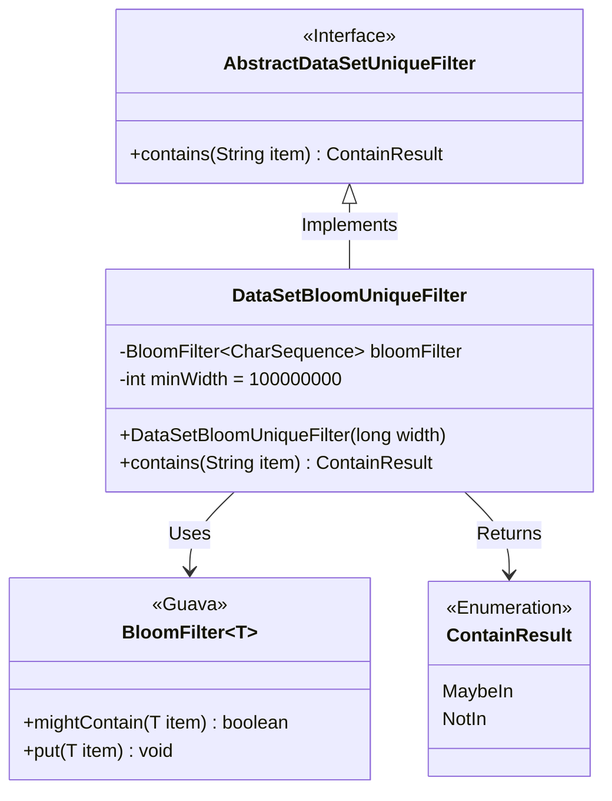
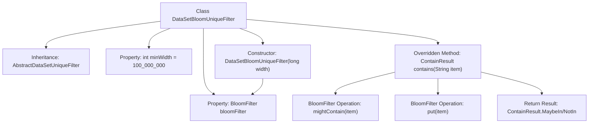

# Basic Information

|      |      |
|------|------|
| Name | DataSetBloomUniqueFilter |
| Language | .java |
| Code Path | WeFe/fusion/fusion-service/src/main/java/com/welab/wefe/data/fusion/service/utils/unique/DataSetBloomUniqueFilter.java |
| Package Name | com.welab.wefe.data.fusion.service.utils.unique |
| Dependencies | ['com.google.common.base.Charsets', 'com.google.common.hash.BloomFilter', 'com.google.common.hash.Funnels'] |
| Brief Description | The `DataSetBloomUniqueFilter` class inherits from `AbstractDataSetUniqueFilter` and uses a Bloom filter to determine string uniqueness. The constructor sets an initial capacity with a minimum of 100 million. The `contains` method checks whether a string exists; if not, it adds the string to the filter and returns a result indicating possible existence or non-existence. |

# Description

DataSetBloomUniqueFilter is a class that inherits from AbstractDataSetUniqueFilter, designed to implement data deduplication functionality based on a Bloom filter. It contains a BloomFilter member variable with a default minimum capacity of 100 million. The constructor accepts a width parameter, automatically doubles it while ensuring it is not less than the minimum capacity, and initializes the Bloom filter with the character set set to UTF-8 and an error rate of 0.01. The contains method checks whether a string may exist in the filter, and regardless of the result, the string is added to the filter. If the string may exist, it returns MaybeIn; otherwise, it returns NotIn.

# Class Summary

| Name   | Type  | Description |
|-------|------|-------------|
| DataSetBloomUniqueFilter | class | The `DataSetBloomUniqueFilter` class inherits from `AbstractDataSetUniqueFilter` and uses a Bloom filter to determine whether a string exists. During construction, it sets a minimum width of 100 million and a default false positive rate of 1%. The `contains` method checks and adds elements, returning results indicating possible existence or non-existence. |

## Class DataSetBloomUniqueFilter

|      |      |
|------|------|
| Access Modifier | public |
| Type | class |
| Name | DataSetBloomUniqueFilter |
| Description | The `DataSetBloomUniqueFilter` class inherits from `AbstractDataSetUniqueFilter` and uses a Bloom filter to determine whether a string exists. During construction, it sets a minimum width of 100 million and a default false positive rate of 1%. The `contains` method checks and adds elements, returning results indicating possible existence or non-existence. |

### UML Class Diagram

Class Diagram Description:  
This diagram illustrates that the DataSetBloomUniqueFilter class inherits from the AbstractDataSetUniqueFilter interface and depends on Guava's BloomFilter generic class and ContainResult enumeration. DataSetBloomUniqueFilter implements efficient deduplication functionality via a Bloom filter, including a constructor to initialize the filter's capacity and a contains method to determine element existence with enumerated results. BloomFilter provides mightContain and put methods for probabilistic duplicate checking, while ContainResult enumeration defines two possible states. The overall structure reflects a design pattern combining interface implementation and utility class composition.

### Internal Method Call Graph

This code implements a deduplication filter based on Bloom Filter. The flowchart illustrates class inheritance, property definitions, and core method invocation chains. The constructor initializes the Bloom Filter with a minimum capacity of 100 million and dynamically adjusts its size based on input. The contains() method first checks for possible element existence, then inserts the element, and finally returns an enum value based on the check result. The entire process achieves efficient probabilistic deduplication functionality, suitable for massive data scenarios.

### Field List

| Name  | Type  | Description |
|-------|-------|------|
| bloomFilter | BloomFilter<CharSequence> | Private Bloom Filter, generic over character sequence types. |
| minWidth = 100_000_000 | int | Define a private integer variable minWidth with an initial value of 100 million. |

### Method List

| Name  | Type  | Description |
|-------|-------|------|
| contains | ContainResult | The method checks whether the Bloom filter contains a certain element. If it may exist, it returns MaybeIn; otherwise, it returns NotIn and adds the element to the filter. |

