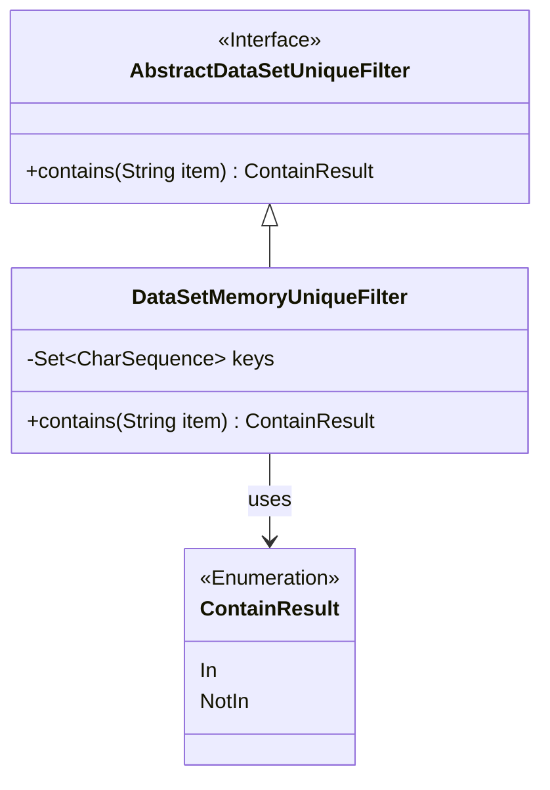
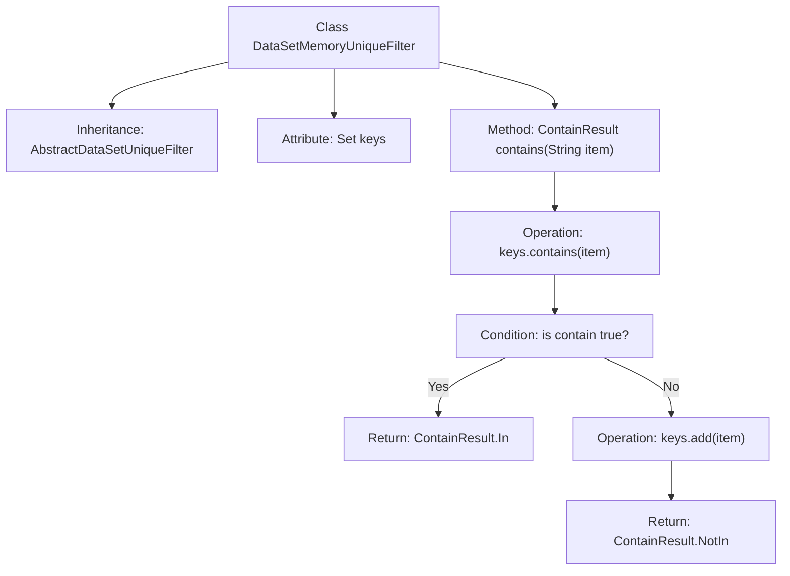

# Basic Information

|      |      |
|------|------|
| Name | DataSetMemoryUniqueFilter |
| Language | .java |
| Code Path | WeFe/fusion/fusion-service/src/main/java/com/welab/wefe/data/fusion/service/utils/unique/DataSetMemoryUniqueFilter.java |
| Package Name | com.welab.wefe.data.fusion.service.utils.unique |
| Dependencies | ['java.util.HashSet', 'java.util.Set'] |
| Brief Description | Dataset in-memory deduplication filter, using HashSet to store key values, checks for item existence and returns "In" if present, otherwise adds it and returns "NotIn". |

# Description

DataSetMemoryUniqueFilter is a class that inherits from AbstractDataSetUniqueFilter, designed to detect and filter duplicate data. It utilizes a HashSet to store keys of type CharSequence and checks whether an input string already exists in the set via the contains method. If the string is found, it returns ContainResult.In; otherwise, it adds the string to the set and returns ContainResult.NotIn. This implementation is memory-based, making it suitable for scenarios requiring fast deduplication.

# Class Summary

| Name   | Type  | Description |
|-------|------|-------------|
| DataSetMemoryUniqueFilter | class | Dataset In-Memory Unique Filter, which uses a HashSet to store key values, checks if a string exists. If it does not exist, the string is added and "NotIn" is returned; if it exists, "In" is returned. |

## Class DataSetMemoryUniqueFilter

|      |      |
|------|------|
| Access Modifier | public |
| Type | class |
| Name | DataSetMemoryUniqueFilter |
| Description | Dataset In-Memory Unique Filter, which uses a HashSet to store key values, checks if a string exists. If it does not exist, the string is added and "NotIn" is returned; if it exists, "In" is returned. |

### UML Class Diagram

This code implements an in-memory dataset uniqueness filter that inherits from an abstract filter class. The core functionality involves storing processed string keys in a HashSet, where the contains() method checks for item existence: if present, it returns the In enumeration value; otherwise, it adds the item to the set and returns NotIn. The class diagram illustrates inheritance relationships, enumeration dependencies, and key data structures, demonstrating the core mechanism of in-memory deduplication.

### Internal Method Call Graph

This flowchart illustrates the structure of the DataSetMemoryUniqueFilter class and the execution logic of its core method "contains". The class inherits from AbstractDataSetUniqueFilter and implements string deduplication functionality via HashSet. The "contains" method first checks if an element exists in the set - returning In status if present, otherwise adding the element to the set and returning NotIn status. The entire process clearly demonstrates the decision-making flow of a memory-level deduplication filter, suitable for scenarios requiring rapid determination of data uniqueness.

### Field List

| Name  | Type  | Description |
|-------|-------|------|
| keys = new HashSet<>() | Set<CharSequence> | Declare a private Set variable named keys, storing elements of type CharSequence, initialized as a HashSet instance. |

### Method List

| Name  | Type  | Description |
|-------|-------|------|
| contains | ContainResult | Check if the collection contains an element; return "In" if it exists, otherwise add the element and return "NotIn". |

