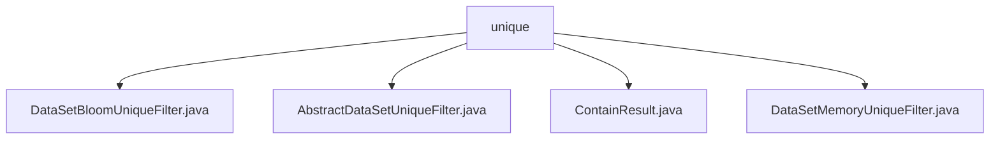

# Basic Information

|      |      |
|------|------|
| Name | unique |
| Language | .java |
| Code Path | WeFe/fusion/fusion-service/src/main/java/com/welab/wefe/data/fusion/service/utils/unique |
| Package Name | docs.fusion.fusion-service.src.main.java.com.welab.wefe.data.fusion.service.utils.unique |
| Brief Description | The DataSetBloomUniqueFilter implements data deduplication based on a Bloom filter, with a default capacity of 100 million, support for UTF-8, and an error rate of 0.01. The AbstractDataSetUniqueFilter is an abstract base class that defines the contains method. The ContainResult enumeration includes three states: In, NotIn, and MaybeIn. The DataSetMemoryUniqueFilter implements in-memory deduplication based on HashSet. |

# Description

## Overview  
This module provides data deduplication functionality based on different strategies, with its core responsibility being efficient element uniqueness verification through Bloom filters or in-memory sets. The interface specification is unified under the `contains` method defined by `AbstractDataSetUniqueFilter`, which returns a `ContainResult` enumeration (In/NotIn/MaybeIn). Key data structures include `BloomFilter` (default capacity: 100 million, error rate: 0.01) and `HashSet`. External dependencies are limited to Java's core libraries. For example, `DataSetBloomUniqueFilter` employs probabilistic deduplication, while `DataSetMemoryUniqueFilter` provides exact matching.  

## Primary Business Scenarios  
The module supports two typical application modes:  
- For large-scale data scenarios, it uses Bloom filters (similar to cache penetration protection), tolerating false positives via the `MaybeIn` state.  
- For small-scale data scenarios, it employs in-memory `HashSet` for precise deduplication.  

Business workflows follow a "check-write" pattern. For instance, Bloom filters unconditionally write new elements. Integration cases demonstrate the module's flexibility in adapting to varying performance and accuracy requirements. For example, `DataSetMemoryUniqueFilter` is suitable for memory-intensive computing scenarios with high real-time demands.

### Package Internal Structure View

This flowchart illustrates the file structure of the unique toolkit in the WeFe project, comprising four Java class files. AbstractDataSetUniqueFilter serves as the abstract base class, while DataSetBloomUniqueFilter and DataSetMemoryUniqueFilter are concrete implementation classes, with ContainResult being an auxiliary class. All files reside under the unique directory, forming a clear hierarchical relationship of utility classes.

# File List

| Name   | Type  | Description |
|-------|------|-------------|
| [DataSetBloomUniqueFilter.java](DataSetBloomUniqueFilter.md) | file | The `DataSetBloomUniqueFilter` class inherits from `AbstractDataSetUniqueFilter` and uses a Bloom filter to determine string uniqueness. The constructor sets an initial capacity with a minimum of 100 million. The `contains` method checks whether a string exists—if not, it adds the string to the filter and returns a result indicating possible existence or non-existence. |
| [AbstractDataSetUniqueFilter.java](AbstractDataSetUniqueFilter.md) | file | The abstract class AbstractDataSetUniqueFilter defines an abstract method `contains` to determine whether an element exists, with the parameter being a string `item` and returning a result of type `ContainResult`. |
| [ContainResult.java](ContainResult.md) | file | The enumeration ContainResult defines three states: In indicates inclusion, NotIn indicates exclusion, and MaybeIn indicates possible inclusion. |
| [DataSetMemoryUniqueFilter.java](DataSetMemoryUniqueFilter.md) | file | Dataset in-memory deduplication filter, which uses a HashSet to store key values, checks for item existence and returns "In" if present, otherwise adds the item and returns "NotIn". |

