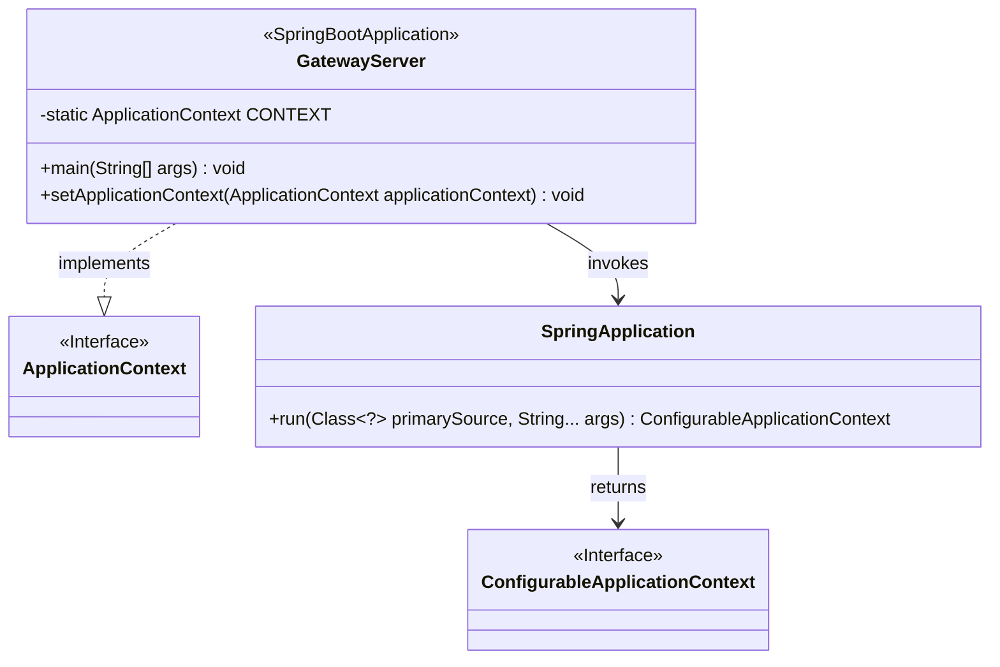
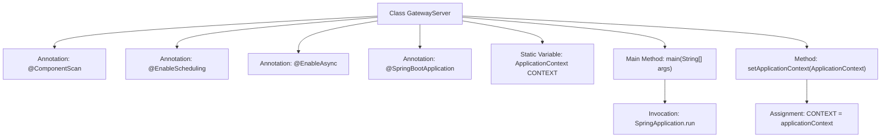

# Basic Information

|      |      |
|------|------|
| Name | GatewayServer |
| Language | .java |
| Code Path | WeFe/gateway/src/main/java/com/welab/wefe/gateway/GatewayServer.java |
| Package Name | com.welab.wefe.gateway |
| Dependencies | ['com.welab.wefe.common.wefe.checkpoint.CheckpointManager', 'org.springframework.beans.BeansException', 'org.springframework.boot.SpringApplication', 'org.springframework.boot.autoconfigure.SpringBootApplication', 'org.springframework.boot.autoconfigure.jdbc.DataSourceAutoConfiguration', 'org.springframework.context.ApplicationContext', 'org.springframework.context.ApplicationContextAware', 'org.springframework.context.annotation.ComponentScan', 'org.springframework.scheduling.annotation.EnableAsync', 'org.springframework.scheduling.annotation.EnableScheduling'] |
| Brief Description | SpringBoot gateway service main class, enabling component scanning, scheduled tasks, and asynchronous processing, excluding data source auto-configuration, providing global application context access. |

# Description

This is the main class of a Spring Boot gateway server, which uses `@ComponentScan` to scan the packages where `GatewayServer` and `CheckpointManager` are located. It enables scheduled tasks via `@EnableScheduling` and supports asynchronous processing with `@EnableAsync`. It excludes the auto-configuration of the data source. The class implements the `ApplicationContextAware` interface to obtain the application context and exposes the context through the static variable `CONTEXT`. The `main` method starts the Spring application.

# Class Summary

| Name   | Type  | Description |
|-------|------|-------------|
| GatewayServer | class | SpringBoot gateway service main class, excluding data source auto-configuration, enabling component scanning, scheduled tasks, and asynchronous processing, preserving the application context. |

## Class GatewayServer

|      |      |
|------|------|
| Access Modifier | @ComponentScan(basePackageClasses = {GatewayServer.class, CheckpointManager.class});@EnableScheduling;@EnableAsync;@SpringBootApplication(exclude = {DataSourceAutoConfiguration.class});public |
| Type | class |
| Name | GatewayServer |
| Description | SpringBoot gateway service main class, excluding data source auto-configuration, enabling component scanning, scheduled tasks, and asynchronous processing, preserving the application context. |

### UML Class Diagram

This code demonstrates a Spring Boot-based gateway server main class GatewayServer, which scans the package containing the specified class via @ComponentScan, enables scheduling and asynchronous functionality using @EnableScheduling and @EnableAsync, and excludes data source auto-configuration. The class implements the ApplicationContextAware interface to obtain the Spring application context and launches the Spring application through a static main method. The class diagram clearly illustrates the relationships between GatewayServer and Spring core classes (ApplicationContext, SpringApplication) along with its primary functional structure.

### Internal Method Call Graph

This flowchart illustrates the core structure of the Spring Boot gateway server class `GatewayServer`. The class is configured with four key annotations for component scanning, scheduled tasks, asynchronous processing, and excluding data source auto-configuration. The static variable `CONTEXT` stores the application context, the main method launches the application via `SpringApplication.run`, and the `setApplicationContext` method implements the `ApplicationContextAware` interface to inject the context. The overall diagram reflects the typical startup process and context management mechanism of a Spring Boot application.

### Field List

| Name  | Type  | Description |
|-------|-------|------|
| CONTEXT = null | ApplicationContext | Static application context variable, initially empty. |

### Method List

| Name  | Type  | Description |
|-------|-------|------|
| main | void | The entry point for launching a Java Spring Boot application, run the main class GatewayServer. |
| setApplicationContext | void | Rewrite the setApplicationContext method to assign the passed-in ApplicationContext to the static variable CONTEXT. |

