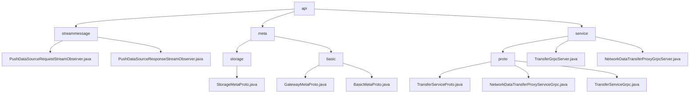

# Basic Information

|      |      |
|------|------|
| Name | api |
| Language | .java |
| Code Path | WeFe/gateway/src/main/java/com/welab/wefe/gateway/api |
| Package Name | docs.gateway.src.main.java.com.welab.wefe.gateway.api |
| Brief Description | Module 1 enables bidirectional streaming data transmission, processes TransferMeta data, and includes request/response stream interfaces, relying on asynchronous coordination mechanisms. Module 2 defines the Protobuf storage protocol, incorporating type identification and resource localization, and supports cross-language data exchange. Module 3 provides gRPC data transmission services, supporting both unary and streaming RPCs, along with metadata transmission and status check functionalities. |

# Description

## Overview  
The core responsibility of this module is to enable cross-network streaming data transmission and storage resource management, encompassing three main functionalities: bidirectional streaming processing (based on StreamObserver), storage location protocol (Protobuf specification), and gRPC proxy services. The interface specification is unified under the GatewayMetaProto protocol, supporting asynchronous streaming (e.g., PushDataSourceRequestStreamObserver) and synchronous RPC (e.g., TransferService.send). Key data structures include TransferMeta (transmission metadata), StorageLocator (quadruple storage locator), and ReturnStatus (status feedback), relying on the Protobuf serialization library and gRPC framework. For example, StorageLocator initializes the LMDB storage type via the builder pattern, while TransferMeta is used for metadata encapsulation in streaming transmission.  

## Key Business Scenarios  
The module supports data synchronization and storage management between distributed systems, with typical scenarios including: clients pushing TransferMeta data via bidirectional streams (similar to pipeline transmission), servers locating storage engines (e.g., CLICK_HOUSE) based on StorageLocator and returning status codes. Interaction modes cover the producer-consumer model (streaming processing), builder pattern (storage location), and interceptor mechanism (gRPC secure transmission). For instance, pushDataSource implements end-to-end state tracking, and StorageLocator.newBuilder() dynamically configures sharded storage. Functional completeness is reflected in end-to-end management, from streaming transmission and storage addressing to secure proxying. Typical applications include cross-system migration (switching StorageType) and sharded queries (using the fragment field).

### Package Internal Structure View

This flowchart illustrates the hierarchical structure of the WeFe Gateway API module, which consists of three main submodules: streammessage, meta, and service. The streammessage submodule contains two stream message handlers, the meta submodule is divided into storage and basic components, and the service submodule includes proto definitions and Grpc service implementations. The entire structure clearly reflects the functional division and dependencies of the Gateway API.

# File List

| Name   | Type  | Description |
|-------|------|-------------|
| [service](service/_module.md) | package | A cross-network data transmission service based on gRPC and Protobuf, providing unary and streaming RPC interfaces (send/recv/push, etc.), supporting metadata transfer and status checks, with interceptor and logging capabilities. |
| [meta](meta/_module.md) | package | The Protobuf protocol file defines the StorageType enum and StorageLocator message, supporting LMDB and CLICK_HOUSE storage types. The gateway metadata protocol includes GatewayMetaProto and BasicMetaProto for structured data transfer and state management, enabling sharded transmission and multiple data carriers. |
| [streammessage](streammessage/_module.md) | package | The PushDataSourceRequestStreamObserver handles the data stream, saves the data, and provides feedback on the status, including exception handling. The PushDataSourceResponseStreamObserver processes the streaming response, categorizes and stores the results, and marks the completion status. |

