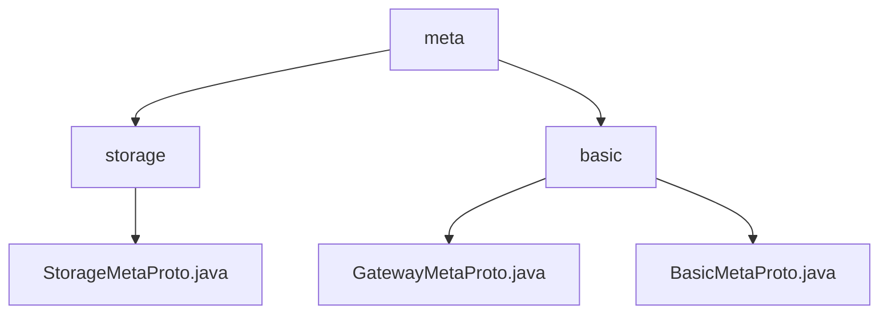

# Basic Information

|      |      |
|------|------|
| Name | meta |
| Language | .java |
| Code Path | WeFe/gateway/src/main/java/com/welab/wefe/gateway/api/meta |
| Package Name | docs.gateway.src.main.java.com.welab.wefe.gateway.api.meta |
| Brief Description | The Protobuf protocol file defines the StorageType enum and StorageLocator message, supporting LMDB and CLICK_HOUSE storage types. The gateway metadata protocol includes GatewayMetaProto and BasicMetaProto for structured data transfer and state management, enabling sharded transmission and multiple data carriers. |

# Description

## Overview  
This module defines a cross-language data exchange protocol based on Protobuf, with core responsibilities including storage type identification (StorageType) and resource location (StorageLocator). Similar to URI specifications but specifically designed for distributed storage scenarios, the interface protocol is unified as the GatewayMetaProto protocol, which includes enumeration types and message bodies. For example, StorageLocator supports builder pattern initialization for fields such as type, namespace, name, and fragment.  

Key data structures include the storage type enumeration (LMDB/CLICK_HOUSE) and the quadruple location message body, complementing the TransferMeta from the basic metadata module. The only external dependency is the Protobuf serialization library. For instance, StorageLocator achieves cross-process transmission through standard encoding and decoding.  

## Primary Business Scenarios  
The module supports standardized addressing of storage resources. A typical workflow involves: the service provider specifying the storage engine via StorageType, filling in the namespace and fragment identifiers in StorageLocator, and then serializing and transmitting it. Interactions employ the builder pattern, such as creating a locator via StorageLocator.newBuilder().setType(StorageType.LMDB).  

Functional completeness is reflected in the full lifecycle management of storage, from type selection to fragment location. Typical applications include cross-system data migration (switching storage engines via the type field) and shard query (locating data blocks using the fragment field). API types include enumeration selection interfaces and locator construction interfaces, such as the CLICK_HOUSE type corresponding to a storage instance with a numerical value of 1.

### Package Internal Structure View

This flowchart illustrates the hierarchical structure of the API metadata module in the WeFe gateway project. The top level is the meta directory, which branches into two subdirectories: storage and basic. The storage directory contains the StorageMetaProto.java file, while the basic directory includes two protocol files: GatewayMetaProto.java and BasicMetaProto.java. The entire structure clearly reflects the modular design of metadata management.

# File List

| Name   | Type  | Description |
|-------|------|-------------|
| [basic](basic/_module.md) | package | The gateway metadata protocol includes transport status enumeration, member information, content carrier, and the main structure of transport metadata, supporting serialization/deserialization. The basic metadata protocol defines endpoints, return statuses, and key-value pair structures, all implemented using Protocol Buffers. |
| [storage](storage/_module.md) | package | StorageMetaProto defines the storage metadata protocol, including the StorageLocator message and StorageType enum. StorageLocator contains fields for type, namespace, name, and shard. The StorageType enum supports two storage types: LMDB and CLICK_HOUSE. |

