# Basic Information

|      |      |
|------|------|
| Name | BasicMetaProto |
| Language | .java |
| Code Path | WeFe/gateway/src/main/java/com/welab/wefe/gateway/api/meta/basic/BasicMetaProto.java |
| Package Name | com.welab.wefe.gateway.api.meta.basic |
| Dependencies | [] |
| Brief Description | BasicMetaProto defines the fundamental structures for network endpoints, status returns, and key-value data. It includes core message types such as Endpoint (IP, port, hostname), Endpoints (list of endpoints), ReturnStatus (status code, message, session ID, and data), and KeyValueData (key-value pairs). |

# Description

The content defines a protocol file based on Google Protocol Buffers, containing four primary data structures:

1. Endpoint: Represents network endpoint information, consisting of three fields:  
   - ip address (string)  
   - port number (integer)  
   - hostname (string)  

2. Endpoints: A collection of multiple Endpoints, using the `repeated` modifier to indicate a repeatable field.  

3. ReturnStatus: A generic return status structure, including:  
   - status code (integer)  
   - message (string)  
   - session ID (string)  
   - data content (string)  

4. KeyValueData: A key-value pair data structure, containing:  
   - key (byte array)  
   - value (byte array)  

The file also includes complete Java class definitions. Each data structure has a corresponding Builder class for object construction and implements serialization/deserialization methods. All classes are located in the `com.welab.wefe.gateway.api.meta.basic` package and are primarily used for basic metadata definitions in gateway APIs.

# Class Summary

| Name   | Type  | Description |
|-------|------|-------------|
| BasicMetaProto | class | BasicMetaProto defines the basic data structures for network endpoints, return statuses, and key-value data. It includes Endpoint (IP, port, hostname), Endpoints (a list of endpoints), ReturnStatus (status code, message, session ID, data), and KeyValueData (key-value pairs). It is used for metadata transmission in gateway APIs. |


## Class BasicMetaProto

|      |      |
|------|------|
| Access Modifier | public final |
| Type | class |
| Name | BasicMetaProto |
| Description | BasicMetaProto defines the basic data structures for network endpoints, return statuses, and key-value data. It includes Endpoint (IP, port, hostname), Endpoints (a list of endpoints), ReturnStatus (status code, message, session ID, data), and KeyValueData (key-value pairs). It is used for metadata transmission in gateway APIs. |


### UML Class Diagram

```mermaid
classDiagram
    class BasicMetaProto {
        <<final>>
        -BasicMetaProto()
        +registerAllExtensions(ExtensionRegistryLite registry) void
        +registerAllExtensions(ExtensionRegistry registry) void
    }

    class EndpointOrBuilder {
        <<Interface>>
        +getIp() String
        +getIpBytes() ByteString
        +getPort() int
        +getHostname() String
        +getHostnameBytes() ByteString
    }

    class Endpoint {
        -String ip_
        -int port_
        -String hostname_
        +Endpoint(GeneratedMessageV3.Builder<?> builder)
        +getIp() String
        +getIpBytes() ByteString
        +getPort() int
        +getHostname() String
        +getHostnameBytes() ByteString
    }
    Endpoint --|> GeneratedMessageV3
    Endpoint ..|> EndpointOrBuilder

    class EndpointsOrBuilder {
        <<Interface>>
        +getEndpointsList() List~Endpoint~
        +getEndpointsCount() int
    }

    class Endpoints {
        -List~Endpoint~ endpoints_
        +Endpoints(GeneratedMessageV3.Builder<?> builder)
        +getEndpointsList() List~Endpoint~
    }
    Endpoints --|> GeneratedMessageV3
    Endpoints ..|> EndpointsOrBuilder

    class ReturnStatusOrBuilder {
        <<Interface>>
        +getCode() int
        +getMessage() String
        +getSessionId() String
        +getData() String
    }

    class ReturnStatus {
        -int code_
        -String message_
        -String sessionId_
        -String data_
        +ReturnStatus(GeneratedMessageV3.Builder<?> builder)
        +getCode() int
        +getMessage() String
        +getSessionId() String
        +getData() String
    }
    ReturnStatus --|> GeneratedMessageV3
    ReturnStatus ..|> ReturnStatusOrBuilder

    class KeyValueDataOrBuilder {
        <<Interface>>
        +getKey() ByteString
        +getValue() ByteString
    }

    class KeyValueData {
        -ByteString key_
        -ByteString value_
        +KeyValueData(GeneratedMessageV3.Builder<?> builder)
        +getKey() ByteString
        +getValue() ByteString
    }
    KeyValueData --|> GeneratedMessageV3
    KeyValueData ..|> KeyValueDataOrBuilder

    // Relationships
    Endpoints "1" *-- "*" Endpoint : contains
```

This code defines a Protobuf protocol file containing four core classes: Endpoint (network endpoint), Endpoints (endpoint collection), ReturnStatus (generic return status), and KeyValueData (key-value data). Each class implements its corresponding OrBuilder interface and inherits from the GeneratedMessageV3 base class. The relationship between Endpoints and Endpoint is aggregation (one Endpoints contains multiple Endpoints). All classes are constructed via the Builder pattern and provide getter methods for fields. These classes are used to define metadata structures and status return formats in network communication.


### Internal Method Call Graph

```mermaid
graph TD
    A["Class BasicMetaProto"]
    B["Method: registerAllExtensions(ExtensionRegistryLite)"]
    C["Method: registerAllExtensions(ExtensionRegistry)"]
    D["Interface: EndpointOrBuilder"]
    E["Method: getIp()"]
    F["Method: getIpBytes()"]
    G["Method: getPort()"]
    H["Method: getHostname()"]
    I["Method: getHostnameBytes()"]
    J["Class: Endpoint"]
    K["Constructor: Endpoint(GeneratedMessageV3.Builder)"]
    L["Method: getIp()"]
    M["Method: getIpBytes()"]
    N["Method: getPort()"]
    O["Method: getHostname()"]
    P["Method: getHostnameBytes()"]
    Q["Interface: EndpointsOrBuilder"]
    R["Class: Endpoints"]
    S["Constructor: Endpoints(GeneratedMessageV3.Builder)"]
    T["Method: getEndpointsList()"]
    U["Interface: ReturnStatusOrBuilder"]
    V["Class: ReturnStatus"]
    W["Constructor: ReturnStatus(GeneratedMessageV3.Builder)"]
    X["Method: getCode()"]
    Y["Method: getMessage()"]
    Z["Method: getSessionId()"]
    AA["Method: getData()"]
    AB["Interface: KeyValueDataOrBuilder"]
    AC["Class: KeyValueData"]
    AD["Constructor: KeyValueData(GeneratedMessageV3.Builder)"]
    AE["Method: getKey()"]
    AF["Method: getValue()"]

    A --> B
    A --> C
    A --> D
    D --> E
    D --> F
    D --> G
    D --> H
    D --> I
    A --> J
    J --> K
    J --> L
    J --> M
    J --> N
    J --> O
    J --> P
    A --> Q
    A --> R
    R --> S
    R --> T
    A --> U
    A --> V
    V --> W
    V --> X
    V --> Y
    V --> Z
    V --> AA
    A --> AB
    A --> AC
    AC --> AD
    AC --> AE
    AC --> AF
```



This code defines a Protobuf protocol file containing multiple message types and interfaces. The core components include Endpoint (network endpoint), Endpoints (endpoint collection), ReturnStatus (generic return status), and KeyValueData (key-value data). The flowchart illustrates inheritance relationships between classes and the main method call chains, where Endpoint serves as the basic network address descriptor, Endpoints manages multiple Endpoints, ReturnStatus provides standardized response formats, and KeyValueData handles binary key-value storage. All message types implement corresponding OrBuilder interfaces to support Protobuf's builder pattern.

### Field List

| Name  | Type  | Description |
|-------|-------|------|
| internal_static_com_welab_wefe_gateway_api_meta_basic_KeyValueData_descriptor | com.google.protobuf.Descriptors.Descriptor | Protobuf descriptor definition for the metadata of the KeyValueData class. |
| internal_static_com_welab_wefe_gateway_api_meta_basic_ReturnStatus_fieldAccessorTable | com.google.protobuf.GeneratedMessageV3.FieldAccessorTable | Declare a private static immutable field accessor table for managing metadata access of the ReturnStatus class. |
| internal_static_com_welab_wefe_gateway_api_meta_basic_KeyValueData_fieldAccessorTable | com.google.protobuf.GeneratedMessageV3.FieldAccessorTable | Protobuf-generated KeyValueData field accessor table for internal metadata operations. |
| internal_static_com_welab_wefe_gateway_api_meta_basic_Endpoints_fieldAccessorTable | com.google.protobuf.GeneratedMessageV3.FieldAccessorTable | Protobuf-generated Endpoints message field accessor table for internal metadata operations. |
| internal_static_com_welab_wefe_gateway_api_meta_basic_Endpoint_fieldAccessorTable | com.google.protobuf.GeneratedMessageV3.FieldAccessorTable | Private static final field of type Protobuf's FieldAccessorTable, used for Endpoint metadata access. |
| internal_static_com_welab_wefe_gateway_api_meta_basic_Endpoint_descriptor | com.google.protobuf.Descriptors.Descriptor | Private static final descriptor variable, defining the protocol buffer metadata descriptor for the Endpoint class. |
| internal_static_com_welab_wefe_gateway_api_meta_basic_Endpoints_descriptor | com.google.protobuf.Descriptors.Descriptor | Private static final descriptor, defining the metadata structure of the Endpoints class. |
| descriptor | com.google.protobuf.Descriptors.FileDescriptor | The private static variable descriptor, of type com.google.protobuf.Descriptors.FileDescriptor. |
| internal_static_com_welab_wefe_gateway_api_meta_basic_ReturnStatus_descriptor | com.google.protobuf.Descriptors.Descriptor | Private static final variable describing the internal Protocol Buffer structure of ReturnStatus. |

### Method List

| Name  | Type  | Description |
|-------|-------|------|
| registerAllExtensions | void | The static method `registerAllExtensions` is used to register extensions with Protobuf's `ExtensionRegistryLite`, and the current implementation is empty. |
| registerAllExtensions | void | Register all Protobuf extensions to the specified registry, supporting both full and lite registry versions. |
| getDescriptor | com.google.protobuf.Descriptors.FileDescriptor | This is a static method that returns the Protocol Buffers file descriptor object `descriptor`. |


