# Basic Information

|      |      |
|------|------|
| Name | GatewayMetaProto |
| Language | .java |
| Code Path | WeFe/gateway/src/main/java/com/welab/wefe/gateway/api/meta/basic/GatewayMetaProto.java |
| Package Name | com.welab.wefe.gateway.api.meta.basic |
| Dependencies | [] |
| Brief Description | GatewayMetaProto defines the protocol structure for gateway transmission metadata, comprising three core message types (Member, Content, TransferMeta) and the TransferStatus enumeration. Key points are as follows:1. Member represents member information, containing the fields memberId, memberName, and endpoint.  2. Content serves as the transmission content carrier, supporting three data formats: string (strData), binary (byteData), and key-value pair lists (keyValueDatas).  3. TransferMeta is the primary message structure for gateway transmission, including:     - Sender (src) and receiver (dst)     - Transmission content (content)     - Processor name (processor)     - Transmission status (transferStatus)     - Session ID (sessionId)     - Timestamps (receiveDate/expireDate)     - Large data chunking information (sequenceNo/sequenceIsEnd)  The TransferStatus enumeration defines six transmission states: Unprocessed, Initializing, Processing, Completed, Error, and Canceled. |

# Description

The content defines a gateway metadata protocol, comprising the following core components:  

1. **TransferStatus Enum**: Defines 6 transfer states (UNPROCESSED/INITIALIZING/PROCESSING/COMPLETED/ERROR/CANCELED).  

2. **Member Message**: Represents member information, including:  
   - Member ID (`memberId`)  
   - Member name (`memberName`)  
   - Endpoint (`endpoint`)  

3. **Content Message**: Represents transfer content, supporting three data carriers:  
   - String data (`strData`)  
   - Binary data (`byteData`)  
   - Key-value pair list (`keyValueDatas`)  

4. **TransferMeta Main Message**: Gateway transfer metadata, including:  
   - Sender (`src`) and receiver (`dst`) member information  
   - Content body (`content`)  
   - Processor name (`processor`)  
   - Transfer status (`transferStatus`)  
   - Session ID (`sessionId`)  
   - Timestamps (`receiveDate`/`expireDate`)  
   - Large data chunking information (`sequenceNo`/`sequenceIsEnd`)  
   - Extension fields (`tag`/`extField`, etc.)  

The protocol is implemented using Protocol Buffers, providing complete Java class definitions and builder patterns to support data serialization and deserialization. It is primarily used for structured data transfer between gateway services, supporting large data chunking and state tracking.

# Class Summary

| Name   | Type  | Description |
|-------|------|-------------|
| GatewayMetaProto | class | GatewayMetaProto defines the gateway metadata protocol, which consists of three main structures: Member, Content, and TransferMeta. Member represents member information, including ID, name, and endpoint; Content is used for data transmission, supporting string, binary, and key-value pair data; TransferMeta is the metadata structure for gateway message sending and receiving, containing information such as sender, receiver, content, processor, status, and session ID. The TransferStatus enumeration defines transmission states, such as unprocessed, initialized, processing, completed, error, and canceled. |


## Class GatewayMetaProto

|      |      |
|------|------|
| Access Modifier | public final |
| Type | class |
| Name | GatewayMetaProto |
| Description | GatewayMetaProto defines the gateway metadata protocol, which consists of three main structures: Member, Content, and TransferMeta. Member represents member information, including ID, name, and endpoint; Content is used for data transmission, supporting string, binary, and key-value pair data; TransferMeta is the metadata structure for gateway message sending and receiving, containing information such as sender, receiver, content, processor, status, and session ID. The TransferStatus enumeration defines transmission states, such as unprocessed, initialized, processing, completed, error, and canceled. |


### UML Class Diagram

```mermaid
classDiagram
    class GatewayMetaProto {
        <<final>>
        -GatewayMetaProto()
        +registerAllExtensions(ExtensionRegistryLite registry)
        +registerAllExtensions(ExtensionRegistry registry)
    }

    enum TransferStatus {
        <<enumeration>>
        NOT_PROCESSED = 0
        INITIALIZING = 1
        PROCESSING = 2
        COMPLETE = 3
        ERROR = 4
        CANCELLED = 5
        UNRECOGNIZED = -1
        +getNumber() int
        +valueOf(int value) TransferStatus
        +forNumber(int value) TransferStatus
        +internalGetValueMap() EnumLiteMap~TransferStatus~
    }

    interface MemberOrBuilder {
        <<Interface>>
        +getMemberId() String
        +getMemberIdBytes() ByteString
        +getMemberName() String
        +getMemberNameBytes() ByteString
        +hasEndpoint() boolean
        +getEndpoint() Endpoint
        +getEndpointOrBuilder() EndpointOrBuilder
    }

    class Member {
        -String memberId_
        -String memberName_
        -Endpoint endpoint_
        +Member(GeneratedMessageV3.Builder~?~ builder)
        +getMemberId() String
        +getMemberIdBytes() ByteString
        +getMemberName() String
        +getMemberNameBytes() ByteString
        +hasEndpoint() boolean
        +getEndpoint() Endpoint
        +getEndpointOrBuilder() EndpointOrBuilder
    }

    interface ContentOrBuilder {
        <<Interface>>
        +getStrData() String
        +getStrDataBytes() ByteString
        +getByteData() ByteString
        +getKeyValueDatasList() List~KeyValueData~
        +getKeyValueDatas(int index) KeyValueData
        +getKeyValueDatasCount() int
    }

    class Content {
        -String strData_
        -ByteString byteData_
        -List~KeyValueData~ keyValueDatas_
        +Content(GeneratedMessageV3.Builder~?~ builder)
        +getStrData() String
        +getStrDataBytes() ByteString
        +getByteData() ByteString
        +getKeyValueDatasList() List~KeyValueData~
        +getKeyValueDatas(int index) KeyValueData
        +getKeyValueDatasCount() int
    }

    interface TransferMetaOrBuilder {
        <<Interface>>
        +hasSrc() boolean
        +getSrc() Member
        +getSrcOrBuilder() MemberOrBuilder
        +hasDst() boolean
        +getDst() Member
        +getDstOrBuilder() MemberOrBuilder
        +hasContent() boolean
        +getContent() Content
        +getContentOrBuilder() ContentOrBuilder
        +getProcessor() String
        +getProcessorBytes() ByteString
        +getTransferStatusValue() int
        +getTransferStatus() TransferStatus
        +getSessionId() String
        +getSessionIdBytes() ByteString
        +getReceiveDate() long
        +getExpireDate() long
        +getSequenceNo() int
        +getSequenceIsEnd() boolean
        +getTaggedVariableName() ByteString
        +getTag() String
        +getTagBytes() ByteString
        +getExtField() String
        +getExtFieldBytes() ByteString
    }

    class TransferMeta {
        -Member src_
        -Member dst_
        -Content content_
        -String processor_
        -int transferStatus_
        -String sessionId_
        -long receiveDate_
        -long expireDate_
        -int sequenceNo_
        -boolean sequenceIsEnd_
        -ByteString taggedVariableName_
        -String tag_
        -String extField_
        +TransferMeta(GeneratedMessageV3.Builder~?~ builder)
        +hasSrc() boolean
        +getSrc() Member
        +getSrcOrBuilder() MemberOrBuilder
        +hasDst() boolean
        +getDst() Member
        +getDstOrBuilder() MemberOrBuilder
        +hasContent() boolean
        +getContent() Content
        +getContentOrBuilder() ContentOrBuilder
        +getProcessor() String
        +getProcessorBytes() ByteString
        +getTransferStatusValue() int
        +getTransferStatus() TransferStatus
        +getSessionId() String
        +getSessionIdBytes() ByteString
        +getReceiveDate() long
        +getExpireDate() long
        +getSequenceNo() int
        +getSequenceIsEnd() boolean
        +getTaggedVariableName() ByteString
        +getTag() String
        +getTagBytes() ByteString
        +getExtField() String
        +getExtFieldBytes() ByteString
    }

    GatewayMetaProto --> TransferStatus : contains
    Member ..|> MemberOrBuilder : implements
    Content ..|> ContentOrBuilder : implements
    TransferMeta ..|> TransferMetaOrBuilder : implements
    TransferMeta --> Member : contains
    TransferMeta --> Content : contains
    Member --> BasicMetaProto.Endpoint : references
    Content --> BasicMetaProto.KeyValueData : references
```

This class diagram represents a Protobuf-based gateway metadata system with several key components. The `GatewayMetaProto` class serves as the root container, with an embedded `TransferStatus` enum defining message states. The system features three main message types (`Member`, `Content`, and `TransferMeta`) each with their builder interfaces (`*OrBuilder`). The `TransferMeta` acts as the primary message container, referencing `Member` for sender/receiver information and `Content` for payload data, while also connecting to basic data types from `BasicMetaProto`. The relationships show a clear hierarchy where gateway messages contain members and content, with content further containing key-value data structures.


### Internal Method Call Graph

```mermaid
graph TD
    A["Class GatewayMetaProto"]
    B["Enum TransferStatus"]
    C["Interface MemberOrBuilder"]
    D["Class Member"]
    E["Interface ContentOrBuilder"]
    F["Class Content"]
    G["Interface TransferMetaOrBuilder"]
    H["Class TransferMeta"]
    
    A --> B
    A --> D
    A --> F
    A --> H
    
    B -->|Enum Value| B1["NOT_PROCESSED(0)"]
    B -->|Enum Value| B2["INITIALIZING(1)"]
    B -->|Enum Value| B3["PROCESSING(2)"]
    B -->|Enum Value| B4["COMPLETE(3)"]
    B -->|Enum Value| B5["ERROR(4)"]
    B -->|Enum Value| B6["CANCELLED(5)"]
    B -->|Enum Value| B7["UNRECOGNIZED(-1)"]
    
    D -->|Implements| C
    D -->|Field| D1["String memberId"]
    D -->|Field| D2["String memberName"]
    D -->|Field| D3["Endpoint endpoint"]
    D -->|Method| D4["getMemberId()"]
    D -->|Method| D5["getMemberName()"]
    D -->|Method| D6["hasEndpoint()"]
    D -->|Method| D7["getEndpoint()"]
    
    F -->|Implements| E
    F -->|Field| F1["String strData"]
    F -->|Field| F2["bytes byteData"]
    F -->|Field| F3["repeated KeyValueData keyValueDatas"]
    F -->|Method| F4["getStrData()"]
    F -->|Method| F5["getByteData()"]
    F -->|Method| F6["getKeyValueDatasList()"]
    
    H -->|Implements| G
    H -->|Field| H1["Member src"]
    H -->|Field| H2["Member dst"]
    H -->|Field| H3["Content content"]
    H -->|Field| H4["String processor"]
    H -->|Field| H5["TransferStatus transferStatus"]
    H -->|Field| H6["String sessionId"]
    H -->|Field| H7["int64 receiveDate"]
    H -->|Field| H8["int64 expireDate"]
    H -->|Field| H9["int32 sequenceNo"]
    H -->|Field| H10["bool sequenceIsEnd"]
    H -->|Field| H11["bytes taggedVariableName"]
    H -->|Field| H12["String tag"]
    H -->|Field| H13["String extField"]
    H -->|Method| H14["hasSrc()"]
    H -->|Method| H15["getSrc()"]
    H -->|Method| H16["hasDst()"]
    H -->|Method| H17["getDst()"]
    H -->|Method| H18["hasContent()"]
    H -->|Method| H19["getContent()"]
    H -->|Method| H20["getProcessor()"]
    H -->|Method| H21["getTransferStatusValue()"]
    H -->|Method| H22["getSessionId()"]
    H -->|Method| H23["getReceiveDate()"]
    H -->|Method| H24["getExpireDate()"]
    H -->|Method| H25["getSequenceNo()"]
    H -->|Method| H26["getSequenceIsEnd()"]
    H -->|Method| H27["getTaggedVariableName()"]
    H -->|Method| H28["getTag()"]
    H -->|Method| H29["getExtField()"]
```



This code defines the structure of a gateway metadata protocol, comprising four core components: the TransferStatus enum, Member class, Content class, and TransferMeta class. The TransferStatus enum defines 6 transfer states and 1 unrecognized state. The Member class represents member information, including ID, name, and endpoint. The Content class encapsulates three data carrier formats. TransferMeta serves as the core transmission structure containing complete message metadata (sender, recipient, content, status, etc.). All classes implement corresponding OrBuilder interfaces to support Protobuf's builder pattern. The code uses Protobuf v3 syntax, achieving complex data structure definitions through nested messages and enums.

### Field List

| Name  | Type  | Description |
|-------|-------|------|
| descriptor | com.google.protobuf.Descriptors.FileDescriptor | The static private variable `descriptor`, of type `com.google.protobuf.Descriptors.FileDescriptor`. |
| internal_static_com_welab_wefe_gateway_api_meta_basic_TransferMeta_fieldAccessorTable | com.google.protobuf.GeneratedMessageV3.FieldAccessorTable | This is a private static constant of type FieldAccessorTable generated by Protobuf, used for field access in internal metadata transmission. |
| internal_static_com_welab_wefe_gateway_api_meta_basic_Content_fieldAccessorTable | com.google.protobuf.GeneratedMessageV3.FieldAccessorTable | Declare a private static immutable Protobuf field accessor table for internal content metadata access. |
| internal_static_com_welab_wefe_gateway_api_meta_basic_TransferMeta_descriptor | com.google.protobuf.Descriptors.Descriptor | Private static constant defining the Protobuf descriptor for TransferMeta. |
| internal_static_com_welab_wefe_gateway_api_meta_basic_Content_descriptor | com.google.protobuf.Descriptors.Descriptor | Private static final variable, descriptor type, used to define the metadata structure of the Content class. |
| internal_static_com_welab_wefe_gateway_api_meta_basic_Member_fieldAccessorTable | com.google.protobuf.GeneratedMessageV3.FieldAccessorTable | Private static final field of type GeneratedMessageV3.FieldAccessorTable, used for internal field access in the Member class. |
| internal_static_com_welab_wefe_gateway_api_meta_basic_Member_descriptor | com.google.protobuf.Descriptors.Descriptor | Private static constant describing the protocol buffer metadata of the Member class. |

### Method List

| Name  | Type  | Description |
|-------|-------|------|
| registerAllExtensions | void | Java Method: Static Registration Extension, converting ExtensionRegistry to ExtensionRegistryLite for unified registration. |
| registerAllExtensions | void | The static method `registerAllExtensions` is used to register all extensions into the Protobuf extension registry `registry`, currently implemented as an empty operation. |
| getDescriptor | com.google.protobuf.Descriptors.FileDescriptor | This is a static method that returns the protobuf file descriptor descriptor. |


