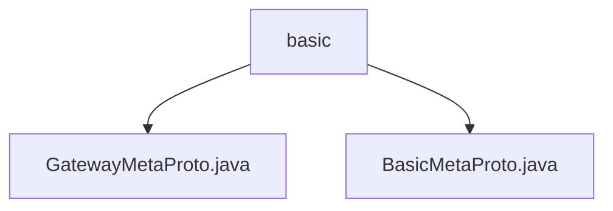

# Basic Information

|      |      |
|------|------|
| Name | basic |
| Language | .java |
| Code Path | WeFe/gateway/src/main/java/com/welab/wefe/gateway/api/meta/basic |
| Package Name | docs.gateway.src.main.java.com.welab.wefe.gateway.api.meta.basic |
| Brief Description | The gateway metadata protocol includes transport status enumeration, member information, content carrier, and the main structure of transport metadata, supporting serialization/deserialization. The basic metadata protocol defines endpoints, return statuses, and key-value pair structures, all implemented using Protocol Buffers. |

# Description

## Overview  
This module defines the core metadata protocol for gateway services, utilizing Protocol Buffers for structured data transmission and state management. Its core responsibilities include cross-service member information exchange, content transmission status tracking, and large-data shard processing, akin to the envelope protocol of message middleware.  

The interface specification comprises two protocol files, GatewayMetaProto and BasicMetaProto, providing data structures such as the TransferStatus enum and Member/Content message bodies. Key structures include transmission metadata (TransferMeta), endpoint information (Endpoint), and key-value pairs (KeyValueData), supporting multiple data carriers like binary/string/key-value formats.  

The only external dependency is the Protocol Buffers serialization library. For instance, TransferMeta supports shard transmission (sequenceNo field), the Member message body contains endpoint information, and Content enables binary transmission via byteData.  

## Primary Business Scenarios  
The module facilitates structured data exchange between gateway services. A typical workflow involves: the sender constructing TransferMeta (containing Member endpoints, Content data bodies, and status markers), transmitting it via serialization, and the receiver deserializing and processing it.  

The interaction pattern employs the builder pattern to create message bodies, such as constructing Endpoint via BasicMetaProto.Builder. Full functionality covers the entire data transmission lifecycle, from initialization (TransferStatus.INIT) to completion/error state tracking.  

Typical applications include cross-node large-data shard transmission (using sequenceIsEnd to mark shard completion) and stateful content routing (specifying processors via the processor field). API types include metadata construction interfaces and serialization interfaces, such as KeyValueData supporting byte-array-based key-value storage.

### Package Internal Structure View

This flowchart illustrates the file structure relationships within the `basic` directory of the WeFe gateway project. The `basic` node serves as the parent, containing two protocol files: `GatewayMetaProto.java` and `BasicMetaProto.java`. Both files belong to the gateway API metadata foundation module and are used to define the basic protocol structures for gateway communication.

# File List

| Name   | Type  | Description |
|-------|------|-------------|
| [GatewayMetaProto.java](GatewayMetaProto.md) | file | GatewayMetaProto defines the protocol structure for gateway transmission metadata, comprising three core message types—Member, Content, TransferMeta—and the TransferStatus enumeration. Key points are as follows:  1. Member represents member information, containing the fields memberId, memberName, and endpoint.  2. Content serves as the transmission payload, supporting three data formats: string (strData), binary (byteData), and key-value pair lists (keyValueDatas).  3. TransferMeta is the primary message structure for gateway transmission, including:     - Sender (src) and receiver (dst)     - Transmission content (content)     - Processor name (processor)     - Transmission status (transferStatus)     - Session ID (sessionId)     - Timestamps (receiveDate/expireDate)     - Large data chunking information (sequenceNo/sequenceIsEnd)  The TransferStatus enumeration defines six transmission states: Unprocessed, Initializing, Processing, Completed, Error, and Canceled. |
| [BasicMetaProto.java](BasicMetaProto.md) | file | BasicMetaProto defines the fundamental structures for network endpoints, status returns, and key-value data. It includes core message types such as Endpoint (IP, port, hostname), Endpoints (list of endpoints), ReturnStatus (status code, message, session ID, and data), and KeyValueData (key-value pairs). |

