# Basic Information

|      |      |
|------|------|
| Name | StorageMetaProto |
| Language | .java |
| Code Path | WeFe/gateway/src/main/java/com/welab/wefe/gateway/api/meta/storage/StorageMetaProto.java |
| Package Name | com.welab.wefe.gateway.api.meta.storage |
| Dependencies | [] |
| Brief Description | StorageMetaProto defines the storage metadata protocol, including the StorageLocator message and StorageType enumeration. StorageLocator contains fields for type, namespace, name, and shard. The StorageType enumeration supports two storage types: LMDB and CLICK_HOUSE. |

# Description

This content defines a Protobuf protocol file, primarily consisting of two parts: the StorageType enum and the StorageLocator message type. The StorageType enum defines two storage types: LMDB and CLICK_HOUSE, corresponding to values 0 and 1 respectively. The StorageLocator message type contains four fields: type represents the storage type, namespace and name are string-type fields, and fragment is an integer-type field. The file also includes complete serialization, deserialization, and builder implementation logic for handling the encoding and decoding operations of StorageLocator messages. The overall structure adheres to the Protobuf standard format and is suitable for cross-language data exchange scenarios.

# Class Summary

| Name   | Type  | Description |
|-------|------|-------------|
| StorageMetaProto | class | StorageMetaProto defines the storage metadata protocol, including the StorageLocator message body and the StorageType enumeration (LMDB and CLICK_HOUSE), which are used to describe storage types, namespaces, names, and sharding information. |


## Class StorageMetaProto

|      |      |
|------|------|
| Access Modifier | public final |
| Type | class |
| Name | StorageMetaProto |
| Description | StorageMetaProto defines the storage metadata protocol, including the StorageLocator message body and the StorageType enumeration (LMDB and CLICK_HOUSE), which are used to describe storage types, namespaces, names, and sharding information. |


### UML Class Diagram

```mermaid
classDiagram
    class StorageMetaProto {
        <<final>>
        -StorageMetaProto()
        +registerAllExtensions(ExtensionRegistryLite registry) void
        +registerAllExtensions(ExtensionRegistry registry) void
    }

    class StorageType {
        <<enum>>
        +LMDB = 0
        +CLICK_HOUSE = 1
        +UNRECOGNIZED = -1
        -int value
        +getNumber() int
        +valueOf(int value) StorageType
        +forNumber(int value) StorageType
        +internalGetValueMap() EnumLiteMap~StorageType~
        +getValueDescriptor() EnumValueDescriptor
        +getDescriptorForType() EnumDescriptor
        +getDescriptor() EnumDescriptor
        +valueOf(EnumValueDescriptor desc) StorageType
    }

    interface StorageLocatorOrBuilder {
        <<Interface>>
        +getTypeValue() int
        +getType() StorageType
        +getNamespace() String
        +getNamespaceBytes() ByteString
        +getName() String
        +getNameBytes() ByteString
        +getFragment() int
    }

    class StorageLocator {
        <<final>>
        -int type_
        -String namespace_
        -String name_
        -int fragment_
        -StorageLocator()
        +getTypeValue() int
        +getType() StorageType
        +getNamespace() String
        +getNamespaceBytes() ByteString
        +getName() String
        +getNameBytes() ByteString
        +getFragment() int
        +writeTo(CodedOutputStream output) void
        +getSerializedSize() int
        +equals(Object obj) boolean
        +hashCode() int
        +parseFrom(ByteBuffer data) StorageLocator
        +newBuilder() Builder
    }

    class StorageLocator.Builder {
        -int type_
        -String namespace_
        -String name_
        -int fragment_
        +Builder()
        +setTypeValue(int value) Builder
        +setType(StorageType value) Builder
        +setNamespace(String value) Builder
        +setName(String value) Builder
        +setFragment(int value) Builder
        +build() StorageLocator
    }

    StorageMetaProto --> StorageType : Contains enum
    StorageMetaProto --> StorageLocator : Contains message
    StorageLocator ..|> StorageLocatorOrBuilder : Implements
    StorageLocator --> StorageLocator.Builder : Builds with
    StorageLocator.Builder --> StorageLocator : Generates
```

This code defines a storage metadata protocol using Google Protocol Buffers, including the StorageLocator message type and StorageType enumeration. StorageLocator describes storage location information with type, namespace, name, and fragment number, constructed via the Builder pattern. The class diagram illustrates the core structure of the protocol, featuring immutable message classes, Builder pattern implementation, and enumeration type relationships, demonstrating Protobuf's strong typing and code generation features.


### Internal Method Call Graph

```mermaid
graph TD
    A["Class StorageMetaProto"]
    B["Static Method: registerAllExtensions(ExtensionRegistryLite)"]
    C["Static Method: registerAllExtensions(ExtensionRegistry)"]
    D["Enum StorageType"]
    E["Enum Value: LMDB=0"]
    F["Enum Value: CLICK_HOUSE=1"]
    G["Enum Value: UNRECOGNIZED=-1"]
    H["Enum Method: getNumber()"]
    I["Enum Method: valueOf()/forNumber()"]
    J["Enum Method: internalGetValueMap()"]
    K["Interface StorageLocatorOrBuilder"]
    L["Method: getTypeValue()/getType()"]
    M["Method: getNamespace()/getNamespaceBytes()"]
    N["Method: getName()/getNameBytes()"]
    O["Method: getFragment()"]
    P["Inner Class StorageLocator"]
    Q["Constructor: StorageLocator()"]
    R["Method: getTypeValue()/getType()"]
    S["Method: getNamespace()/getNamespaceBytes()"]
    T["Method: getName()/getNameBytes()"]
    U["Method: getFragment()"]
    V["Inner Class Builder"]
    W["Constructor: Builder()"]
    X["Method: setType()/clearType()"]
    Y["Method: setNamespace()/clearNamespace()"]
    Z["Method: setName()/clearName()"]
    AA["Method: setFragment()/clearFragment()"]

    A --> B
    A --> C
    A --> D
    D --> E
    D --> F
    D --> G
    D --> H
    D --> I
    D --> J
    A --> K
    K --> L
    K --> M
    K --> N
    K --> O
    A --> P
    P --> Q
    P --> R
    P --> S
    P --> T
    P --> U
    P --> V
    V --> W
    V --> X
    V --> Y
    V --> Z
    V --> AA
```



This flowchart illustrates the complete structure of the StorageMetaProto class, including static extension registration methods, StorageType enum definition, StorageLocatorOrBuilder interface and its implementation class StorageLocator. It highlights enum value definitions and conversion methods, along with attribute operation methods implemented via the Builder pattern. Clear arrow connections demonstrate inheritance and containment relationships between classes, particularly the construction relationship between StorageLocator and its inner Builder class. All method invocation paths are fully presented, including key operation nodes such as parameter handling and type conversion.

### Field List

| Name  | Type  | Description |
|-------|-------|------|
| internal_static_com_welab_wefe_gateway_api_meta_storage_StorageLocator_descriptor | com.google.protobuf.Descriptors.Descriptor | Private static final descriptor variable, defining the internal structure description for storing locators. |
| internal_static_com_welab_wefe_gateway_api_meta_storage_StorageLocator_fieldAccessorTable | com.google.protobuf.GeneratedMessageV3.FieldAccessorTable | Protobuf-generated StorageLocator field accessor table for metadata storage location. |
| descriptor | com.google.protobuf.Descriptors.FileDescriptor | Static private variable of type com.google.protobuf.Descriptors.FileDescriptor, used to describe the file. |

### Method List

| Name  | Type  | Description |
|-------|-------|------|
| registerAllExtensions | void | This is a static method used to register all extensions to a given Protobuf extension registry. Internally, it calls another overloaded method, converting the registry to a Lite version for processing. |
| registerAllExtensions | void | The static method `registerAllExtensions` is used to register extensions with Protobuf's `ExtensionRegistryLite`, currently implemented as an empty method. |
| getDescriptor | com.google.protobuf.Descriptors.FileDescriptor | This is a static method that returns the Protocol Buffers file descriptor object `descriptor`. |


