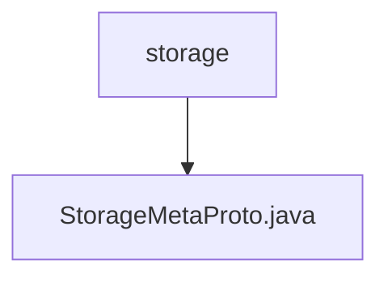

# Basic Information

|      |      |
|------|------|
| Name | storage |
| Language | .java |
| Code Path | WeFe/gateway/src/main/java/com/welab/wefe/gateway/api/meta/storage |
| Package Name | docs.gateway.src.main.java.com.welab.wefe.gateway.api.meta.storage |
| Brief Description | StorageMetaProto defines the storage metadata protocol, including the StorageLocator message and StorageType enum. StorageLocator contains fields for type, namespace, name, and shard. The StorageType enum supports two storage types: LMDB and CLICK_HOUSE. |

# Description

The content defines a Protobuf protocol file, primarily consisting of two parts: the `StorageType` enum and the `StorageLocator` message type. The `StorageType` enum defines two storage types: `LMDB` and `CLICK_HOUSE`, corresponding to values 0 and 1, respectively. The `StorageLocator` message type contains four fields: `type` indicates the storage type, while `namespace` and `name` are string-type fields, and `fragment` is an integer field. The file also includes complete serialization, deserialization, and builder implementation logic for handling the encoding and decoding operations of `StorageLocator` messages. The overall structure adheres to the Protobuf standard format and is suitable for cross-language data exchange scenarios.

### Package Internal Structure View

This flowchart illustrates the file structure related to storage metadata in the WeFe gateway project. The top-level node "storage" represents the storage metadata directory, which contains a Java file "StorageMetaProto.java". This file is likely used to define protocol buffer metadata for storage. The entire structure is concise and clear, reflecting a straightforward file hierarchy within a single directory.

# File List

| Name   | Type  | Description |
|-------|------|-------------|
| [StorageMetaProto.java](StorageMetaProto.md) | file | StorageMetaProto defines the storage metadata protocol, including the StorageLocator message and StorageType enum. StorageLocator contains fields for type, namespace, name, and shard. The StorageType enum supports two storage types: LMDB and CLICK_HOUSE. |

