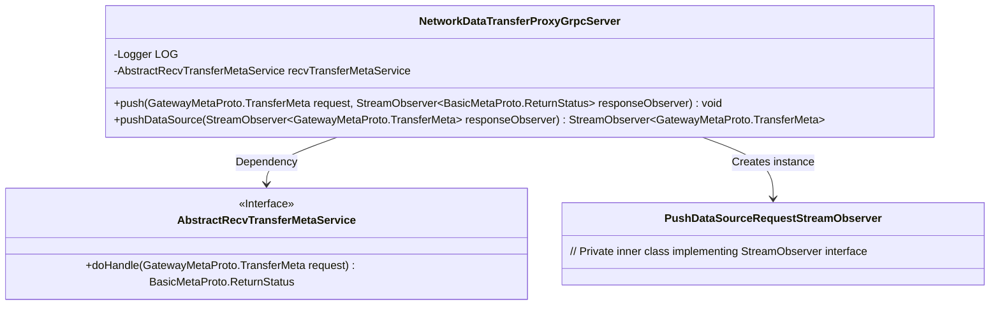
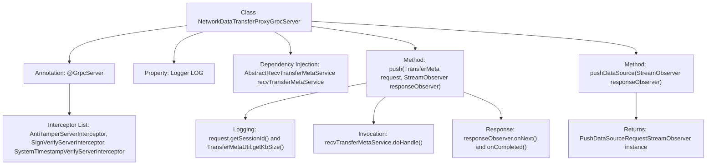

# Basic Information

|      |      |
|------|------|
| Name | NetworkDataTransferProxyGrpcServer |
| Language | .java |
| Code Path | WeFe/gateway/src/main/java/com/welab/wefe/gateway/api/service/NetworkDataTransferProxyGrpcServer.java |
| Package Name | com.welab.wefe.gateway.api.service |
| Dependencies | ['com.welab.wefe.gateway.api.meta.basic.BasicMetaProto', 'com.welab.wefe.gateway.api.meta.basic.GatewayMetaProto', 'com.welab.wefe.gateway.api.service.proto.NetworkDataTransferProxyServiceGrpc', 'com.welab.wefe.gateway.api.streammessage.PushDataSourceRequestStreamObserver', 'com.welab.wefe.gateway.base.GrpcServer', 'com.welab.wefe.gateway.common.GrpcServerScopeEnum', 'com.welab.wefe.gateway.interceptor.AntiTamperServerInterceptor', 'com.welab.wefe.gateway.interceptor.SignVerifyServerInterceptor', 'com.welab.wefe.gateway.interceptor.SystemTimestampVerifyServerInterceptor', 'com.welab.wefe.gateway.service.base.AbstractRecvTransferMetaService', 'com.welab.wefe.gateway.util.TransferMetaUtil', 'io.grpc.stub.StreamObserver', 'org.slf4j.Logger', 'org.slf4j.LoggerFactory', 'org.springframework.beans.factory.annotation.Autowired'] |
| Brief Description | The Grpc service class NetworkDataTransferProxyGrpcServer includes interceptors and logging, providing push and pushDataSource methods to handle data transfer requests, and invoking recvTransferMetaService to process metadata. |

# Description

This is a gRPC service class named `NetworkDataTransferProxyGrpcServer`, which inherits from the base class `NetworkDataTransferProxyServiceGrpc`. The class utilizes three interceptors: `AntiTamperServerInterceptor`, `SignVerifyServerInterceptor`, and `SystemTimestampVerifyServerInterceptor`. Its primary functionalities include handling push data requests and establishing data source push streams. The `push` method receives a `TransferMeta` request and returns the processing status, processing the request data via `recvTransferMetaService`. The `pushDataSource` method returns a `StreamObserver` instance for handling data stream transmission. The class also incorporates logging capabilities to record information such as session IDs and data sizes.

# Class Summary

| Name   | Type  | Description |
|-------|------|-------------|
| NetworkDataTransferProxyGrpcServer | class | The Grpc service class NetworkDataTransferProxyGrpcServer includes interceptors and logging, processes push requests via recvTransferMetaService, and supports both unary and streaming data transfer. |

## Class NetworkDataTransferProxyGrpcServer

|      |      |
|------|------|
| Access Modifier | @GrpcServer(interceptors = {AntiTamperServerInterceptor.class, SignVerifyServerInterceptor.class, SystemTimestampVerifyServerInterceptor.class});public |
| Type | class |
| Name | NetworkDataTransferProxyGrpcServer |
| Description | The Grpc service class NetworkDataTransferProxyGrpcServer includes interceptors and logging, processes push requests via recvTransferMetaService, and supports both unary and streaming data transfer. |

### UML Class Diagram

This code demonstrates a gRPC server implementation class NetworkDataTransferProxyGrpcServer, which inherits from the base class of NetworkDataTransferProxyServiceGrpc and configures three interceptors via the @GrpcServer annotation. The class primarily provides two gRPC methods: push for handling unary request-response mode data transfer, and pushDataSource for handling streaming data transfer. The push method relies on the AbstractRecvTransferMetaService interface to process business logic, while the pushDataSource method creates and returns a PushDataSourceRequestStreamObserver instance to handle streaming requests. The class diagram clearly illustrates the relationships and dependencies between these classes.

### Internal Method Call Graph

This flowchart illustrates the core structure and call flow of the NetworkDataTransferProxyGrpcServer class. The class is configured with three security interceptors via the @GrpcServer annotation, featuring two main methods: push() handles single requests and returns status, involving logging, metadata processing, and response sending; pushDataSource() returns a stream observer instance for handling data streams. Key dependencies are injected via @Autowired, while the logging system records session and data processing volume.

### Field List

| Name  | Type  | Description |
|-------|-------|------|
| recvTransferMetaService | AbstractRecvTransferMetaService | An abstract service instance that automatically injects and receives transmission metadata. |
| LOG = LoggerFactory.getLogger(NetworkDataTransferProxyGrpcServer.class) | Logger | Declare a private static log object LOG for the NetworkDataTransferProxyGrpcServer class. |

### Method List

| Name  | Type  | Description |
|-------|-------|------|
| push | void | Grpc server-side push method, processes transmission metadata and returns status, logs session ID and data size. |
| pushDataSource | StreamObserver<GatewayMetaProto.TransferMeta> | This is a Java method override for pushing a data source. It takes a response observer parameter and returns a new PushDataSourceRequestStreamObserver instance to handle data transfer metadata. |

