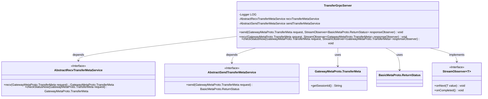
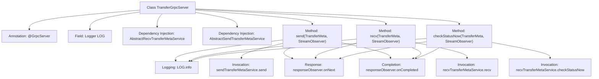

# Basic Information

|      |      |
|------|------|
| Name | TransferGrpcServer |
| Language | .java |
| Code Path | WeFe/gateway/src/main/java/com/welab/wefe/gateway/api/service/TransferGrpcServer.java |
| Package Name | com.welab.wefe.gateway.api.service |
| Dependencies | ['com.welab.wefe.gateway.api.meta.basic.BasicMetaProto', 'com.welab.wefe.gateway.api.meta.basic.GatewayMetaProto', 'com.welab.wefe.gateway.api.service.proto.TransferServiceGrpc', 'com.welab.wefe.gateway.base.GrpcServer', 'com.welab.wefe.gateway.common.GrpcServerScopeEnum', 'com.welab.wefe.gateway.interceptor.IpAddressWhiteListServerInterceptor', 'com.welab.wefe.gateway.service.base.AbstractRecvTransferMetaService', 'com.welab.wefe.gateway.service.base.AbstractSendTransferMetaService', 'com.welab.wefe.gateway.util.TransferMetaUtil', 'io.grpc.stub.StreamObserver', 'org.slf4j.Logger', 'org.slf4j.LoggerFactory', 'org.springframework.beans.factory.annotation.Autowired'] |
| Brief Description | The TransferGrpcServer is an internal gRPC service that includes functionalities for sending, receiving, and checking data status. It utilizes the IpAddressWhiteListServerInterceptor and relies on the AbstractRecv and AbstractSend services to process requests. |

# Description

The TransferGrpcServer is an internally used gRPC service class, marked with the GrpcServer annotation and configured with an IP whitelist interceptor. This class inherits from TransferServiceGrpc.TransferServiceImplBase and contains three core methods: send for transmitting messages to remote destinations while logging session IDs and data size; recv provides clients with an interface to pull data; checkStatusNow allows clients to inspect data status. Each method processes requests through auto-injected service classes, returns response results, and logs relevant information.

# Class Summary

| Name   | Type  | Description |
|-------|------|-------------|
| TransferGrpcServer | class | The TransferGrpcServer is an internal gRPC service that includes functionalities for sending, receiving, and checking data status. It utilizes an IP whitelist interceptor and relies on metadata services for sending and receiving to process requests. |

## Class TransferGrpcServer

|      |      |
|------|------|
| Access Modifier | @GrpcServer(useScope = GrpcServerScopeEnum.INTERNAL, interceptors = {IpAddressWhiteListServerInterceptor.class});public |
| Type | class |
| Name | TransferGrpcServer |
| Description | The TransferGrpcServer is an internal gRPC service that includes functionalities for sending, receiving, and checking data status. It utilizes an IP whitelist interceptor and relies on metadata services for sending and receiving to process requests. |

### UML Class Diagram

This code demonstrates a gRPC server implementation class TransferGrpcServer, which inherits from TransferServiceGrpc.TransferServiceImplBase and provides three gRPC service methods: send, recv, and checkStatusNow. The class relies on two abstract service interfaces, AbstractRecvTransferMetaService and AbstractSendTransferMetaService, to handle specific business logic, and uses the StreamObserver interface to implement gRPC's asynchronous response mechanism. The class diagram clearly illustrates the dependency relationships and interface implementation relationships among these classes.

### Internal Method Call Graph

This flowchart illustrates the core structure and invocation sequence of the TransferGrpcServer class. The class is marked as a gRPC server endpoint via the @GrpcServer annotation, containing three primary RPC methods: send, recv, and checkStatusNow. Each method follows the same pattern: first logging the request, then delegating business logic processing to corresponding Service-layer methods, and finally returning responses via StreamObserver before terminating the call. The two service dependencies (AbstractRecv/SendTransferMetaService) are injected through @Autowired, demonstrating clear hierarchical invocation relationships.

### Field List

| Name  | Type  | Description |
|-------|-------|------|
| sendTransferMetaService | AbstractSendTransferMetaService | Abstract service instance for automatically injecting and sending transfer metadata. |
| recvTransferMetaService | AbstractRecvTransferMetaService | An abstract service instance that automatically injects and receives transmission metadata. |
| LOG = LoggerFactory.getLogger(TransferGrpcServer.class) | Logger | Define a private static log object LOG for the TransferGrpcServer class, created using LoggerFactory. |

### Method List

| Name  | Type  | Description |
|-------|-------|------|
| send | void | Grpc server method, processes transmission requests, logs session ID and data size, returns status, and ends the response. |
| recv | void | The Grpc service receives requests and returns responses, logs the information, then invokes the service for processing and completes the response. |
| checkStatusNow | void | The method `checkStatusNow` handles gRPC requests, logs the operation, and invokes `recvTransferMetaService` to check the status. It returns the result and then closes the connection. |

