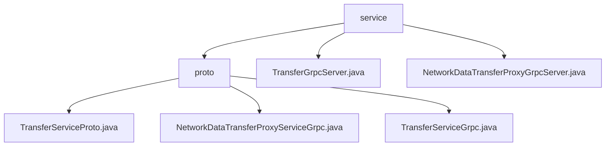

# Basic Information

|      |      |
|------|------|
| Name | service |
| Language | .java |
| Code Path | WeFe/gateway/src/main/java/com/welab/wefe/gateway/api/service |
| Package Name | docs.gateway.src.main.java.com.welab.wefe.gateway.api.service |
| Brief Description | A cross-network data transmission service based on gRPC and Protobuf, providing unary and streaming RPC interfaces (send/recv/push, etc.), supporting metadata transfer and status checks, with interceptor and logging capabilities. |

# Description

## Overview  
This module is a cross-network data transmission service implemented based on gRPC and Protobuf, with its core responsibility being to provide data transmission proxy and status check functionalities. The interface specification includes two types of services: TransferService offers unary RPC methods (e.g., send/recv/checkStatusNow), while NetworkDataTransferProxyService supports streaming RPC (e.g., push/pushDataSource). Key data structures include TransferMeta (transmission metadata) and ReturnStatus (return status), which rely on message formats defined in basic-meta.proto and gateway-meta.proto. For instance, pushDataSource employs bidirectional streaming interaction, resembling a pipeline transmission mode.

## Primary Business Scenarios  
The module is suitable for data synchronization between distributed systems, with typical workflows including metadata transmission (e.g., send/push), status queries (checkStatusNow), and streaming pushes (pushDataSource). It supports both UNARY and streaming RPC interactions, such as clients synchronously sending data via blocking stubs with the send method. Functionality covers three invocation modes: asynchronous, blocking, and Future, with service paths uniformly managed. For example, TransferGrpcServer is protected by an IP whitelist interceptor, while NetworkDataTransferProxyGrpcServer employs three interceptors, including tamper-proofing, to ensure secure transmission.

### Package Internal Structure View

This flowchart illustrates the hierarchical structure of the API service module in the WeFe gateway project. The root node is the service directory, which contains the proto subdirectory and two Grpc service implementation files. The proto directory further includes three protocol files for data transfer and service definition. The overall structure clearly demonstrates the dependency relationship between the service layer and the protocol layer, conforming to the typical architectural design of gRPC services.

# File List

| Name   | Type  | Description |
|-------|------|-------------|
| [TransferGrpcServer.java](TransferGrpcServer.md) | file | The TransferGrpcServer is an internal gRPC service that includes functionalities for sending, receiving, and checking data status. It utilizes the IpAddressWhiteListServerInterceptor and relies on the AbstractRecv and AbstractSend services to process requests. |
| [NetworkDataTransferProxyGrpcServer.java](NetworkDataTransferProxyGrpcServer.md) | file | The Grpc service class NetworkDataTransferProxyGrpcServer includes interceptors and logging, providing push and pushDataSource methods to handle data transfer requests, and invoking recvTransferMetaService to process metadata. |
| [proto](proto/_module.md) | package | The TransferServiceProto defines Protobuf interfaces, including extension registration and descriptor methods, providing two gRPC services—TransferService and NetworkDataTransferProxyService—which handle TransferMeta and ReturnStatus messages. The NetworkDataTransferProxyServiceGrpc implements unidirectional push and bidirectional pushDataSource streaming RPCs, supporting three types of client stubs. The TransferServiceGrpc offers three UNARY methods—send, recv, and checkStatusNow—supporting asynchronous, blocking, and Future calls. |

