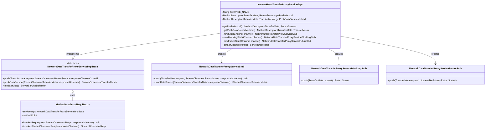

# Basic Information

|      |      |
|------|------|
| Name | NetworkDataTransferProxyServiceGrpc |
| Language | .java |
| Code Path | WeFe/gateway/src/main/java/com/welab/wefe/gateway/api/service/proto/NetworkDataTransferProxyServiceGrpc.java |
| Package Name | com.welab.wefe.gateway.api.service.proto |
| Dependencies | ['io.grpc.MethodDescriptor.generateFullMethodName', 'io.grpc.stub.ClientCalls.asyncBidiStreamingCall', 'io.grpc.stub.ClientCalls.asyncUnaryCall', 'io.grpc.stub.ClientCalls', 'io.grpc.stub.ServerCalls.asyncBidiStreamingCall', 'io.grpc.stub.ServerCalls.asyncUnaryCall', 'io.grpc.stub.ServerCalls'] |
| Brief Description | This is a gRPC service class that provides data transfer proxy functionality, including two methods: push and pushDataSource, supporting unary and bidirectional streaming calls respectively, designed for handling gateway metadata transmission and status returns. |

# Description

The code defines a gRPC service class named `NetworkDataTransferProxyServiceGrpc`, which includes two main methods: `push` and `pushDataSource`. The `push` method is a unary RPC that accepts a `TransferMeta` request and returns a `ReturnStatus`. The `pushDataSource` method is a bidirectional streaming RPC that processes a stream of `TransferMeta` data. The class provides three types of client stubs: asynchronous, blocking, and Future-style, along with the implementation of service descriptor construction logic. All methods communicate based on protobuf-defined message types, and the service name is `com.welab.wefe.gateway.api.service.proto.NetworkDataTransferProxyService`.

# Class Summary

| Name   | Type  | Description |
|-------|------|-------------|
| NetworkDataTransferProxyServiceGrpc | class | This is a gRPC service class that provides network data transmission proxy functionality, including the push and pushDataSource methods, supporting asynchronous, blocking, and Future invocation modes. |

## Class NetworkDataTransferProxyServiceGrpc

|      |      |
|------|------|
| Access Modifier | @javax.annotation.Generated(;    value = "by gRPC proto compiler (version 1.29.0)",;    comments = "Source: gateway-service.proto");public final |
| Type | class |
| Name | NetworkDataTransferProxyServiceGrpc |
| Description | This is a gRPC service class that provides network data transmission proxy functionality, including the push and pushDataSource methods, supporting asynchronous, blocking, and Future invocation modes. |

### UML Class Diagram

This code represents a gRPC service framework defining the core structure of a network data transfer proxy service. NetworkDataTransferProxyServiceGrpc is the main class containing service descriptors and three stub creation methods. ServiceImplBase is an abstract service implementation, with three stubs supporting asynchronous, synchronous blocking, and Future invocation modes respectively. The MethodHandlers class processes specific RPC method invocation logic, routing to different service implementations via method IDs. The entire architecture implements Protobuf-based bidirectional streaming data transfer capabilities.

### Internal Method Call Graph

This flowchart illustrates the core structure of the gRPC service class NetworkDataTransferProxyServiceGrpc. The class contains 3 core RPC methods (getPushMethod/getPushDataSourceMethod) and 3 stub generation methods (newStub/newBlockingStub/newFutureStub). Service binding is implemented through the inner abstract class NetworkDataTransferProxyServiceImplBase, with MethodHandlers processing specific invocation logic. Various descriptor classes (File/MethodDescriptorSupplier) form the service's metadata system, while the three stubs (async/blocking/Future) extend different invocation modes.

### Field List

| Name  | Type  | Description |
|-------|-------|------|
| METHODID_PUSH_DATA_SOURCE = 1 | int | The private static constant METHODID_PUSH_DATA_SOURCE has a value of 1. |
| getPushMethod | io.grpc.MethodDescriptor<com.welab.wefe.gateway.api.meta.basic.GatewayMetaProto.TransferMeta,
      com.welab.wefe.gateway.api.meta.basic.BasicMetaProto.ReturnStatus> | Private static volatile variable for gRPC method description, handling the transfer from TransferMeta to ReturnStatus. |
| SERVICE_NAME = "com.welab.wefe.gateway.api.service.proto.NetworkDataTransferProxyService" | String | Define a static constant SERVICE_NAME with the value being the full classpath name of the network data transfer proxy service. |
| serviceDescriptor | io.grpc.ServiceDescriptor | Private static volatile variable storing the gRPC service descriptor. |
| getPushDataSourceMethod | io.grpc.MethodDescriptor<com.welab.wefe.gateway.api.meta.basic.GatewayMetaProto.TransferMeta,
      com.welab.wefe.gateway.api.meta.basic.GatewayMetaProto.TransferMeta> | Private static volatile variable storing the gRPC method descriptor for the push data source method that transmits metadata. |
| METHODID_PUSH = 0 | int | The private static constant METHODID_PUSH has a value of 0. |

### Method List

| Name  | Type  | Description |
|-------|-------|------|
| getPushDataSourceMethod | io.grpc.MethodDescriptor<com.welab.wefe.gateway.api.meta.basic.GatewayMetaProto.TransferMeta,
      com.welab.wefe.gateway.api.meta.basic.GatewayMetaProto.TransferMeta> | Define the gRPC bidirectional streaming method `pushDataSource`, with both request and response types being `TransferMeta`, ensuring singleton initialization of the method descriptor through a synchronized block. |
| getPushMethod | io.grpc.MethodDescriptor<com.welab.wefe.gateway.api.meta.basic.GatewayMetaProto.TransferMeta,
      com.welab.wefe.gateway.api.meta.basic.BasicMetaProto.ReturnStatus> | Define the gRPC method push, with request type TransferMeta, response type ReturnStatus, method type UNARY, ensuring thread safety through double-checked locking. |
| newStub | NetworkDataTransferProxyServiceStub | Create gRPC client stubs, instantiate the NetworkDataTransferProxyServiceStub through the factory pattern, receive channel parameters, and return a new stub instance. |
| newBlockingStub | NetworkDataTransferProxyServiceBlockingStub | Create a gRPC blocking stub, generate a NetworkDataTransferProxyServiceBlockingStub instance through the factory pattern, and pass in the Channel parameter. |
| newFutureStub | NetworkDataTransferProxyServiceFutureStub | Create a gRPC asynchronous stub factory that generates NetworkDataTransferProxyServiceFutureStub instances through a given channel. |
| getServiceDescriptor | io.grpc.ServiceDescriptor | This is a lazy loading method for a gRPC service descriptor, ensuring thread safety through double-checked locking. It contains two methods (Push and PushDataSource) and sets the file descriptor. |

