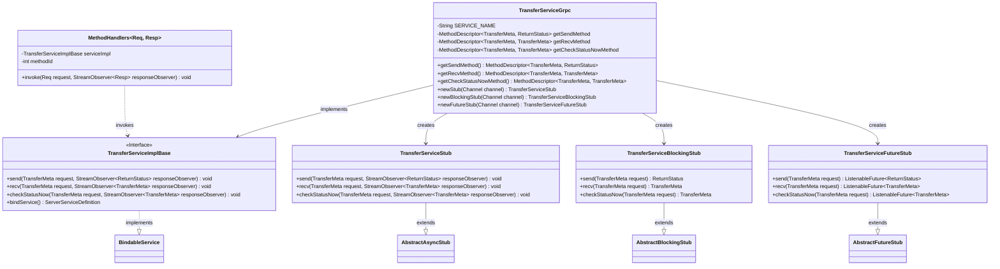

# Basic Information

|      |      |
|------|------|
| Name | TransferServiceGrpc |
| Language | .java |
| Code Path | WeFe/gateway/src/main/java/com/welab/wefe/gateway/api/service/proto/TransferServiceGrpc.java |
| Package Name | com.welab.wefe.gateway.api.service.proto |
| Dependencies | ['io.grpc.MethodDescriptor.generateFullMethodName', 'io.grpc.stub.ClientCalls.asyncUnaryCall', 'io.grpc.stub.ClientCalls.blockingUnaryCall', 'io.grpc.stub.ClientCalls.futureUnaryCall', 'io.grpc.stub.ServerCalls.asyncUnaryCall', 'io.grpc.stub.ServerCalls.asyncUnimplementedUnaryCall'] |
| Brief Description | The TransferServiceGrpc class provides gRPC services, including three methods: send, recv, and checkStatusNow, supporting asynchronous, blocking, and Future invocation modes. |

# Description

The content defines a gRPC-based TransferServiceGrpc class, which includes three main methods: send for sending transfer metadata and returning status, recv for receiving transfer metadata, and checkStatusNow for immediately checking transfer status. The class supports three invocation modes: asynchronous, blocking, and Future, and configures the service through method descriptors and ServiceDescriptor. All methods are of UNARY type, using TransferMeta as the request or response type.

# Class Summary

| Name   | Type  | Description |
|-------|------|-------------|
| TransferServiceGrpc | class | The TransferServiceGrpc class defines a gRPC service, which includes three methods: send, recv, and checkStatusNow, used for processing TransferMeta messages and returning status. It supports three invocation modes: asynchronous, blocking, and Future. |

## Class TransferServiceGrpc

|      |      |
|------|------|
| Access Modifier | @javax.annotation.Generated(;    value = "by gRPC proto compiler (version 1.29.0)",;    comments = "Source: gateway-service.proto");public final |
| Type | class |
| Name | TransferServiceGrpc |
| Description | The TransferServiceGrpc class defines a gRPC service, which includes three methods: send, recv, and checkStatusNow, used for processing TransferMeta messages and returning status. It supports three invocation modes: asynchronous, blocking, and Future. |

### UML Class Diagram

This code represents the Java implementation of a gRPC TransferService, including server base class, three client stubs (async/blocking/Future-style), and method handlers. The core class TransferServiceGrpc provides static method descriptors and stub creation methods, TransferServiceImplBase defines service interfaces, while the three stub classes implement different invocation patterns. Method routing is achieved through MethodHandlers, with the entire system employing double-checked locking for thread-safe lazy initialization.

### Internal Method Call Graph

```mermaid
graph TD
    A["Class TransferServiceGrpc"]
    B["Constant: SERVICE_NAME"]
    C["Static Method: getSendMethod()"]
    D["Static Method: getRecvMethod()"]
    E["Static Method: getCheckStatusNowMethod()"]
    F["Static Method: newStub()"]
    G["Static Method: newBlockingStub()"]
    H["Static Method: newFutureStub()"]
    I["Inner Class: TransferServiceImplBase"]
    J["Inner Class: TransferServiceStub"]
    K["Inner Class: TransferServiceBlockingStub"]
    L["Inner Class: TransferServiceFutureStub"]
    M["Inner Class: MethodHandlers"]
    N["Inner Class: TransferServiceBaseDescriptorSupplier"]
    O["Inner Class: TransferServiceFileDescriptorSupplier"]
    P["Inner Class: TransferServiceMethodDescriptorSupplier"]

    A --> B
    A --> C
    A --> D
    A --> E
    A --> F
    A --> G
    A --> H
    A --> I
    A --> J
    A --> K
    A --> L
    A --> M
    A --> N
    N --> O
    N --> P
    I -->|implements| M
    J -->|extends| io.grpc.stub.AbstractAsyncStub
    K -->|extends| io.grpc.stub.AbstractBlockingStub
    L -->|extends| io.grpc.stub.AbstractFutureStub
```

This code represents a gRPC service framework-generated Java class, primarily providing gRPC interface definitions and implementations for transfer services. The class structure includes core service descriptor generation methods (getSendMethod/getRecvMethod, etc.), three stub creation methods (newStub/newBlockingStub/newFutureStub), and multiple inner classes. The inner classes implement core components such as service base classes, stubs for various invocation methods, and method handlers. They ensure thread-safe method descriptor initialization through the double-checked locking pattern and support UNARY call-type RPC communication.

### Field List

| Name  | Type  | Description |
|-------|-------|------|
| METHODID_CHECK_STATUS_NOW = 2 | int | The private static constant METHODID_CHECK_STATUS_NOW has a value of 2. |
| getSendMethod | io.grpc.MethodDescriptor<com.welab.wefe.gateway.api.meta.basic.GatewayMetaProto.TransferMeta,
      com.welab.wefe.gateway.api.meta.basic.BasicMetaProto.ReturnStatus> | Private static volatile variable storing gRPC method description, used for transferring GatewayMetaProto.TransferMeta and returning BasicMetaProto.ReturnStatus. |
| getRecvMethod | io.grpc.MethodDescriptor<com.welab.wefe.gateway.api.meta.basic.GatewayMetaProto.TransferMeta,
      com.welab.wefe.gateway.api.meta.basic.GatewayMetaProto.TransferMeta> | The private static volatile variable getRecvMethod, of type io.grpc.MethodDescriptor, handles the transfer metadata of GatewayMetaProto.TransferMeta. |
| serviceDescriptor | io.grpc.ServiceDescriptor | Declare a private static volatile gRPC service descriptor variable. |
| SERVICE_NAME = "com.welab.wefe.gateway.api.service.proto.TransferService" | String | Define a static constant SERVICE_NAME with the value being the full service path of TransferService. |
| METHODID_SEND = 0 | int | The private static constant METHODID_SEND has a value of 0. |
| METHODID_RECV = 1 | int | The private static constant METHODID_RECV has a value of 1, which is used to identify the method. |
| getCheckStatusNowMethod | io.grpc.MethodDescriptor<com.welab.wefe.gateway.api.meta.basic.GatewayMetaProto.TransferMeta,
      com.welab.wefe.gateway.api.meta.basic.GatewayMetaProto.TransferMeta> | Private static volatile variable storing the gRPC method descriptor for handling requests and responses of type TransferMeta. |

### Method List

| Name  | Type  | Description |
|-------|-------|------|
| newFutureStub | TransferServiceFutureStub | Static method for creating TransferServiceFutureStub, instantiating asynchronous stubs via gRPC channel and factory pattern. |
| newStub | TransferServiceStub | Static method to create a TransferServiceStub, instantiating and returning a new Stub via gRPC Channel and factory pattern. |
| getSendMethod | io.grpc.MethodDescriptor<com.welab.wefe.gateway.api.meta.basic.GatewayMetaProto.TransferMeta,
      com.welab.wefe.gateway.api.meta.basic.BasicMetaProto.ReturnStatus> | Define the gRPC send method with a request type of TransferMeta, response type of ReturnStatus, method type as UNARY, ensuring thread safety through double-checked locking. |
| newBlockingStub | TransferServiceBlockingStub | Create a blocking gRPC client stub, instantiate it via the factory pattern, and return a TransferServiceBlockingStub object. |
| getRecvMethod | io.grpc.MethodDescriptor<com.welab.wefe.gateway.api.meta.basic.GatewayMetaProto.TransferMeta,
      com.welab.wefe.gateway.api.meta.basic.GatewayMetaProto.TransferMeta> | Define the gRPC method getRecvMethod to handle UNARY requests and responses of TransferMeta type, ensuring thread-safe initialization through double-checked locking. |
| getCheckStatusNowMethod | io.grpc.MethodDescriptor<com.welab.wefe.gateway.api.meta.basic.GatewayMetaProto.TransferMeta,
      com.welab.wefe.gateway.api.meta.basic.GatewayMetaProto.TransferMeta> | Define the gRPC method checkStatusNow, using the TransferMeta class as both the request and response type, with the method type set to UNARY, ensuring thread-safe initialization through double-checked locking. |
| getServiceDescriptor | io.grpc.ServiceDescriptor | This is a lazy loading method for a gRPC service descriptor, which ensures thread safety through double-checked locking. It initializes and returns a service descriptor containing three methods (Send, Recv, CheckStatusNow). |

