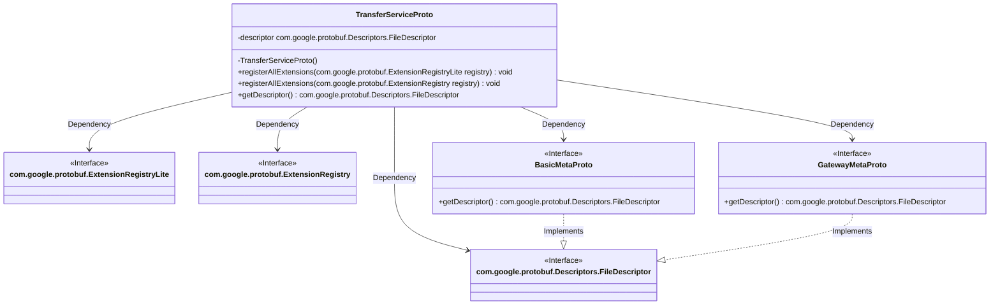
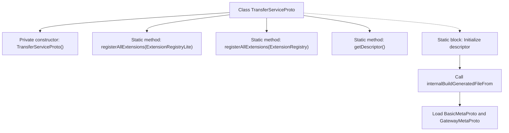

# Basic Information

|      |      |
|------|------|
| Name | TransferServiceProto |
| Language | .java |
| Code Path | WeFe/gateway/src/main/java/com/welab/wefe/gateway/api/service/proto/TransferServiceProto.java |
| Package Name | com.welab.wefe.gateway.api.service.proto |
| Dependencies | [] |
| Brief Description | The TransferServiceProto class defines a data transfer service, including the send, recv, and checkStatusNow methods, which handle TransferMeta and ReturnStatus messages. It also provides the NetworkDataTransferProxyService, supporting push and pushDataSource operations. |

# Description

This is a Java class named TransferServiceProto, used to define a Protobuf service interface. The class includes static methods such as registerAllExtensions for registering extensions and getDescriptor for obtaining the file descriptor. The descriptor data defines two gRPC services, TransferService and NetworkDataTransferProxyService, which provide the send, recv, checkStatusNow and push, pushDataSource methods respectively, handling the TransferMeta and ReturnStatus message types. During class initialization, dependencies on basic-meta.proto and gateway-meta.proto are loaded.

# Class Summary

| Name   | Type  | Description |
|-------|------|-------------|
| TransferServiceProto | class | The TransferServiceProto class defines the data transfer service, including the send, recv, and checkStatusNow methods for handling TransferMeta and ReturnStatus messages. It also includes the NetworkDataTransferProxyService service, supporting the push and pushDataSource methods. It is implemented based on Protocol Buffers. |

## Class TransferServiceProto

|      |      |
|------|------|
| Access Modifier | public final |
| Type | class |
| Name | TransferServiceProto |
| Description | The TransferServiceProto class defines the data transfer service, including the send, recv, and checkStatusNow methods for handling TransferMeta and ReturnStatus messages. It also includes the NetworkDataTransferProxyService service, supporting the push and pushDataSource methods. It is implemented based on Protocol Buffers. |

### UML Class Diagram

This code represents the Google Protocol Buffers-generated TransferServiceProto class, primarily used for protocol definitions in network data transfer services. It is a final utility class containing static methods for registering extensions and obtaining file descriptors, dependent on multiple Protocol Buffers interfaces. The class loads proto file descriptors through static initialization blocks and interacts with two interfaces: BasicMetaProto and GatewayMetaProto. The overall structure demonstrates a typical pattern of Protocol Buffers-generated Java code, emphasizing immutability and static utility methods.

### Internal Method Call Graph

This code represents a Java class generated by Google Protocol Buffers, defining the protocol structure for TransferService. It primarily contains static initialization blocks to construct file descriptors, extension registration methods, and descriptor accessors. The flowchart illustrates the class structure, initialization process, and external dependency loading relationships, with the core mechanism being the construction of protocol descriptors from descriptorData strings and their association with other proto files.

### Field List

| Name  | Type  | Description |
|-------|-------|------|
| descriptor | com.google.protobuf.Descriptors.FileDescriptor | The private static variable `descriptor`, of type `com.google.protobuf.Descriptors.FileDescriptor`. |

### Method List

| Name  | Type  | Description |
|-------|-------|------|
| registerAllExtensions | void | The static method `registerAllExtensions` is used to register extensions with Protobuf's `ExtensionRegistryLite`, and the current implementation is empty. |
| registerAllExtensions | void | This is a Java static method designed to register all extensions into Protobuf's ExtensionRegistry. Internally, it invokes another overloaded method, converting the registry to the ExtensionRegistryLite type for processing. |
| getDescriptor | com.google.protobuf.Descriptors.FileDescriptor | This is a static method that returns the file descriptor object `descriptor` for Google Protocol Buffers. |

