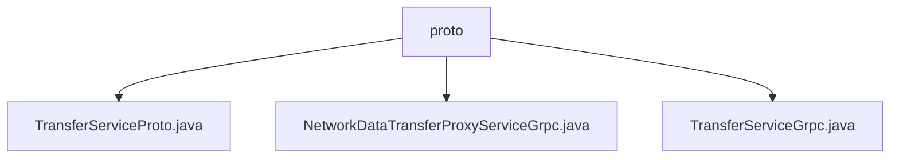

# Basic Information

|      |      |
|------|------|
| Name | proto |
| Language | .java |
| Code Path | WeFe/gateway/src/main/java/com/welab/wefe/gateway/api/service/proto |
| Package Name | docs.gateway.src.main.java.com.welab.wefe.gateway.api.service.proto |
| Brief Description | The TransferServiceProto defines Protobuf interfaces, including extension registration and descriptor methods, providing two gRPC services—TransferService and NetworkDataTransferProxyService—which handle TransferMeta and ReturnStatus messages. The NetworkDataTransferProxyServiceGrpc implements unidirectional push and bidirectional pushDataSource streaming RPCs, supporting three types of client stubs. The TransferServiceGrpc offers three UNARY methods—send, recv, and checkStatusNow—supporting asynchronous, blocking, and Future calls. |

# Description

## Overview  
This module is a cross-network data transmission service implemented based on gRPC and Protobuf. Its core responsibility is to provide data transmission proxy and status checking functionalities. The interface specification includes two types of services: TransferService provides unary RPC methods (send/recv/checkStatusNow), while NetworkDataTransferProxyService supports both unary and bidirectional streaming RPCs (push/pushDataSource). Key data structures are TransferMeta (transmission metadata) and ReturnStatus (return status), which rely on message formats defined in basic-meta.proto and gateway-meta.proto. For example, pushDataSource adopts a bidirectional streaming interaction similar to a pipeline transmission mode.  

## Primary Business Scenarios  
The module is suitable for data synchronization scenarios between distributed systems. Typical workflows include metadata transmission (e.g., send/push), status queries (checkStatusNow), and streaming data推送 (pushDataSource). Interaction modes cover both UNARY and streaming RPCs. For instance, clients can synchronously send data by invoking the send method via blocking stubs. Full functionality supports three invocation methods: asynchronous, blocking, and Future. Service names are uniformly managed under the com.welab.wefe.gateway.api.service.proto path.

### Package Internal Structure View

This flowchart illustrates three key files under the proto directory in the WeFe gateway project: TransferServiceProto.java defines the service interface, while NetworkDataTransferProxyServiceGrpc.java and TransferServiceGrpc.java implement gRPC communication functionalities respectively. Together, these files form the core communication layer of the gateway service, handling data transmission and service invocation.

# File List

| Name   | Type  | Description |
|-------|------|-------------|
| [TransferServiceProto.java](TransferServiceProto.md) | file | The TransferServiceProto class defines a data transfer service, including the send, recv, and checkStatusNow methods for handling TransferMeta and ReturnStatus messages. It also provides the NetworkDataTransferProxyService, supporting push and pushDataSource operations. |
| [NetworkDataTransferProxyServiceGrpc.java](NetworkDataTransferProxyServiceGrpc.md) | file | This is a gRPC service class that provides data transfer proxy functionality, including the `push` and `pushDataSource` methods, which support unidirectional and bidirectional streaming calls respectively, used for handling gateway metadata transmission and status returns. |
| [TransferServiceGrpc.java](TransferServiceGrpc.md) | file | The TransferServiceGrpc class provides gRPC services, including three methods: send, recv, and checkStatusNow, supporting asynchronous, blocking, and Future invocation modes. |

