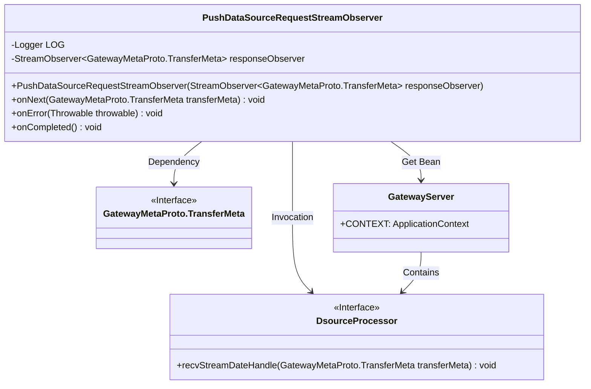
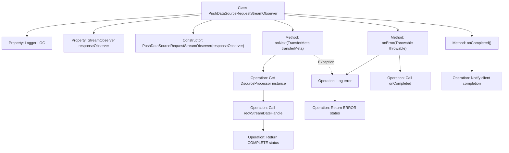

# Basic Information

|      |      |
|------|------|
| Name | PushDataSourceRequestStreamObserver |
| Language | .java |
| Code Path | WeFe/gateway/src/main/java/com/welab/wefe/gateway/api/streammessage/PushDataSourceRequestStreamObserver.java |
| Package Name | com.welab.wefe.gateway.api.streammessage |
| Dependencies | ['com.welab.wefe.gateway.GatewayServer', 'com.welab.wefe.gateway.api.meta.basic.GatewayMetaProto', 'com.welab.wefe.gateway.service.processors.DsourceProcessor', 'io.grpc.stub.StreamObserver', 'org.slf4j.Logger', 'org.slf4j.LoggerFactory'] |
| Brief Description | The PushDataSourceRequestStreamObserver class handles data transmission, saves data to the database, and returns status. In case of exceptions, it logs errors and notifies the client. |

# Description

The `PushDataSourceRequestStreamObserver` class implements the `StreamObserver` interface to handle data streams of the `GatewayMetaProto.TransferMeta` type. It receives a response observer through its constructor and processes the received data in the `onNext` method: invoking `DsourceProcessor` to save data to the database and returning the processing status (COMPLETE for success, ERROR for failure) via the response observer. The `onError` and `onCompleted` methods handle error and completion events respectively, logging the details and notifying the client. The entire process includes exception handling and status feedback mechanisms.

# Class Summary

| Name   | Type  | Description |
|-------|------|-------------|
| PushDataSourceRequestStreamObserver | class | The PushDataSourceRequestStreamObserver class handles the data transmission stream, receives TransferMeta data and saves it to the database, updates the status and notifies the client upon success or failure, while also handling errors and completion events. |

## Class PushDataSourceRequestStreamObserver

|      |      |
|------|------|
| Access Modifier | public |
| Type | class |
| Name | PushDataSourceRequestStreamObserver |
| Description | The PushDataSourceRequestStreamObserver class handles the data transmission stream, receives TransferMeta data and saves it to the database, updates the status and notifies the client upon success or failure, while also handling errors and completion events. |

### UML Class Diagram

This code demonstrates a PushDataSourceRequestStreamObserver class implementing the StreamObserver interface, designed to handle data streams of type GatewayMetaProto.TransferMeta. Key functionalities include: receiving and processing transfer metadata via the onNext method (invoking DsourceProcessor to save to database), and handling error and completion states through onError and onCompleted methods. The class diagram clearly illustrates relationships with the GatewayMetaProto.TransferMeta interface, DsourceProcessor interface, and GatewayServer class, reflecting the core logic of data stream processing and exception handling mechanisms.

### Internal Method Call Graph

This flowchart illustrates the core structure and processing flow of the PushDataSourceRequestStreamObserver class. The class implements bidirectional streaming communication through the StreamObserver interface, primarily handling three states of data transmission: normal processing (onNext), error handling (onError), and completion handling (onCompleted). In the onNext method, received data is processed via DsourceProcessor, and different transfer states are returned based on the processing results. The entire process includes exception handling and logging mechanisms to ensure data transmission reliability.

### Field List

| Name  | Type  | Description |
|-------|-------|------|
| responseObserver | StreamObserver<GatewayMetaProto.TransferMeta> | Private stream observer for handling responses of type GatewayMetaProto.TransferMeta. |
| LOG = LoggerFactory.getLogger(PushDataSourceRequestStreamObserver.class) | Logger | The class PushDataSourceRequestStreamObserver defines a private immutable logger LOG for recording log information. |

### Method List

| Name  | Type  | Description |
|-------|-------|------|
| onError | void | The method `onError` handles exceptions, logs error messages, and calls `onCompleted`. |
| onCompleted | void | Method override completion event, invoke responseObserver to notify the client that data processing is complete. |
| onNext | void | Processing transmission metadata: Save to database and update status to completed or error. Log exceptions and return error status. |

