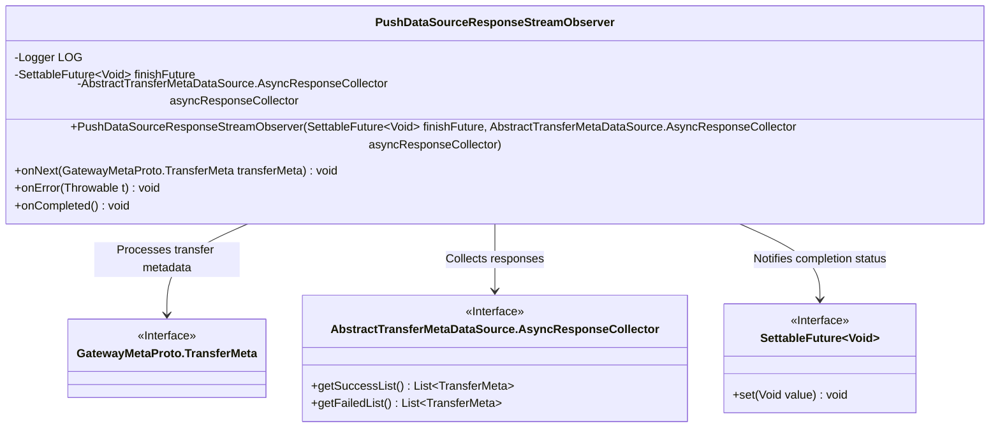
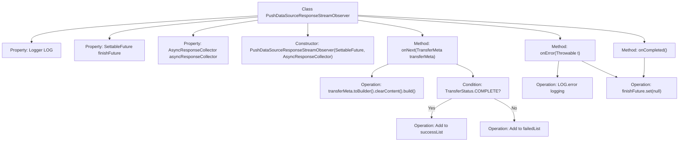

# Basic Information

|      |      |
|------|------|
| Name | PushDataSourceResponseStreamObserver |
| Language | .java |
| Code Path | WeFe/gateway/src/main/java/com/welab/wefe/gateway/api/streammessage/PushDataSourceResponseStreamObserver.java |
| Package Name | com.welab.wefe.gateway.api.streammessage |
| Dependencies | ['com.google.common.util.concurrent.SettableFuture', 'com.welab.wefe.gateway.api.meta.basic.GatewayMetaProto', 'com.welab.wefe.gateway.service.base.AbstractTransferMetaDataSource', 'io.grpc.stub.StreamObserver', 'org.slf4j.Logger', 'org.slf4j.LoggerFactory'] |
| Brief Description | The `PushDataSourceResponseStreamObserver` class implements the `StreamObserver` interface to handle `TransferMeta` stream data. It categorizes and stores successful or failed requests based on transfer status, logs errors and completes the future upon failure, and marks the future as completed when the stream ends. |

# Description

The `PushDataSourceResponseStreamObserver` class implements the `StreamObserver` interface and is used to handle streaming responses of the `GatewayMetaProto.TransferMeta` type. It includes a logger and two member variables: a `SettableFuture` to mark the completion status and an `AsyncResponseCollector` for asynchronously collecting responses. The `onNext` method categorizes the sanitized `transferMeta` into success or failure lists based on the transfer status. The `onError` method logs errors and marks completion, while the `onCompleted` method directly marks completion.

# Class Summary

| Name   | Type  | Description |
|-------|------|-------------|
| PushDataSourceResponseStreamObserver | class | The `PushDataSourceResponseStreamObserver` class implements the `StreamObserver` interface, processes the `TransferMeta` data stream, stores it into success or failure lists based on status, logs errors and completes the future upon errors, and also completes the future when the stream ends. |

## Class PushDataSourceResponseStreamObserver

|      |      |
|------|------|
| Access Modifier | public |
| Type | class |
| Name | PushDataSourceResponseStreamObserver |
| Description | The `PushDataSourceResponseStreamObserver` class implements the `StreamObserver` interface, processes the `TransferMeta` data stream, stores it into success or failure lists based on status, logs errors and completes the future upon errors, and also completes the future when the stream ends. |

### UML Class Diagram

This code demonstrates a PushDataSourceResponseStreamObserver class implementing the StreamObserver interface for handling asynchronous data streams. It processes transfer metadata through three core methods (onNext/onError/onCompleted), categorizes results into AsyncResponseCollector, and notifies completion status via SettableFuture. The class diagram clearly illustrates its dependencies with three interfaces, reflecting the application of the Observer pattern in reactive programming.

### Internal Method Call Graph

This code implements a reactive stream observer for handling three states of data transfer: normal data (onNext), errors (onError), and completion (onCompleted). Upon receiving data, it clears the content and categorizes storage based on transfer status. Errors trigger log recording and Future termination, while completion directly terminates the Future. The flowchart clearly demonstrates state judgment branches and asynchronous callback processing logic, reflecting comprehensive lifecycle management for gRPC streaming calls.

### Field List

| Name  | Type  | Description |
|-------|-------|------|
| LOG = LoggerFactory.getLogger(PushDataSourceResponseStreamObserver.class) | Logger | The class PushDataSourceResponseStreamObserver defines a private immutable Logger instance LOG for logging purposes. |
| finishFuture | SettableFuture<Void> | A privately settable Future object used to represent completion status. |
| asyncResponseCollector | AbstractTransferMetaDataSource.AsyncResponseCollector | The private member variable asyncResponseCollector, of type AsyncResponseCollector which is an inner class of AbstractTransferMetaDataSource. |

### Method List

| Name  | Type  | Description |
|-------|-------|------|
| onError | void | Method override, log errors and set completion status when handling errors. |
| onNext | void | The method processes transmission metadata, clears the content, and categorizes it based on status: successful statuses are stored in the success list, while others are stored in the failure list. |
| onCompleted | void | The method overrides the completion callback, setting the future to null indicates the operation has ended. |

