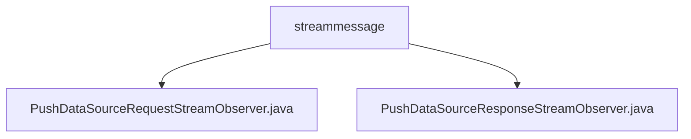

# Basic Information

|      |      |
|------|------|
| Name | streammessage |
| Language | .java |
| Code Path | WeFe/gateway/src/main/java/com/welab/wefe/gateway/api/streammessage |
| Package Name | docs.gateway.src.main.java.com.welab.wefe.gateway.api.streammessage |
| Brief Description | The PushDataSourceRequestStreamObserver handles the data stream, saves the data, and provides feedback on the status, including exception handling. The PushDataSourceResponseStreamObserver processes the streaming response, categorizes and stores the results, and marks the completion status. |

# Description

## Overview  
The core responsibility of this module is to implement bidirectional streaming data processing based on StreamObserver, handling the transmission, storage, and status feedback of TransferMeta-type data. The interface specification follows an asynchronous response pattern, including PushDataSourceRequestStreamObserver (for processing request streams) and PushDataSourceResponseStreamObserver (for processing response streams). The key data structure is GatewayMetaProto.TransferMeta, which relies on SettableFuture and AsyncResponseCollector for asynchronous coordination. For example, the request stream persists data via DsourceProcessor, while the response stream categorizes and stores processing results.  

## Key Business Scenarios  
A typical scenario involves streaming data transmission in a data gateway: the client pushes a TransferMeta data stream, and the server asynchronously processes it and returns status codes (e.g., COMPLETE/ERROR). The interaction model resembles a producer-consumer pattern, where the request stream handles data storage and exception handling, and the response stream aggregates results via the Future mechanism. For instance, onNext triggers database operations, onError uniformly logs errors, and the overall workflow emphasizes end-to-end state tracking and resource cleanup.

### Package Internal Structure View

This flowchart illustrates two Java files under the streammessage directory: PushDataSourceRequestStreamObserver.java and PushDataSourceResponseStreamObserver.java. Both files are directly subordinate to the streammessage directory without any deeper subdirectory hierarchy. The diagram clearly presents the direct containment relationship between the files and their parent directory, conforming to the given path information requirements.

# File List

| Name   | Type  | Description |
|-------|------|-------------|
| [PushDataSourceRequestStreamObserver.java](PushDataSourceRequestStreamObserver.md) | file | The PushDataSourceRequestStreamObserver class handles data transmission, saves data to the database, and returns status. In case of exceptions, it logs errors and notifies the client. |
| [PushDataSourceResponseStreamObserver.java](PushDataSourceResponseStreamObserver.md) | file | The `PushDataSourceResponseStreamObserver` class implements the `StreamObserver` interface to handle `TransferMeta` stream data. It categorizes and stores successful or failed requests based on transfer status, logs errors and completes the future upon errors, and marks the future as completed when the stream ends. |

