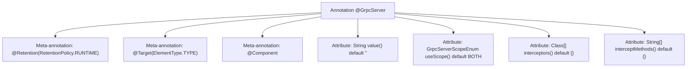

# Basic Information

|      |      |
|------|------|
| Name | GrpcServer |
| Language | .java |
| Code Path | WeFe/gateway/src/main/java/com/welab/wefe/gateway/base/GrpcServer.java |
| Package Name | com.welab.wefe.gateway.base |
| Dependencies | ['com.welab.wefe.gateway.common.GrpcServerScopeEnum', 'io.grpc.ServerInterceptor', 'org.springframework.stereotype.Component', 'java.lang.annotation.ElementType', 'java.lang.annotation.Retention', 'java.lang.annotation.RetentionPolicy', 'java.lang.annotation.Target'] |
| Brief Description | The `GrpcServer` annotation defines a gRPC service, including configuration items such as bean name, scope, interceptor classes, and interceptor methods. |

# Description

This is a Java annotation named GrpcServer, used to mark gRPC server-related components. The annotation has a runtime retention policy and can only be applied at the class level. It includes four configurable attributes: value specifies the bean name, defaulting to an empty string; useScope defines the server usage scope, defaulting to BOTH; interceptors allows setting an array of interceptor classes, defaulting to an empty array; interceptMethods specifies an array of method names to intercept, defaulting to an empty array, and when unset, it intercepts all methods of the target class. This annotation must be used in conjunction with the interceptor attribute.

# Class Summary

| Name   | Type  | Description |
|-------|------|-------------|
| GrpcServer | annotation | The `GrpcServer` annotation is used to define a gRPC service, including configuration items such as bean name, scope, interceptor list, and interception methods. |


## Class GrpcServer

|      |      |
|------|------|
| Access Modifier | @Retention(RetentionPolicy.RUNTIME);@Target(ElementType.TYPE);@Component;public |
| Type | annotation |
| Name | GrpcServer |
| Description | The `GrpcServer` annotation is used to define a gRPC service, including configuration items such as bean name, scope, interceptor list, and interception methods. |


### UML Class Diagram

```mermaid
classDiagram
    class GrpcServer {
        <<Interface>>
        +String value() default ""
        +GrpcServerScopeEnum useScope() default GrpcServerScopeEnum.BOTH
        +Class~ServerInterceptor~[] interceptors() default {}
        +String[] interceptMethods() default {}
    }
    class GrpcServerScopeEnum {
        <<Enumeration>>
        +BOTH
        // Other enumeration values not displayed in code
    }
    class ServerInterceptor {
        <<Interface>>
    }

    GrpcServer --> GrpcServerScopeEnum : Uses enumeration type
    GrpcServer --> ServerInterceptor : Uses interceptor type
```

This code defines an annotation interface named GrpcServer, used to mark gRPC server components. It contains four configurable attributes: bean name (value), service scope (useScope), interceptor list (interceptors), and method names to intercept (interceptMethods). The annotation restricts service scope via the GrpcServerScopeEnum enumeration and supports an array of ServerInterceptor-type interceptor classes. The class diagram clearly illustrates the dependency relationships between the annotation, enumeration, and interceptor interface, demonstrating the core configuration capabilities of a gRPC server.


### Internal Method Call Graph



This flowchart illustrates the structure of the GrpcServer annotation, comprising three meta-annotation declarations and four configurable attributes. The meta-annotations define the annotation's retention policy (RUNTIME), target scope (TYPE), and component identification, while the attributes respectively control bean naming, service scope, interceptor lists, and specific method interception configurations. This design enables flexible configuration of gRPC server behavior through annotations while maintaining code conciseness.

### Field List

| Name  | Type  | Description |
|-------|-------|------|
| value | String | Define the default value of the string type as an empty string. |
| useScope | GrpcServerScopeEnum | The default value of GrpcServerScopeEnum is BOTH, which is used to define the scope of usage. |
| interceptors | Class<? extends ServerInterceptor>[] | Declare an interceptors method that returns an array of ServerInterceptor subclasses, with an empty array as the default value. |
| interceptMethods | String[] | Defined a string array parameter named interceptMethods, with an empty array as the default value. |

### Method List

| Name  | Type  | Description |
|-------|-------|------|


