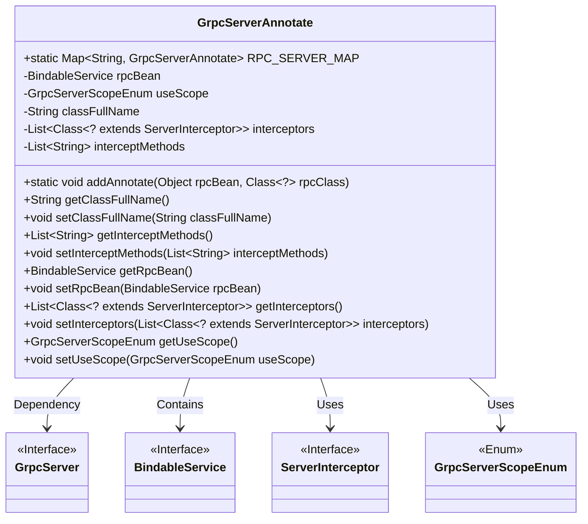
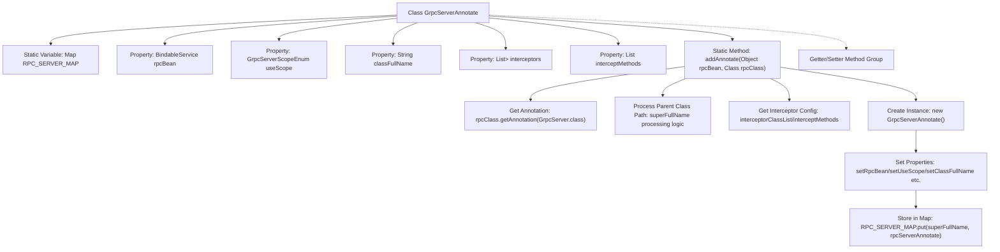

# Basic Information

|      |      |
|------|------|
| Name | GrpcServerAnnotate |
| Language | .java |
| Code Path | WeFe/gateway/src/main/java/com/welab/wefe/gateway/base/GrpcServerAnnotate.java |
| Package Name | com.welab.wefe.gateway.base |
| Dependencies | ['com.welab.wefe.gateway.common.GrpcServerScopeEnum', 'io.grpc.BindableService', 'io.grpc.ServerInterceptor', 'java.util'] |
| Brief Description | The GrpcServerAnnotate class is used to manage gRPC services annotated with @RpcServer, containing service objects, scopes, class paths, interceptors, and interception methods. It stores all annotation instances through a static Map. |

# Description

The `GrpcServerAnnotate` class is designed to manage gRPC service entities annotated with `@RpcServer`. Its core functionality involves maintaining a global mapping `RPC_SERVER_MAP`, which stores associations between fully qualified class names of services and their corresponding annotation objects. The class comprises five key attributes: `rpcBean` stores the annotated service object, `useScope` defines the service usage scope, `classFullName` records the fully qualified class name of the service (automatically removing the `grpc` suffix), `interceptors` holds a list of interceptors, and `interceptMethods` specifies the set of method names to be intercepted. The core method `addAnnotate` is responsible for parsing annotation information, constructing the annotation entity, and registering it in the mapping table. Access and modification capabilities for each attribute are provided through getter/setter methods.

# Class Summary

| Name   | Type  | Description |
|-------|------|-------------|
| GrpcServerAnnotate | class | The GrpcServerAnnotate class is used to manage gRPC service entities annotated with @RpcServer, containing service objects, scopes, class paths, interceptors, and interception methods. These entities are registered into a static mapping table via the addAnnotate method. |

## Class GrpcServerAnnotate

|      |      |
|------|------|
| Access Modifier | public |
| Type | class |
| Name | GrpcServerAnnotate |
| Description | The GrpcServerAnnotate class is used to manage gRPC service entities annotated with @RpcServer, containing service objects, scopes, class paths, interceptors, and interception methods. These entities are registered into a static mapping table via the addAnnotate method. |

### UML Class Diagram

This code defines a `GrpcServerAnnotate` class for managing metadata of gRPC service annotations. Its core functionality involves collecting information about classes annotated with `@RpcServer` through the static method `addAnnotate`, including interceptor lists, scope, etc., and storing them in the static mapping table `RPC_SERVER_MAP`. The class has dependencies with the `GrpcServer` annotation, `BindableService` interface, `ServerInterceptor` interface, and `GrpcServerScopeEnum` enumeration, collectively forming the infrastructure for gRPC service registration and interception mechanisms. The design adopts interface-oriented programming, ensuring type safety through generics, making it suitable for handling service registration requirements in dynamic proxy scenarios.

### Internal Method Call Graph

This flowchart illustrates the core structure of the GrpcServerAnnotate class and the processing flow of the addAnnotate method. The class maintains all @RpcServer annotated entity objects through a static Map, while the addAnnotate method is responsible for parsing annotation configurations (including interceptor settings and scope) and storing them in the static Map after processing. Key properties include the gRPC service instance, scope enumeration, class full path, etc., with standard Getter/Setter methods providing access interfaces.

### Field List

| Name  | Type  | Description |
|-------|-------|------|
| rpcBean | BindableService | Private RPC service binding object. |
| RPC_SERVER_MAP = new HashMap<>(16) | Map<String, GrpcServerAnnotate> | The static Map variable RPC_SERVER_MAP, with an initial capacity of 16, stores GrpcServerAnnotate objects, with keys of String type. |
| interceptors = new ArrayList<>() | List<Class<? extends ServerInterceptor>> | Declare a private list variable named interceptors to store subclass types of the ServerInterceptor class. |
| useScope | GrpcServerScopeEnum | The private GrpcServerScopeEnum type variable useScope. |
| interceptMethods | List<String> | Private string list, storing intercepted method names. |
| classFullName | String | Private string variable storing the fully qualified class name. |

### Method List

| Name  | Type  | Description |
|-------|-------|------|
| addAnnotate | void | This method adds annotations to the gRPC service, processes the parent class path, interceptor list, and methods, and stores them in a global mapping table. |
| setRpcBean | void | Set up the RPC service Bean, assigning the passed BindableService instance to the member variable rpcBean. |
| getInterceptMethods | List<String> | The method to obtain the list of interception methods returns a string list containing the names of the stored interception methods. |
| getRpcBean | BindableService | Methods to obtain RPC service Beans, returning a BindableService type object rpcBean. |
| getClassFullName | String | Method to get the fully qualified name of a class, returns the classFullName as a string. |
| setInterceptMethods | void | Set the list of methods to be intercepted. |
| setClassFullName | void | This is a Java method used to set the fully qualified name property of a class. The method takes a string parameter `classFullName` and assigns it to the property of the same name in the current object. |
| getInterceptors | List<Class<? extends ServerInterceptor>> | This method returns a list containing subclasses of ServerInterceptor, used to obtain the collection of interceptors. |
| setInterceptors | void | Method for setting the server interceptor list, which receives a list of interceptor classes and assigns them to the member variable. |
| getUseScope | GrpcServerScopeEnum | The method to obtain the useScope property value of the GrpcServerScopeEnum type. |
| setUseScope | void | A public method named `setUseScope` is defined to set the value of the `useScope` property of type `GrpcServerScopeEnum`. |

