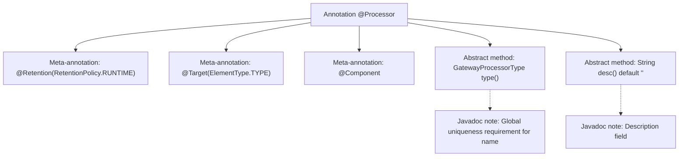

# Basic Information

|      |      |
|------|------|
| Name | Processor |
| Language | .java |
| Code Path | WeFe/gateway/src/main/java/com/welab/wefe/gateway/base/Processor.java |
| Package Name | com.welab.wefe.gateway.base |
| Dependencies | ['com.welab.wefe.common.wefe.enums.GatewayProcessorType', 'org.springframework.stereotype.Component', 'java.lang.annotation.ElementType', 'java.lang.annotation.Retention', 'java.lang.annotation.RetentionPolicy', 'java.lang.annotation.Target'] |
| Brief Description | Defined a runtime-retained annotation @Processor for classes, containing a mandatory type field and an optional desc description field. |

# Description

This is a Java annotation definition named Processor, which uses meta-annotations to specify its retention policy as runtime and target as class. The annotation contains two elements: the type() method returns a GatewayProcessorType enum and requires a globally unique name, while the desc() method returns a description string with a default value of an empty string. The annotation is also marked with Spring's @Component annotation.

# Class Summary

| Name   | Type  | Description |
|-------|------|-------------|
| Processor | annotation | Defines a runtime-retained processor annotation that includes type and description fields, where the type must be globally unique. |


## Class Processor

|      |      |
|------|------|
| Access Modifier | @Retention(RetentionPolicy.RUNTIME);@Target(ElementType.TYPE);@Component;public |
| Type | annotation |
| Name | Processor |
| Description | Defines a runtime-retained processor annotation that includes type and description fields, where the type must be globally unique. |


### UML Class Diagram

```mermaid
classDiagram
    class Processor {
        <<Interface>>
        +GatewayProcessorType type()
        +String desc() default ""
    }
    // The @Component annotation indicates this is a Spring component
    // @Retention and @Target annotations specify the retention policy and applicable targets
    Processor ..> GatewayProcessorType : dependency
```

This code defines an annotation interface named `Processor`, primarily used to mark processor-type components. The annotation includes two methods: `type()` returns a `GatewayProcessorType` enum (must be globally unique), and `desc()` returns a description string (defaulting to empty). The `@Component` annotation indicates this is a Spring component, `@Retention(RetentionPolicy.RUNTIME)` ensures the annotation is available at runtime, and `@Target(ElementType.TYPE)` restricts the annotation to be used only on classes/interfaces. The class diagram clearly illustrates the structure of the annotation and its dependency relationship with `GatewayProcessorType`.


### Internal Method Call Graph



This code defines a Java annotation named `@Processor`, which incorporates three meta-annotations: runtime retention policy, class-level target restriction, and Spring component marking. Core functionality is achieved through two abstract methods: the `type()` method mandates returning a gateway processor type enum (requiring global uniqueness), while the `desc()` method optionally returns a description string (defaulting to empty). The flowchart clearly illustrates the annotation structure, metadata constraints, and hierarchical relationships of functional methods, making it suitable for identifying gateway processor types.

### Field List

| Name  | Type  | Description |
|-------|-------|------|
| type | GatewayProcessorType | Methods for obtaining the gateway handler type. |
| desc | String | The method returns an empty string description by default. |

### Method List

| Name  | Type  | Description |
|-------|-------|------|


