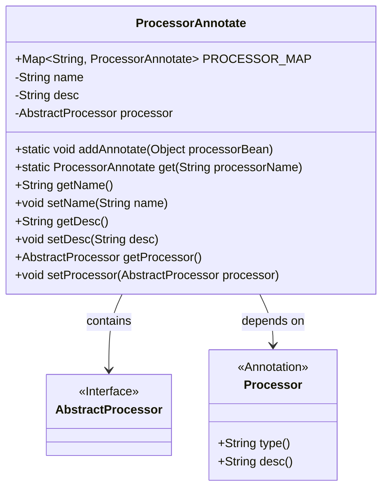
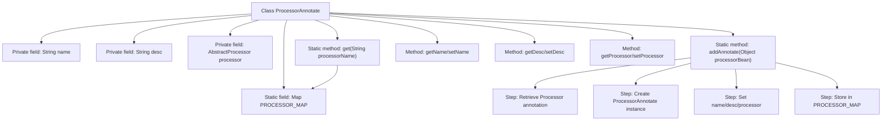

# Basic Information

|      |      |
|------|------|
| Name | ProcessorAnnotate |
| Language | .java |
| Code Path | WeFe/gateway/src/main/java/com/welab/wefe/gateway/base/ProcessorAnnotate.java |
| Package Name | com.welab.wefe.gateway.base |
| Dependencies | ['com.welab.wefe.gateway.service.processors.AbstractProcessor', 'java.util.HashMap', 'java.util.Map'] |
| Brief Description | The `ProcessorAnnotate` class is used to manage entity objects annotated with `@Processor`, containing name, description, and processor instance, providing add and retrieve functionalities. |

# Description

The `ProcessorAnnotate` class is used to manage entity objects annotated with `@Processor`. This class contains a static `Map PROCESSOR_MAP` for storing all processor annotation information, where the key is the annotation name and the value is the corresponding `ProcessorAnnotate` object. Each `ProcessorAnnotate` object includes three attributes: `name` (the annotation type name), `desc` (the annotation description), and `processor` (the annotated `AbstractProcessor` object). It provides the `addAnnotate` method to add processor objects to the Map and the `get` method to retrieve the corresponding `ProcessorAnnotate` object by name. Additionally, it includes getter and setter methods for each attribute.

# Class Summary

| Name   | Type  | Description |
|-------|------|-------------|
| ProcessorAnnotate | class | The `ProcessorAnnotate` class is used to manage entity objects annotated with `@Processor`, containing name, description, and processor objects, while providing add and retrieve functionalities. |

## Class ProcessorAnnotate

|      |      |
|------|------|
| Access Modifier | public |
| Type | class |
| Name | ProcessorAnnotate |
| Description | The `ProcessorAnnotate` class is used to manage entity objects annotated with `@Processor`, containing name, description, and processor objects, while providing add and retrieve functionalities. |

### UML Class Diagram

This code defines a `ProcessorAnnotate` class for managing processor objects annotated with `@Processor`. The class includes a static map `PROCESSOR_MAP` to store the mapping between annotation names and processor objects, providing an `addAnnotate` method to add new processors and a `get` method to retrieve processors by name. The `ProcessorAnnotate` class has associations with the `AbstractProcessor` interface and the `Processor` annotation, where the former stores concrete processor instances and the latter provides annotation metadata. The overall design implements an annotation-based processor registration and lookup mechanism.

### Internal Method Call Graph

This flowchart illustrates the complete structure of the ProcessorAnnotate class, including the core processing logic of the static mapping table PROCESSOR_MAP. It highlights the 4 key steps of the addAnnotate method: retrieving annotations via reflection, creating annotation wrapper objects, populating attribute fields, and storing them in the static mapping table. The class centrally manages all processor annotation instances through static methods while providing standard getter/setter access to private fields, achieving centralized storage and name-based retrieval of processor annotation information.

### Field List

| Name  | Type  | Description |
|-------|-------|------|
| PROCESSOR_MAP = new HashMap<>(16) | Map<String, ProcessorAnnotate> | Static hash map with string keys and processor annotation object values, initial capacity 16. |
| processor | AbstractProcessor | The private member variable `processor`, of type `AbstractProcessor`. |
| name | String | The private string type variable name. |
| desc | String | The private string-type variable `desc` is used to describe information. |

### Method List

| Name  | Type  | Description |
|-------|-------|------|
| getDesc | String | Methods for obtaining descriptive information, returning the desc value of string type. |
| addAnnotate | void | The method `addAnnotate` retrieves processor information through annotations, creates and populates a `ProcessorAnnotate` object, and finally stores it in `PROCESSOR_MAP`. |
| setName | void | Methods for setting object names, assigning the parameter 'name' to the object's 'name' property. |
| get | ProcessorAnnotate | The static method `get` retrieves the corresponding `ProcessorAnnotate` instance from `PROCESSOR_MAP` via `processorName`. |
| getName | String | Methods to obtain the name, returning the value of the name variable of string type. |
| setDesc | void | This is a Java method used to set the description information of an object. The method takes a string parameter desc and assigns it to the desc property of the object. |
| getProcessor | AbstractProcessor | Methods to obtain a processor instance, returning an object of type AbstractProcessor. |
| setProcessor | void | Set the processor method to assign the incoming AbstractProcessor instance to the processor property of the current object. |

