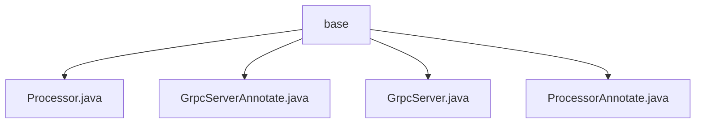

# Basic Information

|      |      |
|------|------|
| Name | base |
| Language | .java |
| Code Path | WeFe/gateway/src/main/java/com/welab/wefe/gateway/base |
| Package Name | docs.gateway.src.main.java.com.welab.wefe.gateway.base |
| Brief Description | The `Processor` annotation marks a class as a Spring component, containing type and description elements. `GrpcServerAnnotate` manages services annotated with `GrpcServer`, maintaining a global mapping that includes attributes such as service objects, scope, and interceptors. The `GrpcServer` annotation marks gRPC components, with configurations such as name, scope, and interceptors. `ProcessorAnnotate` manages processors annotated with `Processor`, maintaining a global mapping that includes name, description, and processor objects. |

# Description

## Overview  
The core responsibility of this module is to implement component registration and management through custom annotations (@Processor and @GrpcServer), similar to Spring's Bean container pattern. The interface specification includes two types of annotations: @Processor requires declaring a unique type and description, while @GrpcServer needs to configure service scope/interception rules, etc. Key data structures include global mapping tables (PROCESSOR_MAP/RPC_SERVER_MAP) and annotation entity classes (e.g., GrpcServerAnnotate). External dependencies only involve Spring Framework's @Component annotation. For example, @Processor is used to mark processor classes, and @GrpcServer manages gRPC service instances.  

## Main Business Scenarios  
The module primarily supports two types of businesses: processor registration (collecting AbstractProcessor subclasses via @Processor) and gRPC service management (registering service instances via @GrpcServer). The interaction mode is annotation-driven in both cases. For instance, GrpcServerAnnotate parses interceptor configurations, and ProcessorAnnotate maintains processor mappings. Typical applications include dynamic loading of processors (e.g., the GatewayProcessorType enum class) and gRPC method interception (via the interceptMethods attribute). API types are centralized as annotation-configurable, such as @GrpcServer(interceptors={AuthInterceptor.class}) for implementing permission validation.

### Package Internal Structure View

This flowchart illustrates the file structure relationships under the base directory in the WeFe gateway project. The base serves as the root node and directly contains four Java files: Processor.java, GrpcServerAnnotate.java, GrpcServer.java, and ProcessorAnnotate.java. These files belong to the gateway's foundational components and are used to implement gRPC service-related functionalities, with no deeper subdirectory hierarchy. The entire structure exhibits a flat characteristic, with all files residing at the same level.

# File List

| Name   | Type  | Description |
|-------|------|-------------|
| [Processor.java](Processor.md) | file | Defines a runtime-retained annotation @Processor for classes, containing a mandatory type field and an optional desc description field. |
| [GrpcServerAnnotate.java](GrpcServerAnnotate.md) | file | The `GrpcServerAnnotate` class is used to manage gRPC services annotated with `@RpcServer`, containing service objects, scopes, class paths, interceptors, and interception methods. It stores all annotation instances via a static Map. |
| [GrpcServer.java](GrpcServer.md) | file | The `GrpcServer` annotation defines a gRPC service, including configuration items such as bean name, scope, interceptor classes, and interceptor methods. |
| [ProcessorAnnotate.java](ProcessorAnnotate.md) | file | The `ProcessorAnnotate` class is used to manage entity objects annotated with `@Processor`, containing names, descriptions, and processor instances, while providing add and retrieve functionalities. |

