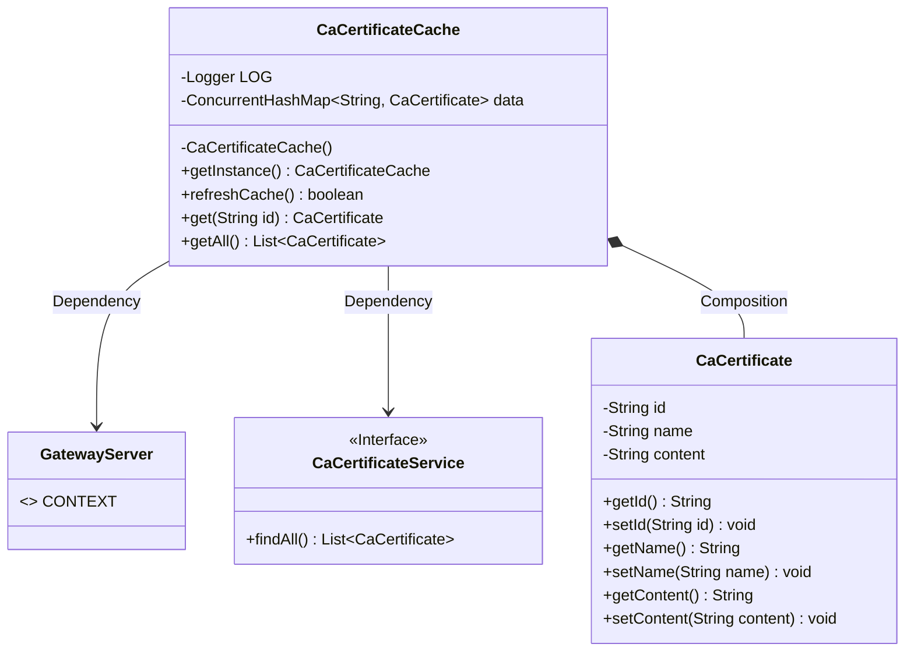

# Basic Information

|      |      |
|------|------|
| Name | CaCertificateCache |
| Language | .java |
| Code Path | WeFe/gateway/src/main/java/com/welab/wefe/gateway/cache/CaCertificateCache.java |
| Package Name | com.welab.wefe.gateway.cache |
| Dependencies | ['com.welab.wefe.gateway.GatewayServer', 'com.welab.wefe.gateway.service.CaCertificateService', 'org.apache.commons.collections4.CollectionUtils', 'org.slf4j.Logger', 'org.slf4j.LoggerFactory', 'java.util.ArrayList', 'java.util.List', 'java.util.concurrent.ConcurrentHashMap'] |
| Brief Description | The CaCertificateCache class is a singleton cache used for storing CaCertificate objects, providing functionalities such as refreshing the cache, and retrieving individual or all certificates. |

# Description

CaCertificateCache is a singleton class designed to cache CA certificate data. It utilizes a ConcurrentHashMap to store CaCertificate objects and provides get and getAll methods for retrieving certificates. The refreshCache method updates cached data through CaCertificateService, including operations for addition, update, and deletion. CaCertificate is an inner class containing id, name, and content attributes along with corresponding getter and setter methods. The class incorporates logging and exception handling mechanisms.

# Class Summary

| Name   | Type  | Description |
|-------|------|-------------|
| CaCertificateCache | class | The CaCertificateCache class implements the singleton pattern, using ConcurrentHashMap to cache CaCertificate objects, and provides methods to refresh the cache, retrieve a single certificate, or all certificates. The CaCertificate includes attributes such as id, name, and content. |

## Class CaCertificateCache

|      |      |
|------|------|
| Access Modifier | public |
| Type | class |
| Name | CaCertificateCache |
| Description | The CaCertificateCache class implements the singleton pattern, using ConcurrentHashMap to cache CaCertificate objects, and provides methods to refresh the cache, retrieve a single certificate, or all certificates. The CaCertificate includes attributes such as id, name, and content. |

### UML Class Diagram

Class diagram description: CaCertificateCache is a singleton class for managing cached CaCertificate objects, storing data via ConcurrentHashMap. It depends on GatewayServer to obtain Spring context and queries certificate data through the CaCertificateService interface. The inner class CaCertificate represents a certificate entity containing id, name, and content fields with corresponding getters/setters. The refreshCache() method implements cache update logic including data loading and expiration cleanup.

### Internal Method Call Graph

```mermaid
graph TD
    A["Class CaCertificateCache"]
    B["Property: Logger LOG"]
    C["Static Property: CaCertificateCache caCertificateCache"]
    D["Property: ConcurrentHashMap<String, CaCertificate> data"]
    E["Private Constructor: CaCertificateCache()"]
    F["Static Method: getInstance()"]
    G["Method: refreshCache()"]
    H["Method: get(String id)"]
    I["Method: getAll()"]
    J["Static Inner Class: CaCertificate"]
    K["Property: String id"]
    L["Property: String name"]
    M["Property: String content"]
    N["Method: getId()"]
    O["Method: setId(String id)"]
    P["Method: getName()"]
    Q["Method: setName(String name)"]
    R["Method: getContent()"]
    S["Method: setContent(String content)"]
    T["Exception Handling: LOG.error('Refresh ca certificate cache exception: ', e)"]

    A --> B
    A --> C
    A --> D
    A --> E
    A --> F
    A --> G
    A --> H
    A --> I
    A --> J
    J --> K
    J --> L
    J --> M
    J --> N
    J --> O
    J --> P
    J --> Q
    J --> R
    J --> S
    G --> T
```

This flowchart illustrates the complete structure of the CaCertificateCache class, including singleton pattern implementation, cache refresh logic, and the properties/methods of the inner CaCertificate class. The core method refreshCache() retrieves certificate lists via GatewayServer, updates the ConcurrentHashMap cache, and cleans invalid data, with the entire process incorporating exception handling. The inner class CaCertificate encapsulates three basic properties (certificate ID, name, and content) along with their corresponding getter/setter methods.

### Field List

| Name  | Type  | Description |
|-------|-------|------|
| LOG = LoggerFactory.getLogger(CaCertificateCache.class) | Logger | The class CaCertificateCache declares a private immutable logger LOG for recording log information. |
| caCertificateCache = new CaCertificateCache() | CaCertificateCache | Declare a private static constant caCertificateCache, initialized as an instance of CaCertificateCache. |
| data = new ConcurrentHashMap<>() | ConcurrentHashMap<String, CaCertificate> | Using a thread-safe ConcurrentHashMap to store the mapping from strings to CaCertificate. |

### Method List

| Name  | Type  | Description |
|-------|-------|------|
| getInstance | CaCertificateCache | Method to obtain the singleton instance of CaCertificateCache. |
| refreshCache | boolean | Method to refresh cache: Retrieve the certificate list; if it is empty, clear the cache; otherwise, update the cached data by removing invalid entries. Return true if successful, or log the error and return false if failed. |
| get | CaCertificate | Get the certificate object with the specified ID. |
| getAll | List<CaCertificate> | The method returns a list containing all CaCertificate objects by creating a new ArrayList with values copied from the data collection. |

