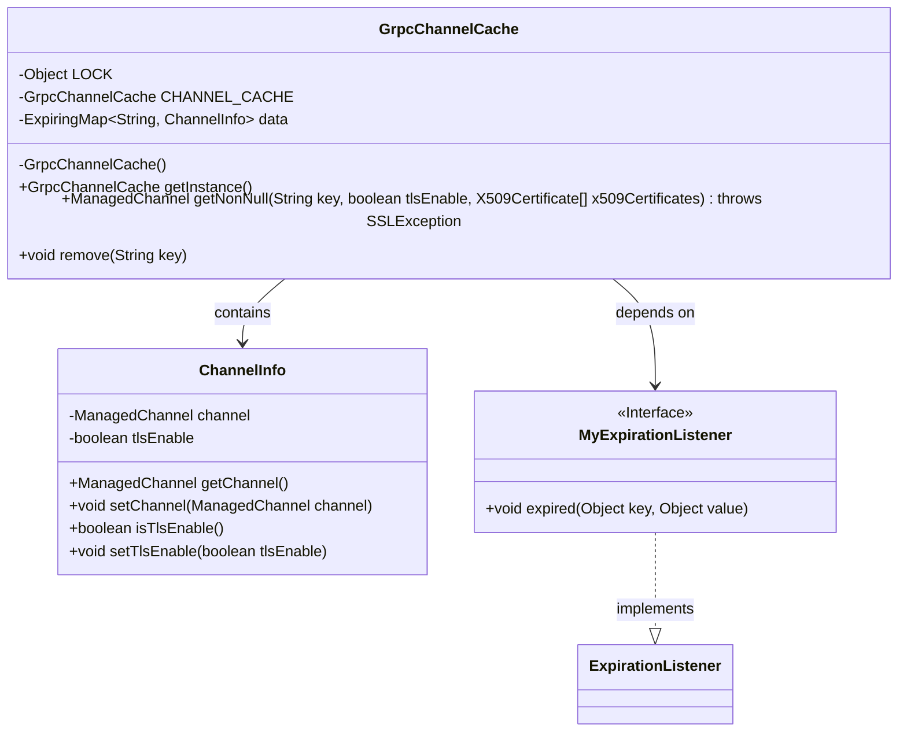

# Basic Information

|      |      |
|------|------|
| Name | GrpcChannelCache |
| Language | .java |
| Code Path | WeFe/gateway/src/main/java/com/welab/wefe/gateway/cache/GrpcChannelCache.java |
| Package Name | com.welab.wefe.gateway.cache |
| Dependencies | ['com.welab.wefe.common.util.StringUtil', 'com.welab.wefe.gateway.common.EndpointBuilder', 'com.welab.wefe.gateway.util.GrpcUtil', 'io.grpc.ManagedChannel', 'net.jodah.expiringmap.ExpirationListener', 'net.jodah.expiringmap.ExpirationPolicy', 'net.jodah.expiringmap.ExpiringMap', 'javax.net.ssl.SSLException', 'java.security.cert.X509Certificate', 'java.util.concurrent.TimeUnit'] |
| Brief Description | The GrpcChannelCache class implements the singleton pattern, using ExpiringMap to cache gRPC channels, supports TLS configuration, and automatically expires and closes channels after 24 hours of inactivity. |

# Description

GrpcChannelCache is a singleton class designed to cache and manage gRPC channels. It utilizes ExpiringMap to store channel information, where the key is the gateway URI (in host:port format) and the value is a ChannelInfo object containing a ManagedChannel and a TLS-enabled flag. The caching policy expires entries after 24 hours of inactivity, automatically closing the channel upon expiration. The getNonNull method is provided to retrieve or create a channel, supporting both TLS and non-TLS modes while ensuring thread safety. The remove method allows manual removal and closure of channels. The inner class ChannelInfo encapsulates the channel and TLS state, while MyExpirationListener handles the closure of expired channels.

# Class Summary

| Name   | Type  | Description |
|-------|------|-------------|
| GrpcChannelCache | class | GrpcChannelCache is a singleton class that utilizes ExpiringMap to cache gRPC channels, with gateway URIs as keys and a 24-hour expiration period for inactive entries. It supports both TLS and non-TLS channels, automatically cleaning up stale connections. |


## Class GrpcChannelCache

|      |      |
|------|------|
| Access Modifier | public |
| Type | class |
| Name | GrpcChannelCache |
| Description | GrpcChannelCache is a singleton class that utilizes ExpiringMap to cache gRPC channels, with gateway URIs as keys and a 24-hour expiration period for inactive entries. It supports both TLS and non-TLS channels, automatically cleaning up stale connections. |


### UML Class Diagram



Class diagram description: GrpcChannelCache is a singleton class for caching gRPC channels, internally using ExpiringMap to store ChannelInfo objects with thread safety ensured by double-checked locking. ChannelInfo encapsulates ManagedChannel and TLS enable flag, while MyExpirationListener implements expiration listening to automatically close channels. The overall design achieves channel caching, automatic cleanup, and thread-safe access.


### Internal Method Call Graph

```mermaid
graph TD
    A["Class GrpcChannelCache"]
    B["Static Property: Object LOCK"]
    C["Static Property: GrpcChannelCache CHANNEL_CACHE"]
    D["Property: ExpiringMap<String, ChannelInfo> data"]
    E["Private Constructor: GrpcChannelCache()"]
    F["Static Method: getInstance()"]
    G["Method: getNonNull(String key, boolean tlsEnable, X509Certificate[] x509Certificates)"]
    H["Method: remove(String key)"]
    I["Inner Class: MyExpirationListener"]
    J["Inner Class: ChannelInfo"]
    K["Operation: Validate key"]
    L["Operation: Retrieve ChannelInfo"]
    M["Operation: Check TLS match"]
    N["Operation: Double-check in synchronized block"]
    O["Operation: Remove old channel"]
    P["Operation: Create new channel"]
    Q["Operation: Update data cache"]
    R["Operation: Close channel connection"]

    A --> B
    A --> C
    A --> D
    A --> E
    A --> F
    A --> G
    A --> H
    A --> I
    A --> J
    G --> K["'Check if key is null'"]
    G --> L["'Get ChannelInfo from data'"]
    G --> M["'Verify TLS configuration match'"]
    G --> N["'Recheck within synchronized block'"]
    G --> O["'Call remove method'"]
    G --> P["'Create new ManagedChannel'"]
    G --> Q["'Update data cache'"]
    H --> R["'Close channel connection'"]
    I -->|"Listen expiration event"| R
    P -->|"Condition branch"| "'Non-TLS mode'"
    P -->|"Condition branch"| "'TLS mode'"
```

This flowchart illustrates the core structure and execution flow of the GrpcChannelCache class. The class adopts a singleton pattern to manage gRPC channel caching, implementing a time-based expiration mechanism through ExpiringMap. Key processes include: validating cache availability when retrieving channels, synchronously creating new channels, and automatically handling expired connections. The inner class MyExpirationListener implements expiration callbacks, while ChannelInfo encapsulates channel and TLS states. The design achieves thread-safe channel reuse and automatic cleanup.

### Field List

| Name  | Type  | Description |
|-------|-------|------|
| CHANNEL_CACHE = new GrpcChannelCache() | GrpcChannelCache | The private static GrpcChannelCache instance CHANNEL_CACHE is initialized as a new instance. |
| data = ExpiringMap            .builder()            .expirationListener(new MyExpirationListener())            .expirationPolicy(ExpirationPolicy.ACCESSED)            .expiration(24, TimeUnit.HOURS)            .build() | ExpiringMap<String, ChannelInfo> | Using ExpiringMap to store ChannelInfo, with String as the key, setting a 24-hour access expiration policy, and adding a custom expiration listener. |
| LOCK = new Object() | Object | Define a static immutable object lock for synchronization control. |

### Method List

| Name  | Type  | Description |
|-------|-------|------|
| getNonNull | ManagedChannel | Get or create a ManagedChannel for the specified key, with TLS configuration support. Returns null if the key is empty, returns the existing channel if a match is found, otherwise synchronously creates and stores a new channel. |
| getInstance | GrpcChannelCache | The method to obtain the singleton instance of GrpcChannelCache directly returns the static variable CHANNEL_CACHE. |
| remove | void | This method removes the channel information corresponding to the specified key and closes the associated channel. If the channel information exists, its channel is closed; otherwise, no closing operation is performed. |


