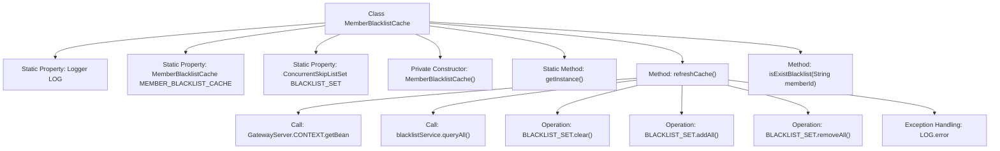

# Basic Information

|      |      |
|------|------|
| Name | MemberBlacklistCache |
| Language | .java |
| Code Path | WeFe/gateway/src/main/java/com/welab/wefe/gateway/cache/MemberBlacklistCache.java |
| Package Name | com.welab.wefe.gateway.cache |
| Dependencies | ['com.welab.wefe.gateway.GatewayServer', 'com.welab.wefe.gateway.entity.BlacklistEntity', 'com.welab.wefe.gateway.service.BlacklistService', 'org.apache.commons.collections4.CollectionUtils', 'org.slf4j.Logger', 'org.slf4j.LoggerFactory', 'java.util.ArrayList', 'java.util.HashSet', 'java.util.List', 'java.util.Set', 'java.util.concurrent.ConcurrentSkipListSet'] |
| Brief Description | The MemberBlacklistCache class is used to manage member blacklist caching, providing singleton access, cache refresh, and member existence checking functionalities. It stores blacklisted IDs via ConcurrentSkipListSet, updates cached data from the database through the refreshCache method, and checks whether a member is on the blacklist using isExistBlacklist. |

# Description

The code defines a singleton class named `MemberBlacklistCache`, which is used to manage the member blacklist cache. The class includes a static `ConcurrentSkipListSet` collection `BLACKLIST_SET` to store blacklisted member IDs. It provides the `refreshCache` method to fetch the latest blacklist data from `BlacklistService` and update the cache, including adding new members and removing deleted ones. Additionally, it offers the `isExistBlacklist` method to check whether a specified member exists in the blacklist. The entire class ensures a globally unique instance through the singleton pattern and uses a thread-safe collection to guarantee concurrent access safety.

# Class Summary

| Name   | Type  | Description |
|-------|------|-------------|
| MemberBlacklistCache | class | Member blacklist cache class, singleton pattern, uses concurrent collections to store blacklisted IDs, provides functions for refreshing the cache and checking if a member is in the blacklist. During refresh, synchronizes data from the database and cleans up invalid entries. |


## Class MemberBlacklistCache

|      |      |
|------|------|
| Access Modifier | public |
| Type | class |
| Name | MemberBlacklistCache |
| Description | Member blacklist cache class, singleton pattern, uses concurrent collections to store blacklisted IDs, provides functions for refreshing the cache and checking if a member is in the blacklist. During refresh, synchronizes data from the database and cleans up invalid entries. |


### UML Class Diagram

```mermaid
classDiagram
    class MemberBlacklistCache {
        -Logger LOG
        -static MemberBlacklistCache MEMBER_BLACKLIST_CACHE
        -static ConcurrentSkipListSet~String~ BLACKLIST_SET
        +MemberBlacklistCache()
        +static MemberBlacklistCache getInstance()
        +boolean refreshCache()
        +boolean isExistBlacklist(String memberId)
    }

    class BlacklistService {
        <<Interface>>
        +List~BlacklistEntity~ queryAll()
    }

    class BlacklistEntity {
        +String getBlacklistMemberId()
    }

    class GatewayServer {
        +static ApplicationContext CONTEXT
    }

    MemberBlacklistCache --> BlacklistService : Dependency: Get instance via GatewayServer
    MemberBlacklistCache --> BlacklistEntity : Dependency: Read blacklisted member ID
    MemberBlacklistCache ..> GatewayServer : Dependency: Get Spring context
```

This code implements a singleton-pattern blacklist cache service `MemberBlacklistCache`, which stores blacklisted member IDs using `ConcurrentSkipListSet`. Core functionalities include: 1) Refreshing cache data from `BlacklistService`; 2) Checking if a member exists in the blacklist. It ensures data consistency through thread-safe collections and double-checked locking mechanism, dynamically retrieves service instances via Spring context, and handles synchronization between database and cache. Error logs are recorded and operation status is returned when exceptions occur.


### Internal Method Call Graph



This code implements a thread-safe singleton class for member blacklist caching, using ConcurrentSkipListSet to store blacklisted member IDs. Core functionalities include: 1) Synchronizing the latest blacklist data from the database via the refreshCache method, incorporating incremental updates and stale data cleanup logic; 2) Providing the isExistBlacklist method for quick determination of whether a member is on the blacklist. The flowchart illustrates the class structure, method invocation relationships, and data operation flow, with particular attention to its thread-safe design and exception handling mechanism.

### Field List

| Name  | Type  | Description |
|-------|-------|------|
| LOG = LoggerFactory.getLogger(MemberBlacklistCache.class) | Logger | Static logger declaration for the member blacklist cache class. |
| MEMBER_BLACKLIST_CACHE = new MemberBlacklistCache() | MemberBlacklistCache | The member blacklist cache instance is initialized as a static private variable. |
| BLACKLIST_SET = new ConcurrentSkipListSet<>() | ConcurrentSkipListSet<String> | Concurrent-safe ordered string blacklist collection. |

### Method List

| Name  | Type  | Description |
|-------|-------|------|
| getInstance | MemberBlacklistCache | The static method getInstance returns the singleton object MEMBER_BLACKLIST_CACHE. |
| refreshCache | boolean | Method to refresh the blacklist cache: Query the database to update the cache, synchronize the removal of deleted members, return true if successful, or log the failure and return false. |
| isExistBlacklist | boolean | Check if the member ID is in the blacklist, return true if it exists, otherwise false. |


