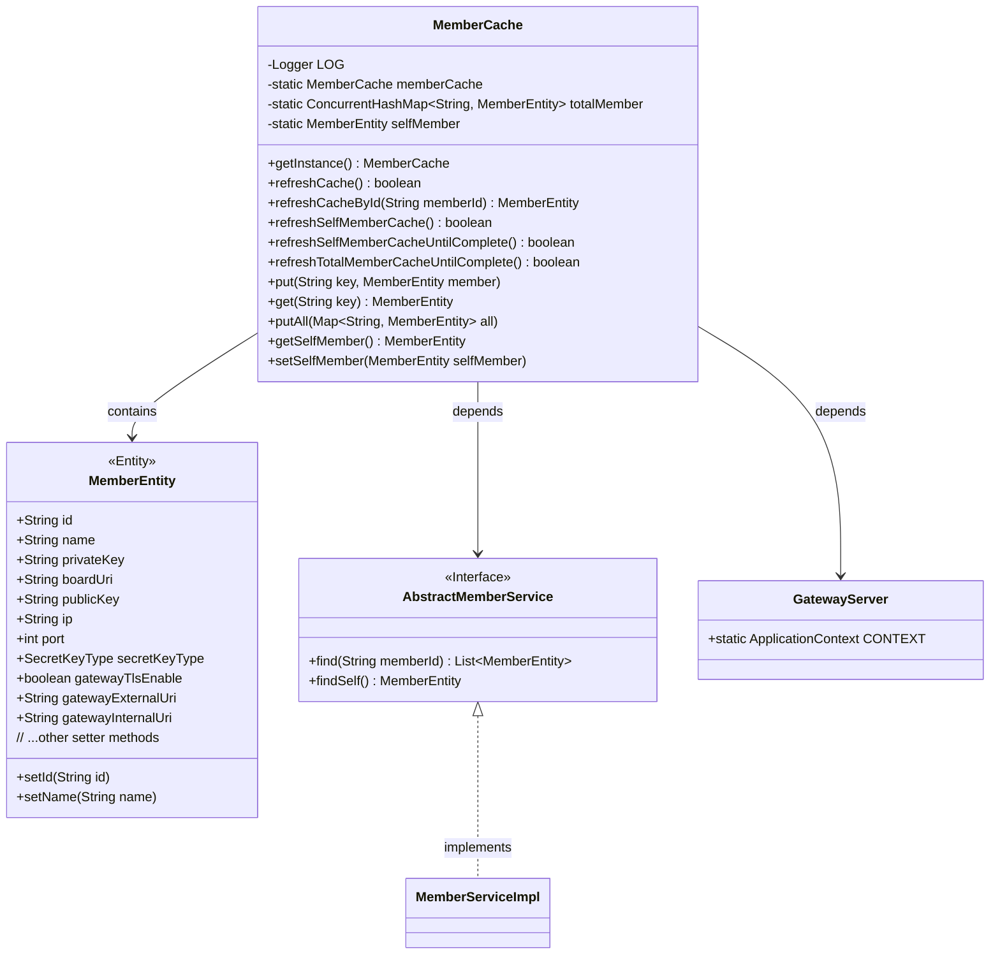
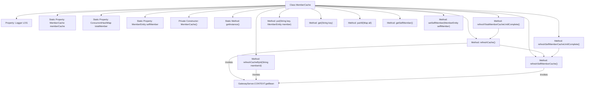

# Basic Information

|      |      |
|------|------|
| Name | MemberCache |
| Language | .java |
| Code Path | WeFe/gateway/src/main/java/com/welab/wefe/gateway/cache/MemberCache.java |
| Package Name | com.welab.wefe.gateway.cache |
| Dependencies | ['com.welab.wefe.common.constant.SecretKeyType', 'com.welab.wefe.common.util.ThreadUtil', 'com.welab.wefe.gateway.GatewayServer', 'com.welab.wefe.gateway.entity.MemberEntity', 'com.welab.wefe.gateway.service.base.AbstractMemberService', 'org.apache.commons.collections4.CollectionUtils', 'org.slf4j.Logger', 'org.slf4j.LoggerFactory', 'java.util.ArrayList', 'java.util.List', 'java.util.Map', 'java.util.concurrent.ConcurrentHashMap'] |
| Brief Description | The MemberCache class implements the singleton pattern to manage member information caching, including functionalities such as refreshing all or specified member caches, self-member information, and continuous refreshing until completion. |

# Description

MemberCache is a singleton class designed to manage the caching of member information. It utilizes a ConcurrentHashMap to store all member data, with member IDs as keys and member objects as values. The class provides methods to refresh the cache, including refreshing all member information, specified member information, and the member's own information. Refresh operations retrieve the latest data from the database, update the cache, and clean up deleted members. The class also offers basic cache operations such as adding and retrieving member information. The member's own information has dedicated properties and refresh methods, supporting continuous retries until database initialization is complete. All operations include exception handling and logging.

# Class Summary

| Name   | Type  | Description |
|-------|------|-------------|
| MemberCache | class | The MemberCache class is a singleton cache class used for storing and updating member information, including global members and the gateway's own members, providing cache refresh and query functionalities. |

## Class MemberCache

|      |      |
|------|------|
| Access Modifier | public |
| Type | class |
| Name | MemberCache |
| Description | The MemberCache class is a singleton cache class used for storing and updating member information, including global members and the gateway's own members, providing cache refresh and query functionalities. |

### UML Class Diagram

Class diagram description: This diagram illustrates a singleton-pattern MemberCache class for managing member information caching. Core functionalities include refreshing all/individual member caches, maintaining gateway self-member information, and storing all member data via ConcurrentHashMap. MemberCache relies on the AbstractMemberService interface for data retrieval and interacts with the MemberEntity entity class. GatewayServer provides Spring context support. The overall design demonstrates a thread-safe cache management mechanism.

### Internal Method Call Graph

This code demonstrates a singleton-pattern MemberCache class for managing member information caching. Core functionalities include refreshing the entire cache (refreshCache), refreshing individual members by ID (refreshCacheById), refreshing self-member information (refreshSelfMemberCache), and loop methods for persistent refreshing until completion. The class uses ConcurrentHashMap to store all member information and maintains the singleton instance through static member variables. The flowchart clearly illustrates the class structure, property relationships, and method invocation chains, particularly highlighting dependencies between refresh methods.

### Field List

| Name  | Type  | Description |
|-------|-------|------|
| LOG = LoggerFactory.getLogger(MemberCache.class) | Logger | The class MemberCache defines a private immutable logger LOG, which obtains an instance using LoggerFactory. |
| totalMember = new ConcurrentHashMap<>() | ConcurrentHashMap<String, MemberEntity> | Define a thread-safe ConcurrentHashMap variable named totalMember, with keys of type String and values of type MemberEntity. |
| selfMember = null | MemberEntity | The static member variable selfMember, of type MemberEntity, has an initial value of null. |
| memberCache = new MemberCache() | MemberCache | Declare a static private instance memberCache of the MemberCache class. |

### Method List

| Name  | Type  | Description |
|-------|-------|------|
| refreshCache | boolean | Cache refresh method: Prioritizes loading its own member information, queries all members and updates the cache, cleans up deleted members, returns true if successful, and returns false in case of failure or exception. |
| putAll | void | The method `putAll` merges all member entities from the input Map into `totalMember`. |
| refreshSelfMemberCache | boolean | Method to refresh member cache: Retrieve current member information; if it exists, update or initialize the properties of the selfMember object. Returns true on success, or false and logs an error message on failure. |
| put | void | Add a key-value pair to the mapping table totalMember, where the key is the string key and the value is the member object. |
| refreshCacheById | MemberEntity | The method `refreshCacheById` refreshes the cache by `memberId`: it queries member information, updates the cache if the member exists, removes the cache entry if the member does not exist, and logs exceptions before returning null. |
| refreshTotalMemberCacheUntilComplete | boolean | The method continuously attempts to refresh the member cache, returning true if successful. If it fails, it waits for 3 seconds before retrying and logs the event. |
| getSelfMember | MemberEntity | Get the current member entity object. |
| refreshSelfMemberCacheUntilComplete | boolean | The method continuously refreshes its own member cache until successful. If the refresh fails, it prompts that the member information is uninitialized and requires login completion, then waits for 3 seconds before retrying. |
| getInstance | MemberCache | This is a static method that returns the member cache instance memberCache. |
| setSelfMember | void | This method is used to set the current member entity, storing it in the static variable selfMember of MemberCache. |
| get | MemberEntity | Get the member entity corresponding to the specified key. |

