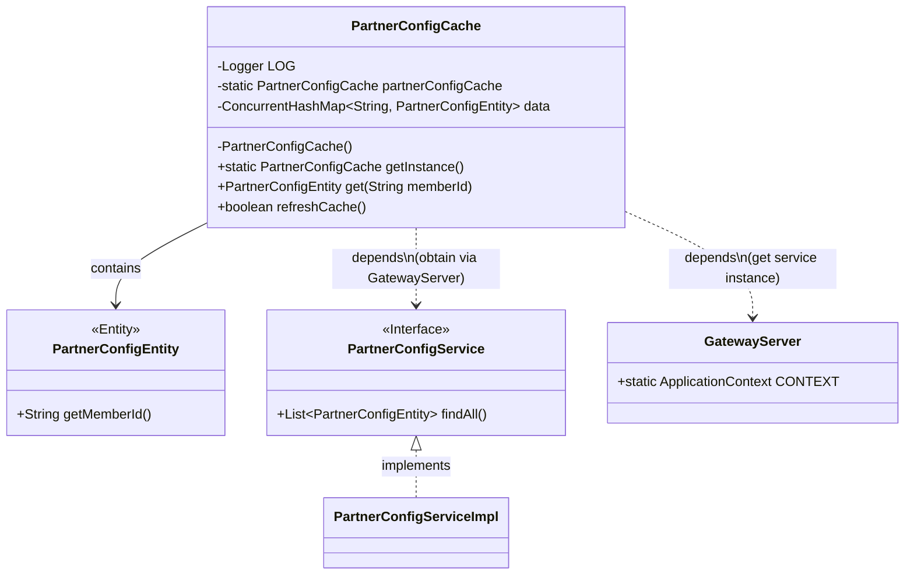
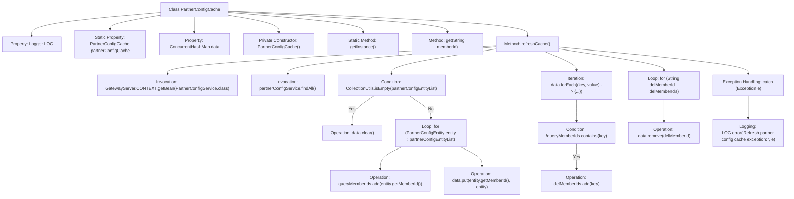

# Basic Information

|      |      |
|------|------|
| Name | PartnerConfigCache |
| Language | .java |
| Code Path | WeFe/gateway/src/main/java/com/welab/wefe/gateway/cache/PartnerConfigCache.java |
| Package Name | com.welab.wefe.gateway.cache |
| Dependencies | ['com.welab.wefe.gateway.GatewayServer', 'com.welab.wefe.gateway.entity.PartnerConfigEntity', 'com.welab.wefe.gateway.service.PartnerConfigService', 'org.slf4j.Logger', 'org.slf4j.LoggerFactory', 'org.springframework.util.CollectionUtils', 'java.util.ArrayList', 'java.util.List', 'java.util.concurrent.ConcurrentHashMap'] |
| Brief Description | PartnerConfigCache is a singleton class that uses ConcurrentHashMap to cache PartnerConfigEntity data, providing functions for retrieving and refreshing the cache. During refresh, it fetches data from the service and updates the cache, handling deleted items. In case of exceptions, it logs the error and returns a failure. |

# Description

PartnerConfigCache is a singleton class used for caching partner configuration information. It utilizes a ConcurrentHashMap to store PartnerConfigEntity objects, with memberId as the key. The class provides a getInstance method to retrieve the singleton instance and a get method to fetch configurations based on memberId. The refreshCache method is used to refresh the cache by retrieving all configurations via PartnerConfigService, updating them into the data, and cleaning up entries corresponding to deleted memberIds. If an operation fails, it logs an error and returns false.

# Class Summary

| Name   | Type  | Description |
|-------|------|-------------|
| PartnerConfigCache | class | PartnerConfigCache is a singleton class used for caching PartnerConfigEntity data, providing get and refreshCache methods to update the cache, and is thread-safe. |

## Class PartnerConfigCache

|      |      |
|------|------|
| Access Modifier | public |
| Type | class |
| Name | PartnerConfigCache |
| Description | PartnerConfigCache is a singleton class used for caching PartnerConfigEntity data, providing get and refreshCache methods to update the cache, and is thread-safe. |

### UML Class Diagram

Class diagram description: PartnerConfigCache is a singleton configuration cache class that uses ConcurrentHashMap to store PartnerConfigEntity objects for fast lookup by member ID. It relies on GatewayServer to obtain an instance of the PartnerConfigService interface for refreshing cached data, which clears deleted member configurations. The PartnerConfigService interface is implemented by PartnerConfigServiceImpl, and PartnerConfigEntity is an entity class containing configuration information such as member IDs.

### Internal Method Call Graph

This flowchart illustrates the core structure of the PartnerConfigCache class and the complete logic flow of the refreshCache method. Implemented as a singleton pattern configuration cache class, its core functionality involves retrieving the latest configuration data from PartnerConfigService via the refreshCache method, updating the internal ConcurrentHashMap cache, and cleaning up deleted member information. The process includes key steps such as service invocation, data iteration, conditional checks, and exception handling, fully reflecting the thread-safe cache update mechanism.

### Field List

| Name  | Type  | Description |
|-------|-------|------|
| partnerConfigCache = new PartnerConfigCache() | PartnerConfigCache | The private static variable partnerConfigCache is initialized as an instance of PartnerConfigCache. |
| LOG = LoggerFactory.getLogger(PartnerConfigCache.class) | Logger | Declare a private immutable log object LOG for logging in the PartnerConfigCache class. |
| data = new ConcurrentHashMap<>() | ConcurrentHashMap<String, PartnerConfigEntity> | Store PartnerConfigEntity objects in a thread-safe ConcurrentHashMap with String type keys. |

### Method List

| Name  | Type  | Description |
|-------|-------|------|
| get | PartnerConfigEntity | Get the partner configuration entity for the specified member ID. |
| getInstance | PartnerConfigCache | This is a static method that returns the singleton instance partnerConfigCache of the PartnerConfigCache class. |
| refreshCache | boolean | Cache refresh method: Retrieve all partner configurations, update data and clear invalid member information. Returns true if successful; logs the error and returns false if failed. |

