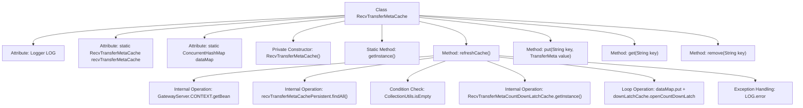

# Basic Information

|      |      |
|------|------|
| Name | RecvTransferMetaCache |
| Language | .java |
| Code Path | WeFe/gateway/src/main/java/com/welab/wefe/gateway/cache/RecvTransferMetaCache.java |
| Package Name | com.welab.wefe.gateway.cache |
| Dependencies | ['com.welab.wefe.gateway.GatewayServer', 'com.welab.wefe.gateway.api.meta.basic.GatewayMetaProto', 'com.welab.wefe.gateway.service.base.AbstractRecvTransferMetaCachePersistentService', 'org.apache.commons.collections4.CollectionUtils', 'org.slf4j.Logger', 'org.slf4j.LoggerFactory', 'java.util.List', 'java.util.concurrent.ConcurrentHashMap'] |
| Brief Description | The RecvTransferMetaCache class is a singleton-implemented cache manager that utilizes ConcurrentHashMap to store transfer metadata. It provides operations such as cache refreshing, addition, deletion, and query, while supporting data loading state synchronization via CountDownLatch. |

# Description

RecvTransferMetaCache is a singleton class designed to manage the cache of received transfer metadata. It utilizes a ConcurrentHashMap to store data, with strings as keys and TransferMeta objects as values. The class provides a static method getInstance to retrieve its instance. The refreshCache method loads data from the persistence service, clears the content body, sets the status to COMPLETE, and stores it in the cache, while notifying data readiness via CountDownLatchCache. It also offers basic put, get, and remove operations for cache management. Error logs are recorded in case of exceptions.

# Class Summary

| Name   | Type  | Description |
|-------|------|-------------|
| RecvTransferMetaCache | class | RecvTransferMetaCache is a singleton class that uses ConcurrentHashMap to store TransferMeta data, providing cache refresh, add/delete/query functions, and synchronizing states via CountDownLatch. |


## Class RecvTransferMetaCache

|      |      |
|------|------|
| Access Modifier | public |
| Type | class |
| Name | RecvTransferMetaCache |
| Description | RecvTransferMetaCache is a singleton class that uses ConcurrentHashMap to store TransferMeta data, providing cache refresh, add/delete/query functions, and synchronizing states via CountDownLatch. |


### UML Class Diagram

```mermaid
classDiagram
    class RecvTransferMetaCache {
        -Logger LOG
        -static RecvTransferMetaCache recvTransferMetaCache
        -static ConcurrentHashMap~String, GatewayMetaProto.TransferMeta~ dataMap
        -RecvTransferMetaCache()
        +static RecvTransferMetaCache getInstance()
        +boolean refreshCache()
        +void put(String key, GatewayMetaProto.TransferMeta value)
        +GatewayMetaProto.TransferMeta get(String key)
        +GatewayMetaProto.TransferMeta remove(String key)
    }

    class GatewayMetaProto.TransferMeta {
        <<Interface>>
    }

    class AbstractRecvTransferMetaCachePersistentService {
        <<Interface>>
        +List~GatewayMetaProto.TransferMeta~ findAll()
    }

    class RecvTransferMetaCountDownLatchCache {
        +static RecvTransferMetaCountDownLatchCache getInstance()
        +void openCountDownLatch(String sessionId)
    }

    class GatewayServer {
        // Context container
    }

    RecvTransferMetaCache --> GatewayMetaProto.TransferMeta : Stores
    RecvTransferMetaCache --> AbstractRecvTransferMetaCachePersistentService : Invokes : Depends on
    RecvTransferMetaCache --> RecvTransferMetaCountDownLatchCache : Collaborates : Depends on
    AbstractRecvTransferMetaCachePersistentService <|.. GatewayServer : Implements
```

This code describes a receive transfer metadata cache class RecvTransferMetaCache, which adopts the singleton pattern to manage in-memory ConcurrentHashMap data. Core functionalities include cache refresh (refreshCache), data access operations (put/get/remove), where refreshCache retrieves data through a persistent service and synchronously updates it to the in-memory cache and countdown latch. Class collaborations involve the GatewayMetaProto.TransferMeta data transfer protocol, persistent service abstract interface, and countdown latch cache, collectively forming a thread-safe data cache management system.


### Internal Method Call Graph



This code illustrates a singleton-pattern cache class RecvTransferMetaCache, primarily used for managing transfer metadata caching operations. Core functionalities include refreshing cached data from the persistence layer via the refreshCache method, thread-safe data storage using ConcurrentHashMap, and synchronization control through the CountDownLatch mechanism. The flowchart clearly presents the class structure, key method invocation relationships, and the complex internal processing flow of refreshCache, including critical steps such as service retrieval, data querying, null checks, loop processing, and exception logging.

### Field List

| Name  | Type  | Description |
|-------|-------|------|
| dataMap = new ConcurrentHashMap<>() | ConcurrentHashMap<String, GatewayMetaProto.TransferMeta> | Private static concurrent hash map with string keys and transport metadata values. |
| recvTransferMetaCache = new RecvTransferMetaCache() | RecvTransferMetaCache | The private static variable recvTransferMetaCache is initialized as an instance of RecvTransferMetaCache. |
| LOG = LoggerFactory.getLogger(RecvTransferMetaCache.class) | Logger | The class RecvTransferMetaCache defines a private immutable logger LOG for recording log information. |

### Method List

| Name  | Type  | Description |
|-------|-------|------|
| refreshCache | boolean | The `refreshCache` method refreshes the cache by retrieving the `TransferMeta` list from the persistent service. If the list is empty, it returns success; otherwise, it clears the existing content, stores it in memory, sets the status to `COMPLETE`, and updates the countdown lock cache. It returns `true` on success or logs the error and returns `false` on failure. |
| getInstance | RecvTransferMetaCache | This is a static method that returns an instance of the singleton object recvTransferMetaCache. |
| put | void | This method stores key-value pairs into the dataMap, where the key is a string and the value is of the type GatewayMetaProto.TransferMeta. |
| get | GatewayMetaProto.TransferMeta | The method `get` retrieves the corresponding `TransferMeta` object from `dataMap` using the key. |
| remove | GatewayMetaProto.TransferMeta | Remove the transmission metadata corresponding to the specified key and return it. |


