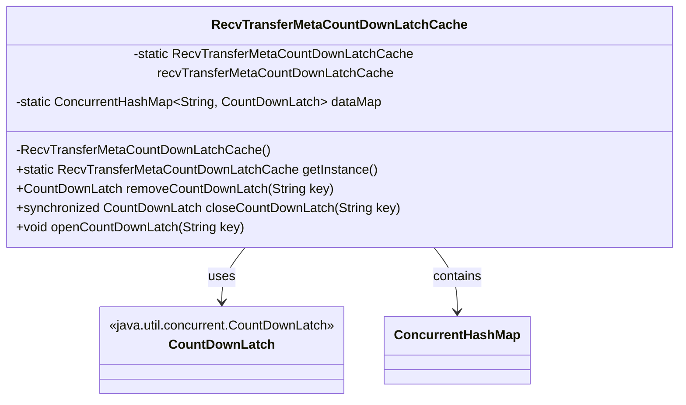
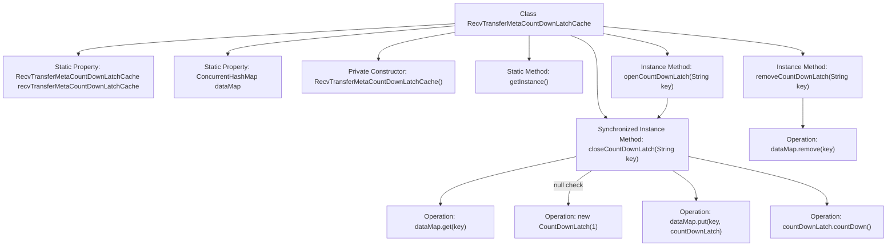

# Basic Information

|      |      |
|------|------|
| Name | RecvTransferMetaCountDownLatchCache |
| Language | .java |
| Code Path | WeFe/gateway/src/main/java/com/welab/wefe/gateway/cache/RecvTransferMetaCountDownLatchCache.java |
| Package Name | com.welab.wefe.gateway.cache |
| Dependencies | ['java.util.concurrent.ConcurrentHashMap', 'java.util.concurrent.CountDownLatch'] |
| Brief Description | The singleton class `RecvTransferMetaCountDownLatchCache` uses `ConcurrentHashMap` to store `CountDownLatch` and provides methods for removing, closing, and opening latches. |

# Description

This class implements a singleton-pattern cache manager designed to store and manage CountDownLatch objects based on string keys. It ensures singleton behavior through a private constructor and provides a global access point via getInstance. Core functionalities include: removing a specified latch via removeCountDownLatch; the closeCountDownLatch method synchronously creates or retrieves an existing latch (initial count set to 1); while openCountDownLatch triggers the countdown operation (decrement by 1) for the specified key's latch. All latches are stored in a ConcurrentHashMap to guarantee thread safety.

# Class Summary

| Name   | Type  | Description |
|-------|------|-------------|
| RecvTransferMetaCountDownLatchCache | class | The singleton class RecvTransferMetaCountDownLatchCache manages CountDownLatch in ConcurrentHashMap, providing methods to remove, close, and open latches. |

## Class RecvTransferMetaCountDownLatchCache

|      |      |
|------|------|
| Access Modifier | public |
| Type | class |
| Name | RecvTransferMetaCountDownLatchCache |
| Description | The singleton class RecvTransferMetaCountDownLatchCache manages CountDownLatch in ConcurrentHashMap, providing methods to remove, close, and open latches. |

### UML Class Diagram

This code implements a singleton-pattern CountDownLatch cache manager, which uses ConcurrentHashMap to store key-value pairs and provides thread-safe creation, removal, and triggering of CountDownLatch functionality. The class diagram illustrates the core data structure dependencies, where the private static instance and ConcurrentHashMap ensure global uniqueness and thread safety. The three public methods respectively implement the removal, creation/retrieval, and triggering of the counter functionality.

### Internal Method Call Graph

This code implements a ConcurrentHashMap-based CountDownLatch cache singleton class, primarily used for inter-thread synchronization control. Core functionalities include: creating/retrieving a latch for a specified key via closeCountDownLatch, triggering latch release with openCountDownLatch, and removing latches through removeCountDownLatch. All operations are thread-safe, with closeCountDownLatch employing synchronized methods to ensure atomicity. The flowchart clearly illustrates the class structure, method invocation relationships, and data operation flows, particularly highlighting the critical path of latch creation and triggering.

### Field List

| Name  | Type  | Description |
|-------|-------|------|
| recvTransferMetaCountDownLatchCache = new RecvTransferMetaCountDownLatchCache() | RecvTransferMetaCountDownLatchCache | The static variable recvTransferMetaCountDownLatchCache is initialized as an instance of RecvTransferMetaCountDownLatchCache. |
| dataMap = new ConcurrentHashMap<>() | ConcurrentHashMap<String, CountDownLatch> | Private static concurrent hash map with string keys and countdown latch values. |

### Method List

| Name  | Type  | Description |
|-------|-------|------|
| closeCountDownLatch | CountDownLatch | The synchronization method retrieves or creates a CountDownLatch based on the key and returns it. If it does not exist, a new one is created and stored in the map. |
| getInstance | RecvTransferMetaCountDownLatchCache | Get the singleton instance of the countdown lock cache for receiving transmission metadata. |
| removeCountDownLatch | CountDownLatch | Remove the countdown lock corresponding to the specified key and return it. |
| openCountDownLatch | void | This method closes via the key and triggers the countdown lock's decrement operation. |

