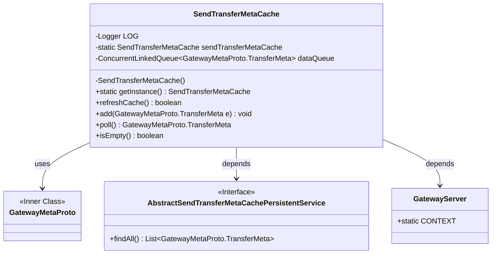
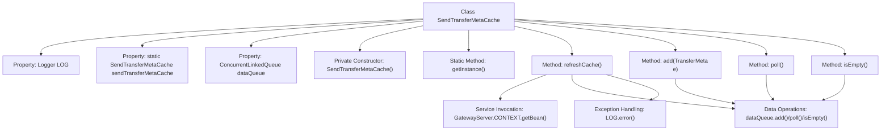

# Basic Information

|      |      |
|------|------|
| Name | SendTransferMetaCache |
| Language | .java |
| Code Path | WeFe/gateway/src/main/java/com/welab/wefe/gateway/cache/SendTransferMetaCache.java |
| Package Name | com.welab.wefe.gateway.cache |
| Dependencies | ['com.welab.wefe.gateway.GatewayServer', 'com.welab.wefe.gateway.api.meta.basic.GatewayMetaProto', 'com.welab.wefe.gateway.service.base.AbstractSendTransferMetaCachePersistentService', 'org.apache.commons.collections4.CollectionUtils', 'org.slf4j.Logger', 'org.slf4j.LoggerFactory', 'java.util.List', 'java.util.concurrent.ConcurrentLinkedQueue'] |
| Brief Description | The `SendTransferMetaCache` class is a singleton cache that utilizes a `ConcurrentLinkedQueue` to store `TransferMeta` data, providing functionalities such as cache refresh, addition, retrieval, and emptiness checking. |

# Description

SendTransferMetaCache is a singleton class designed to manage a data queue of the type GatewayMetaProto.TransferMeta. It contains a thread-safe ConcurrentLinkedQueue for storing data and provides the getInstance method to retrieve the instance. Core functionalities include refreshCache for loading data from persistent storage into the queue, add for inserting elements, poll for retrieving elements, and isEmpty for checking the queue's state. Error logs are recorded in case of exceptions.

# Class Summary

| Name   | Type  | Description |
|-------|------|-------------|
| SendTransferMetaCache | class | SendTransferMetaCache is a singleton class that utilizes a concurrent queue to store TransferMeta data, providing functionalities such as cache refreshing, adding, retrieving, and checking for emptiness. |

## Class SendTransferMetaCache

|      |      |
|------|------|
| Access Modifier | public |
| Type | class |
| Name | SendTransferMetaCache |
| Description | SendTransferMetaCache is a singleton class that utilizes a concurrent queue to store TransferMeta data, providing functionalities such as cache refreshing, adding, retrieving, and checking for emptiness. |

### UML Class Diagram

This code illustrates a singleton-pattern `SendTransferMetaCache` class designed to manage a cache queue for transfer metadata. It includes thread-safe queue operations, cache refresh functionality, and retrieves the persistent service interface implementation via Spring context. The class diagram clearly depicts dependencies with the `GatewayMetaProto` data class, persistent service interface, and server context, demonstrating how the core cache management functionality interacts with external components.

### Internal Method Call Graph

This flowchart illustrates the complete structure of the SendTransferMetaCache class, a thread-safe cache class designed using the singleton pattern. Core functionalities include loading data into the queue from persistent services via the refreshCache method, providing queue operation methods such as add/poll/isEmpty, and built-in exception logging. All operations are thread-safe based on ConcurrentLinkedQueue, where refreshCache involves Spring context service retrieval and batch data loading processes, while other methods directly manipulate the queue. The flowchart clearly presents class properties, singleton construction, main method invocation relationships, and exception handling paths.

### Field List

| Name  | Type  | Description |
|-------|-------|------|
| LOG = LoggerFactory.getLogger(SendTransferMetaCache.class) | Logger | The class SendTransferMetaCache defines a private immutable logger LOG, which is created using LoggerFactory. |
| sendTransferMetaCache = new SendTransferMetaCache() | SendTransferMetaCache | The private static variable sendTransferMetaCache is initialized as an instance of SendTransferMetaCache. |
| dataQueue = new ConcurrentLinkedQueue<>() | ConcurrentLinkedQueue<GatewayMetaProto.TransferMeta> | Concurrent-safe queue for storing and transferring metadata. |

### Method List

| Name  | Type  | Description |
|-------|-------|------|
| refreshCache | boolean | The refreshCache method attempts to retrieve a list of TransferMeta from the persistent service. If the list is not empty, it adds the data to the dataQueue, returning true upon success. If it fails, it logs the error and returns false. |
| add | void | The method `add` appends the parameter `e` of type `GatewayMetaProto.TransferMeta` to the `dataQueue` queue. |
| poll | GatewayMetaProto.TransferMeta | The method `poll` retrieves and returns a `TransferMeta` object from the `dataQueue`. |
| isEmpty | boolean | Check if the queue is empty and return a boolean value. |
| getInstance | SendTransferMetaCache | This is a Java static method that returns an instance named sendTransferMetaCache. |

