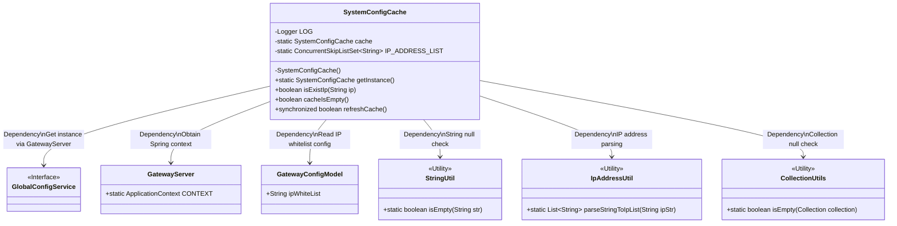
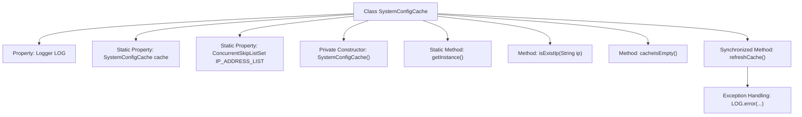

# Basic Information

|      |      |
|------|------|
| Name | SystemConfigCache |
| Language | .java |
| Code Path | WeFe/gateway/src/main/java/com/welab/wefe/gateway/cache/SystemConfigCache.java |
| Package Name | com.welab.wefe.gateway.cache |
| Dependencies | ['com.welab.wefe.common.util.IpAddressUtil', 'com.welab.wefe.common.util.StringUtil', 'com.welab.wefe.common.wefe.dto.global_config.GatewayConfigModel', 'com.welab.wefe.gateway.GatewayServer', 'com.welab.wefe.gateway.service.GlobalConfigService', 'org.slf4j.Logger', 'org.slf4j.LoggerFactory', 'org.springframework.util.CollectionUtils', 'java.util.ArrayList', 'java.util.List', 'java.util.concurrent.ConcurrentSkipListSet'] |
| Brief Description | The SystemConfigCache class implements the IP whitelist functionality, including singleton pattern, IP existence checking, cache refresh, and empty cache judgment methods. It supports wildcard matching and synchronous updates. |

# Description

SystemConfigCache is a singleton class designed to manage system IP whitelist configuration caching. It utilizes ConcurrentSkipListSet to store IP address lists, providing thread-safe operations. Key functionalities include: checking if an IP exists in the whitelist (supporting wildcard matching), determining whether the cache is empty, and synchronously refreshing cached data. During refresh operations, it retrieves the latest configuration from GlobalConfigService and updates the IP list through comparison. Exceptions are logged with corresponding operation status returned.

# Class Summary

| Name   | Type  | Description |
|-------|------|-------------|
| SystemConfigCache | class | The `SystemConfigCache` class is a singleton-implemented IP whitelist cache that includes functionalities for IP address existence checking, cache refreshing, and empty cache determination, with support for wildcard matching. |

## Class SystemConfigCache

|      |      |
|------|------|
| Access Modifier | public |
| Type | class |
| Name | SystemConfigCache |
| Description | The `SystemConfigCache` class is a singleton-implemented IP whitelist cache that includes functionalities for IP address existence checking, cache refreshing, and empty cache determination, with support for wildcard matching. |

### UML Class Diagram

This code demonstrates a singleton-pattern SystemConfigCache class primarily managing IP whitelists. The class contains IP validation, cache refresh functionalities, and stores IP lists thread-safely using ConcurrentSkipListSet. It relies on Spring context to obtain GlobalConfigService for reading gateway configurations, and utilizes multiple utility classes for string processing, IP parsing, and collection operations. The synchronized refreshCache method ensures thread safety while handling edge cases of empty configurations. The overall design reflects thread-safe and defensive programming principles.

### Internal Method Call Graph

This code implements a system configuration cache class that manages an IP whitelist using the singleton pattern. Core functionalities include: 1) Checking if an IP exists in the whitelist via the isExistIp method, supporting wildcard matching; 2) Synchronously updating cached data through the refreshCache method, fetching the latest whitelist from a global configuration service; 3) Thread-safe design, utilizing ConcurrentSkipListSet to store IP addresses and synchronized methods for updates. The flowchart illustrates the class structure and method invocation relationships, including property initialization, IP validation logic, and cache refresh mechanisms.

### Field List

| Name  | Type  | Description |
|-------|-------|------|
| IP_ADDRESS_LIST = new ConcurrentSkipListSet<>() | ConcurrentSkipListSet<String> | Define a thread-safe concurrent ordered collection IP_ADDRESS_LIST for storing IP addresses of string type. |
| LOG = LoggerFactory.getLogger(SystemConfigCache.class) | Logger | An immutable logger instance is declared in the system configuration cache class. |
| cache = new SystemConfigCache() | SystemConfigCache | The private static variable cache is initialized as an instance of SystemConfigCache. |

### Method List

| Name  | Type  | Description |
|-------|-------|------|
| getInstance | SystemConfigCache | This is a static method that returns the singleton instance `cache` of the `SystemConfigCache` class. |
| isExistIp | boolean | Check if an IP exists in the list, supporting wildcard matching. Empty IP returns false, wildcard * matches any IP, and partial matching is also valid. |
| cacheIsEmpty | boolean | Check if the IP address list is empty, return true if it is empty, otherwise return false. |
| refreshCache | boolean | Synchronization method to refresh cache: Retrieve gateway configuration, parse IP whitelist, update IP address list, return true upon success, or return false and log exceptions if any. |

