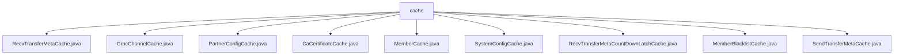

# Basic Information

|      |      |
|------|------|
| Name | cache |
| Language | .java |
| Code Path | WeFe/gateway/src/main/java/com/welab/wefe/gateway/cache |
| Package Name | docs.gateway.src.main.java.com.welab.wefe.gateway.cache |
| Brief Description | RecvTransferMetaCache manages transfer metadata caching, GrpcChannelCache handles gRPC channels, PartnerConfigCache caches partner configurations, CaCertificateCache stores CA certificates, MemberCache manages member information, SystemConfigCache processes IP whitelists, CountDownLatchCache oversees latches, MemberBlacklistCache maintains blacklists, and SendTransferMetaCache manages transfer data queues. All are implemented as thread-safe singletons. |

# Description

## Overview  
This module is a cache management component within the gateway system, employing the singleton pattern to centrally manage various core data (e.g., transfer metadata, gRPC channels, partner configurations, etc.). All caches are stored using thread-safe containers (such as ConcurrentHashMap/ConcurrentSkipListSet) and support dynamic refresh and expiration cleanup. For instance, GrpcChannelCache utilizes ExpiringMap to implement automatic 24-hour expiration, while SystemConfigCache validates IP whitelists through wildcard matching.  

The interface specification includes three standard operations: singleton retrieval (getInstance), data access (get/put), and cache refresh (refreshCache). Key data structures include TransferMeta (transfer metadata), ChannelInfo (gRPC channel information), PartnerConfigEntity (partner configuration), and others. Dependencies involve persistence services (e.g., PartnerConfigService), TLS encryption, logging components, and gRPC's ManagedChannel.  

## Key Business Scenarios  
The module primarily supports data relay and security control in the gateway, operating similarly to a message hub. For example, RecvTransferMetaCache synchronizes metadata readiness states via CountDownLatchCache, while GrpcChannelCache maintains long-lived gRPC connections for cross-node communication. A typical workflow is: receive request → validate blacklist (MemberBlacklistCache) → verify IP whitelist (SystemConfigCache) → forward data via cached channels (GrpcChannelCache).  

Business interactions include two modes: proactive refresh (e.g., PartnerConfigCache periodically fetches the latest configurations) and event-driven (e.g., SendTransferMetaCache triggers data transmission via queues). API integration examples cover TLS channel establishment (GrpcChannelCache.getNonNull), certificate validation (CaCertificateCache.getAll), member information synchronization (MemberCache continuously retries initialization), and other scenarios. All operations feature built-in exception handling and logging capabilities.

### Package Internal Structure View

This flowchart illustrates the file structure of the cache module in the WeFe Gateway project. With the cache directory as the root node, it includes 9 Java class files related to caching, covering implementations for different functionalities such as transfer metadata, gRPC channels, partner configurations, CA certificates, and member information. All files are directly under the cache directory with no subdirectory hierarchy.

# File List

| Name   | Type  | Description |
|-------|------|-------------|
| [RecvTransferMetaCache.java](RecvTransferMetaCache.md) | file | The RecvTransferMetaCache class is a singleton-implemented cache manager that utilizes ConcurrentHashMap to store transfer metadata. It provides operations such as cache refresh, addition, deletion, and query, while supporting data loading state synchronization via CountDownLatch. |
| [GrpcChannelCache.java](GrpcChannelCache.md) | file | The GrpcChannelCache class implements the singleton pattern, utilizing ExpiringMap to cache gRPC channels with TLS configuration support, automatically expiring and closing channels after 24 hours of inactivity. |
| [PartnerConfigCache.java](PartnerConfigCache.md) | file | PartnerConfigCache is a singleton class that uses ConcurrentHashMap to cache PartnerConfigEntity data, providing functions to retrieve and refresh the cache. During refresh, it fetches data from the service and updates the cache while handling deleted items. In case of exceptions, it logs the error and returns a failure status. |
| [CaCertificateCache.java](CaCertificateCache.md) | file | The `CaCertificateCache` class is a singleton cache designed to store `CaCertificate` objects, providing functionalities such as refreshing the cache, and retrieving individual or all certificates. |
| [MemberCache.java](MemberCache.md) | file | The MemberCache class implements the singleton pattern, manages member information caching, and includes functionalities such as refreshing all or specified member caches, its own member information, and continuous refreshing until completion. |
| [SystemConfigCache.java](SystemConfigCache.md) | file | The SystemConfigCache class implements the IP whitelist functionality, including singleton pattern, IP existence check, cache refresh, and empty cache judgment methods. It supports wildcard matching and synchronous updates. |
| [RecvTransferMetaCountDownLatchCache.java](RecvTransferMetaCountDownLatchCache.md) | file | The singleton class `RecvTransferMetaCountDownLatchCache` uses `ConcurrentHashMap` to store `CountDownLatch`, providing methods to remove, close, and open the latches. |
| [MemberBlacklistCache.java](MemberBlacklistCache.md) | file | The `MemberBlacklistCache` class is used to manage member blacklist caching, providing singleton access, cache refresh, and member existence checking functionalities. It stores blacklisted IDs via `ConcurrentSkipListSet`, updates cached data from the database through the `refreshCache` method, and checks whether a member is on the blacklist using `isExistBlacklist`. |
| [SendTransferMetaCache.java](SendTransferMetaCache.md) | file | The `SendTransferMetaCache` class is a singleton cache that utilizes a `ConcurrentLinkedQueue` to store `TransferMeta` data, providing functionalities such as cache refresh, addition, retrieval, and emptiness checking. |

