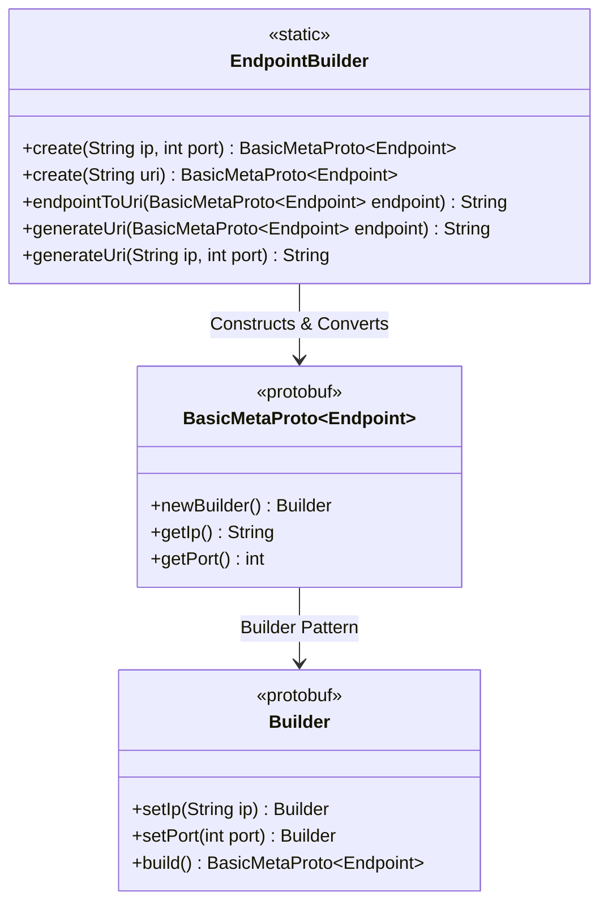
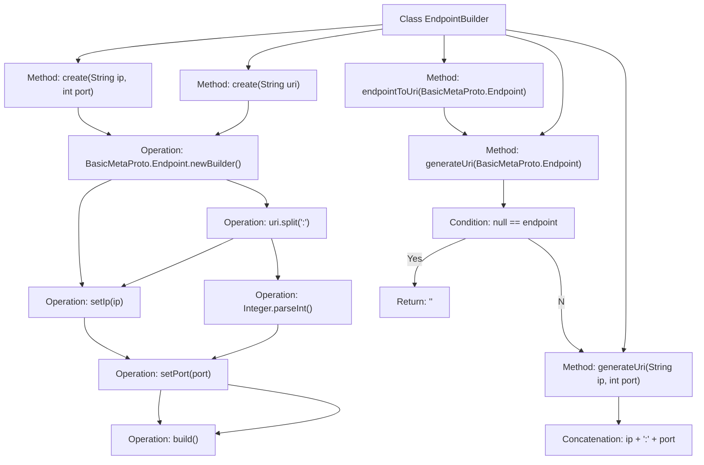

# Basic Information

|      |      |
|------|------|
| Name | EndpointBuilder |
| Language | .java |
| Code Path | WeFe/gateway/src/main/java/com/welab/wefe/gateway/common/EndpointBuilder.java |
| Package Name | com.welab.wefe.gateway.common |
| Dependencies | ['com.welab.wefe.gateway.api.meta.basic.BasicMetaProto'] |
| Brief Description | The EndpointBuilder class provides static methods to create and transform Endpoint objects, supporting IP-port combinations or URI string inputs, and can convert Endpoint objects into URI format. |

# Description

The EndpointBuilder class provides methods for creating and converting network endpoints. It includes two static create methods: one directly creates an Endpoint object using an IP and port, while the other parses a URI string to create the object. The endpointToUri and generateUri methods convert an Endpoint object or an IP-port pair into a URI string formatted as "IP:port". Empty endpoints are handled by returning an empty string. All methods are static utility methods and do not involve instantiation.

# Class Summary

| Name   | Type  | Description |
|-------|------|-------------|
| EndpointBuilder | class | The EndpointBuilder class provides methods for creating and transforming Endpoint objects, supporting input in IP port or URI formats, and can reversely generate URI strings. |

## Class EndpointBuilder

|      |      |
|------|------|
| Access Modifier | public |
| Type | class |
| Name | EndpointBuilder |
| Description | The EndpointBuilder class provides methods for creating and transforming Endpoint objects, supporting input in IP port or URI formats, and can reversely generate URI strings. |

### UML Class Diagram

This code demonstrates an endpoint utility class EndpointBuilder that provides various static methods to create and convert BasicMetaProto.Endpoint objects. The class diagram clearly illustrates three core components: the EndpointBuilder utility class, the BasicMetaProto.Endpoint protobuf class, and its internal Builder class. EndpointBuilder creates Endpoint objects through two approaches (direct parameters or URI strings) and offers bidirectional conversion functionality (between endpoint objects and URI strings). The design employs the Builder pattern with method chaining for property setting, ultimately constructing immutable objects, showcasing excellent encapsulation and flexibility.

### Internal Method Call Graph

This flowchart illustrates the core functional structure of the EndpointBuilder class. The class provides two ways to create Endpoint objects (via IP/port or URI string) and methods to convert Endpoint to URI strings. Key paths include: 1) Constructing Endpoint objects via the Builder pattern; 2) URI string parsing and concatenation processing; 3) Null-safety validation logic. All methods are static utility methods, embodying the high-cohesion design principle, making it particularly suitable for standardized network endpoint address handling scenarios.

### Field List

| Name  | Type  | Description |
|-------|-------|------|

### Method List

| Name  | Type  | Description |
|-------|-------|------|
| create | BasicMetaProto.Endpoint | The static method `create` accepts a URI string, parses the IP and port, constructs and returns an `Endpoint` object. |
| create | BasicMetaProto.Endpoint | Static method creates an Endpoint object by passing in IP and port parameters, returning the constructed Endpoint instance. |
| generateUri | String | Method for generating URI: Concatenate the IP and port into a string in the format "IP:Port". |
| generateUri | String | Static method to generate a URI with an Endpoint object as the parameter. If the object is null, return an empty string; otherwise, call the overloaded method by passing the IP and port to generate the URI. |
| endpointToUri | String | Static methods convert the Endpoint object into a URI string by invoking generateUri. |

