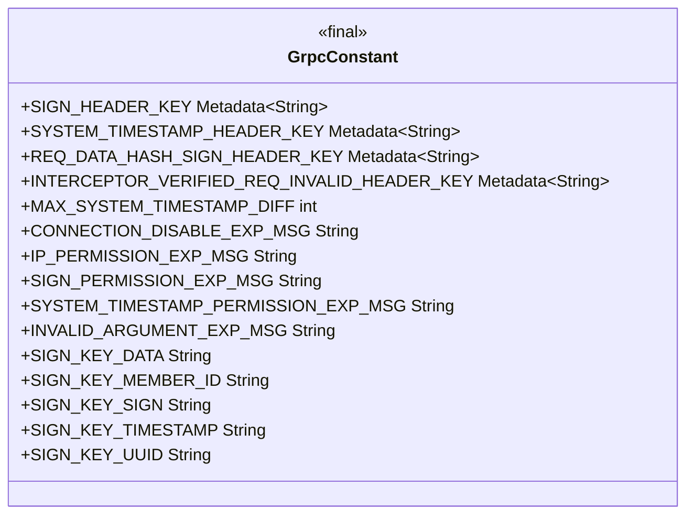

# Basic Information

|      |      |
|------|------|
| Name | GrpcConstant |
| Language | .java |
| Code Path | WeFe/gateway/src/main/java/com/welab/wefe/gateway/common/GrpcConstant.java |
| Package Name | com.welab.wefe.gateway.common |
| Dependencies | ['io.grpc.Metadata'] |
| Brief Description | The GrpcConstant class defines gRPC request header constants, exception keywords, and signature JSON structure keys, including headers for signature verification, system timestamps, request data hashes, as well as maximum time difference limits and various permission exception prompts. |

# Description

The GrpcConstant class defines constants for gRPC communication, including request header key names and exception message keywords. The request header key names involve signature verification, system timestamp, request data hash, and interceptor validation identifiers. The maximum allowable difference for the system timestamp is 300 seconds. Exception message keywords cover scenarios such as connection unavailability, IP whitelisting, signature verification failure, abnormal system timestamp, and data tampering. Additionally, it defines key names in the signature JSON structure, such as data, member ID, signature, timestamp, and UUID.

# Class Summary

| Name   | Type  | Description |
|-------|------|-------------|
| GrpcConstant | class | The GrpcConstant class defines gRPC request header constants, exception keywords, and JSON structure keys for signatures, including header information such as signature verification, system timestamp, request data hash, as well as maximum time difference and various permission exception prompts. |

## Class GrpcConstant

|      |      |
|------|------|
| Access Modifier | public |
| Type | class |
| Name | GrpcConstant |
| Description | The GrpcConstant class defines gRPC request header constants, exception keywords, and JSON structure keys for signatures, including header information such as signature verification, system timestamp, request data hash, as well as maximum time difference and various permission exception prompts. |

### UML Class Diagram

Class diagram description: GrpcConstant is a utility class containing gRPC-related constants. It defines metadata keys for signature verification, system timestamps, request data hashing, etc., as well as exception message keywords for connection errors, IP whitelisting, and signature validation. It also includes key field names for JSON signature structures. All fields are of public static final type for global access.

### Internal Method Call Graph

```mermaid
graph TD
    A["Class GrpcConstant"]
    B["Constant: SIGN_HEADER_KEY"]
    C["Constant: SYSTEM_TIMESTAMP_HEADER_KEY"]
    D["Constant: REQ_DATA_HASH_SIGN_HEADER_KEY"]
    E["Constant: INTERCEPTOR_VERIFIED_REQ_INVALID_HEADER_KEY"]
    F["Constant: MAX_SYSTEM_TIMESTAMP_DIFF"]
    G["Constant: CONNECTION_DISABLE_EXP_MSG"]
    H["Constant: IP_PERMISSION_EXP_MSG"]
    I["Constant: SIGN_PERMISSION_EXP_MSG"]
    J["Constant: SYSTEM_TIMESTAMP_PERMISSION_EXP_MSG"]
    K["Constant: INVALID_ARGUMENT_EXP_MSG"]
    L["Constant: SIGN_KEY_DATA"]
    M["Constant: SIGN_KEY_MEMBER_ID"]
    N["Constant: SIGN_KEY_SIGN"]
    O["Constant: SIGN_KEY_TIMESTAMP"]
    P["Constant: SIGN_KEY_UUID"]

    A --> B
    A --> C
    A --> D
    A --> E
    A --> F
    A --> G
    A --> H
    A --> I
    A --> J
    A --> K
    A --> L
    A --> M
    A --> N
    A --> O
    A --> P
```

This flowchart illustrates all constants defined in the GrpcConstant class and their relationships. GrpcConstant is a utility class containing gRPC-related constants, primarily categorized into three types: request header key constants (e.g., signature verification, timestamp), exception message constants (e.g., connection unavailable, IP whitelist), and signature JSON structure key constants (e.g., memberId, timestamp). These constants are used to uniformly manage various configurations and error messages during gRPC communication, ensuring code consistency and maintainability.

### Field List

| Name  | Type  | Description |
|-------|-------|------|
| CONNECTION_DISABLE_EXP_MSG = "UNAVAILABLE" | String | Static constant string with the value "UNAVAILABLE", representing the error message for unavailable connection. |
| SYSTEM_TIMESTAMP_HEADER_KEY = Metadata.Key.of("system_timestamp_header_key", Metadata.ASCII_STRING_MARSHALLER) | Metadata.Key<String> | A static constant SYSTEM_TIMESTAMP_HEADER_KEY is defined, of type Metadata.Key<String>, used to store the system timestamp header key in ASCII string format. |
| MAX_SYSTEM_TIMESTAMP_DIFF = 300 | int | The static constant MAX_SYSTEM_TIMESTAMP_DIFF has a value of 300, indicating the maximum allowable difference in system timestamps. |
| SIGN_KEY_MEMBER_ID = "memberId" | String | Define the constant SIGN_KEY_MEMBER_ID with the value "memberId". |
| INTERCEPTOR_VERIFIED_REQ_INVALID_HEADER_KEY = Metadata.Key.of("interceptor_verify_req_invalid_header_key", Metadata.ASCII_STRING_MARSHALLER) | Metadata.Key<String> | Defined a static constant Metadata.Key to identify the interceptor's verification request for invalid headers, with the key name "interceptor_verify_req_invalid_header_key," using an ASCII string marshaller. |
| INVALID_ARGUMENT_EXP_MSG = "INVALID_ARGUMENT" | String | Define a constant string representing the invalid parameter exception message. |
| REQ_DATA_HASH_SIGN_HEADER_KEY = Metadata.Key.of("req_data_hash_sign_header_key", Metadata.ASCII_STRING_MARSHALLER) | Metadata.Key<String> | Define a static constant REQ_DATA_HASH_SIGN_HEADER_KEY of type Metadata.Key<String> to store the request data hash signature header key in ASCII string format. |
| SYSTEM_TIMESTAMP_PERMISSION_EXP_MSG = "FAILED_PRECONDITION" | String | The static constant SYSTEM_TIMESTAMP_PERMISSION_EXP_MSG has a value of "FAILED_PRECONDITION", indicating a system timestamp permission expiration error. |
| SIGN_KEY_DATA = "data" | String | Define a static constant SIGN_KEY_DATA with the value "data". |
| SIGN_HEADER_KEY = Metadata.Key.of("sign_header_key", Metadata.ASCII_STRING_MARSHALLER) | Metadata.Key<String> | Defined a static constant SIGN_HEADER_KEY of type Metadata.Key<String>, representing the signature header key for ASCII strings. |
| SIGN_PERMISSION_EXP_MSG = "UNAUTHENTICATED" | String | The static constant SIGN_PERMISSION_EXP_MSG has a value of "UNAUTHENTICATED", representing the unauthenticated error message. |
| SIGN_KEY_TIMESTAMP = "timestamp" | String | Define a static constant SIGN_KEY_TIMESTAMP with the value "timestamp". |
| SIGN_KEY_SIGN = "sign" | String | Define the static constant SIGN_KEY_SIGN with the value "sign". |
| IP_PERMISSION_EXP_MSG = "PERMISSION_DENIED" | String | The static constant string IP_PERMISSION_EXP_MSG is defined as the permission denial prompt message "PERMISSION_DENIED". |
| SIGN_KEY_UUID = "uuid" | String | Define the static constant SIGN_KEY_UUID with the value "uuid". |

### Method List

| Name  | Type  | Description |
|-------|-------|------|

