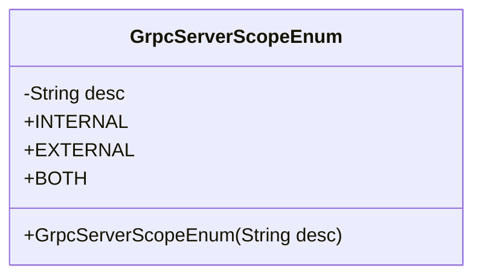
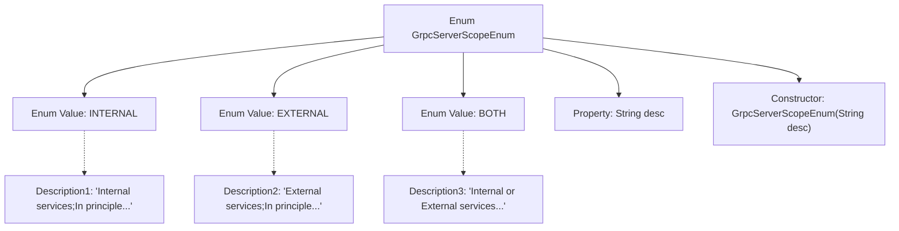

# Basic Information

|      |      |
|------|------|
| Name | GrpcServerScopeEnum |
| Language | .java |
| Code Path | WeFe/gateway/src/main/java/com/welab/wefe/gateway/common/GrpcServerScopeEnum.java |
| Package Name | com.welab.wefe.gateway.common |
| Dependencies | [] |
| Brief Description | GrpcServerScopeEnum defines the scope of gRPC services: INTERNAL for intranet calls only, EXTERNAL for public network calls, and BOTH supporting both intranet and public network calls. |

# Description

GrpcServerScopeEnum is an enumeration type that defines three service scopes for gRPC servers. INTERNAL represents service interfaces exclusively for internal network calls; EXTERNAL denotes service interfaces provided for public network calls; BOTH indicates service interfaces that support both internal and external network calls. Each enum value includes corresponding descriptive information to clarify its applicable scenarios and invocation principles.

# Class Summary

| Name   | Type  | Description |
|-------|------|-------------|
| GrpcServerScopeEnum | enum | GrpcServerScopeEnum defines the scope of gRPC services: INTERNAL for intranet-only calls, EXTERNAL for public network-only calls, and BOTH supporting calls from both intranet and public network. |

## Class GrpcServerScopeEnum

|      |      |
|------|------|
| Access Modifier | public |
| Type | enum |
| Name | GrpcServerScopeEnum |
| Description | GrpcServerScopeEnum defines the scope of gRPC services: INTERNAL for intranet-only calls, EXTERNAL for public network-only calls, and BOTH supporting calls from both intranet and public network. |

### UML Class Diagram

This code defines an enum class `GrpcServerScopeEnum` to represent three types of gRPC server scopes: internal service (INTERNAL), external service (EXTERNAL), and both (BOTH). Each enum value has a description field `desc`, initialized via the constructor. This enum class is primarily used to identify the access scope of gRPC services, distinguishing between services that are only callable within an internal network, only publicly accessible, or both.

### Internal Method Call Graph

This flowchart illustrates the structure of the GrpcServerScopeEnum enumeration, which includes three enum values (INTERNAL/EXTERNAL/BOTH) and their corresponding descriptive texts. Each enum value initializes the desc property through a constructor. The enumeration encapsulates the descriptive texts via a private constructor, clearly delineating three types of gRPC service network scopes (internal-only/public-only/hybrid network).

### Field List

| Name  | Type  | Description |
|-------|-------|------|

### Method List

| Name  | Type  | Description |
|-------|-------|------|

