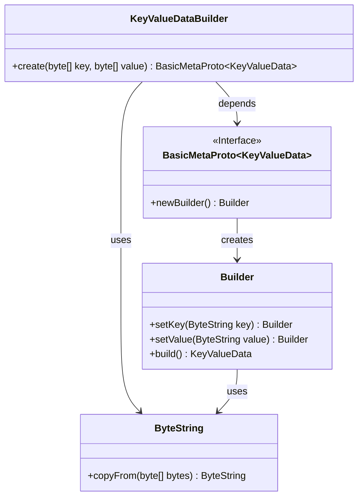
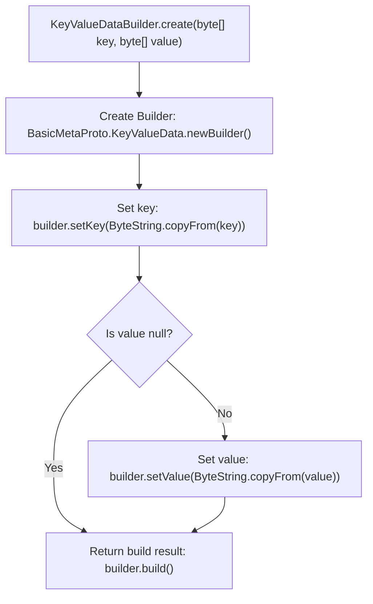

# Basic Information

|      |      |
|------|------|
| Name | KeyValueDataBuilder |
| Language | .java |
| Code Path | WeFe/gateway/src/main/java/com/welab/wefe/gateway/common/KeyValueDataBuilder.java |
| Package Name | com.welab.wefe.gateway.common |
| Dependencies | ['com.google.protobuf.ByteString', 'com.welab.wefe.gateway.api.meta.basic.BasicMetaProto'] |
| Brief Description | The KeyValueDataBuilder class provides a static method `create` to construct a KeyValueData object using key and value byte arrays, where the value can be null. |

# Description

The KeyValueDataBuilder class provides a static method called create for constructing KeyValueData objects. This method takes two byte array parameters, key and value, and sets the key-value data through KeyValueData.Builder. The key parameter is mandatory and will be converted to the ByteString type; the value parameter is optional and, if non-null, will also be converted to ByteString. Finally, it returns the constructed KeyValueData instance.

# Class Summary

| Name   | Type  | Description |
|-------|------|-------------|
| KeyValueDataBuilder | class | The KeyValueDataBuilder class provides a static method create, which constructs a KeyValueData object by passing in key and value byte arrays, with the value being optional. |

## Class KeyValueDataBuilder

|      |      |
|------|------|
| Access Modifier | public |
| Type | class |
| Name | KeyValueDataBuilder |
| Description | The KeyValueDataBuilder class provides a static method create, which constructs a KeyValueData object by passing in key and value byte arrays, with the value being optional. |

### UML Class Diagram

This code demonstrates a KeyValueDataBuilder class that constructs BasicMetaProto.KeyValueData objects through its static create method. The process involves ByteString handling byte arrays, the Builder pattern for setting key-value pairs, and ultimately returning the constructed data object. The class diagram clearly reflects the dependencies between components, including interface definitions, the builder pattern, and utility class collaboration.

### Internal Method Call Graph

This flowchart illustrates the execution logic of the `create` method in the `KeyValueDataBuilder` class. The method first creates a Builder object, then mandatorily sets the `key` field, followed by checking whether `value` is null. If not null, it sets the `value` field, and finally constructs and returns the `KeyValueData` object. The process clearly demonstrates conditional branching and the setting of required fields, making it suitable for protocol buffer construction scenarios involving key-value pair data.

### Field List

| Name  | Type  | Description |
|-------|-------|------|

### Method List

| Name  | Type  | Description |
|-------|-------|------|
| create | BasicMetaProto.KeyValueData | Static method creates a key-value data object, sets the key and optional value, then returns the constructed result. |

