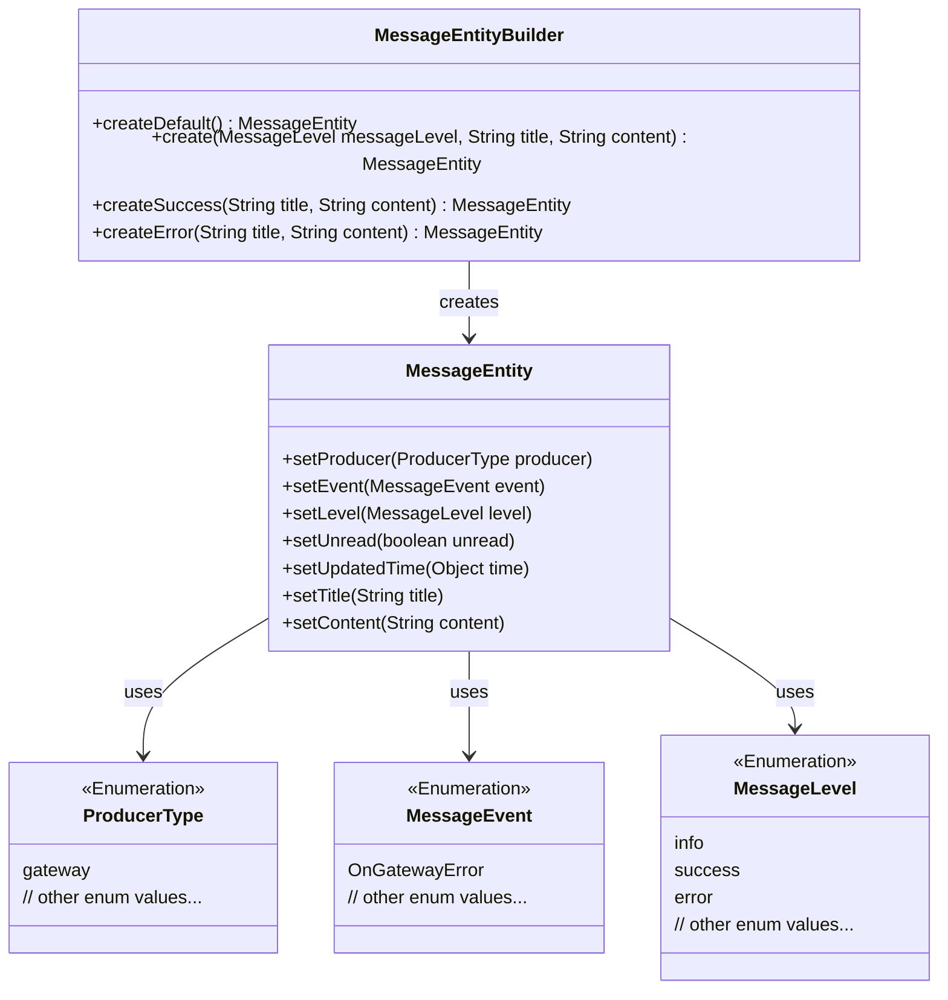
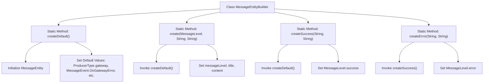

# Basic Information

|      |      |
|------|------|
| Name | MessageEntityBuilder |
| Language | .java |
| Code Path | WeFe/gateway/src/main/java/com/welab/wefe/gateway/common/MessageEntityBuilder.java |
| Package Name | com.welab.wefe.gateway.common |
| Dependencies | ['com.welab.wefe.common.wefe.enums.MessageEvent', 'com.welab.wefe.common.wefe.enums.MessageLevel', 'com.welab.wefe.common.wefe.enums.ProducerType', 'com.welab.wefe.gateway.entity.MessageEntity'] |
| Brief Description | The MessageEntityBuilder class provides static methods to create message entities, with default settings for producer type as gateway, event as OnGatewayError, level as info, unread status, and no update time. It supports customizing levels, titles, and content, as well as quickly creating success or error messages. |

# Description

The `MessageEntityBuilder` class provides static methods for creating `MessageEntity` instances. The `createDefault` method generates an entity with default configurations, setting the producer type to `gateway`, the event to `OnGatewayError`, the message level to `info`, the unread status to `true`, and the update time to `null`. The `create` method allows customization of the message level, title, and content. The `createSuccess` and `createError` methods create message entities with success and error levels respectively, inheriting the default configurations while setting the corresponding levels. All methods maintain the unread status and null update time.

# Class Summary

| Name   | Type  | Description |
|-------|------|-------------|
| MessageEntityBuilder | class | The MessageEntityBuilder class provides static methods to create message entities, supporting default configurations, custom levels, success and error messages, as well as setting titles, content, unread status, and empty update times. |

## Class MessageEntityBuilder

|      |      |
|------|------|
| Access Modifier | public |
| Type | class |
| Name | MessageEntityBuilder |
| Description | The MessageEntityBuilder class provides static methods to create message entities, supporting default configurations, custom levels, success and error messages, as well as setting titles, content, unread status, and empty update times. |

### UML Class Diagram

This code demonstrates a `MessageEntityBuilder` class that provides various static factory methods to create and configure `MessageEntity` objects. The `MessageEntity` class includes multiple property-setting methods involving three enumeration types: `ProducerType` (producer type), `MessageEvent` (message event), and `MessageLevel` (message level). The Builder pattern offers default configurations through the `createDefault()` method and supports creating messages of different levels via methods like `create()`, `createSuccess()`, and `createError()`, where `createError()` reuses the logic of `createSuccess()` while modifying the message level. All methods return fully configured `MessageEntity` instances, showcasing the encapsulation and flexibility of factory methods.

### Internal Method Call Graph

This flowchart illustrates the structure of the MessageEntityBuilder class and the invocation relationships among its static methods. The createDefault() method initializes the entity and sets default values, while other creation methods (create, createSuccess, createError) are all built upon createDefault() through chained calls to achieve message creation at different levels. The createError() method reuses the logic of createSuccess() with only the level modified, demonstrating code reuse design. All methods ultimately return a configured MessageEntity instance.

### Field List

| Name  | Type  | Description |
|-------|-------|------|

### Method List

| Name  | Type  | Description |
|-------|-------|------|
| create | MessageEntity | Method for creating message entity: Set message level, title, content, mark as unread, and clear update time. |
| createDefault | MessageEntity | Create a default message entity, set the producer as the gateway, the event as a gateway error, the level as information, the status as unread, and the update time as empty. |
| createSuccess | MessageEntity | Method for creating a success message entity: Set the title, content, success level, and unread status, clear the update time, and return the entity. |
| createError | MessageEntity | Static method creates an error message entity, sets the title and content, marks it as error level, and returns it. |

