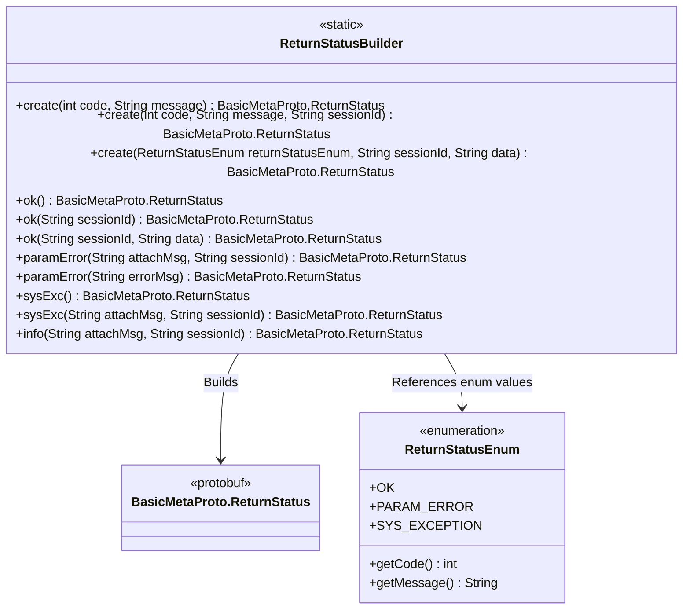
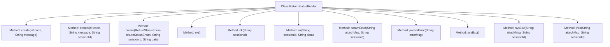

# Basic Information

|      |      |
|------|------|
| Name | ReturnStatusBuilder |
| Language | .java |
| Code Path | WeFe/gateway/src/main/java/com/welab/wefe/gateway/common/ReturnStatusBuilder.java |
| Package Name | com.welab.wefe.gateway.common |
| Dependencies | ['com.welab.wefe.gateway.api.meta.basic.BasicMetaProto'] |
| Brief Description | The `ReturnStatusBuilder` class provides multiple static methods to create `BasicMetaProto.ReturnStatus` objects, supporting the configuration of status codes, messages, session IDs, and data. It includes common statuses such as success, parameter errors, and system exceptions. |

# Description

The `ReturnStatusBuilder` class provides various static methods for constructing `BasicMetaProto.ReturnStatus` objects. Its primary functionalities include: creating basic statuses via `code` and `message`; supporting the addition of `sessionId` and `data` fields; offering predefined shortcut methods for common statuses such as `OK`, `PARAM_ERROR`, and `SYS_EXCEPTION`; and allowing some methods to append additional information to the `message`. All methods utilize the Builder pattern to construct return status objects, enabling flexible construction with different parameter combinations.

# Class Summary

| Name   | Type  | Description |
|-------|------|-------------|
| ReturnStatusBuilder | class | The ReturnStatusBuilder class provides static methods to create BasicMetaProto.ReturnStatus objects, supporting the configuration of status codes, messages, session IDs, and data. It includes commonly used statuses such as success, parameter errors, and system exceptions. |

## Class ReturnStatusBuilder

|      |      |
|------|------|
| Access Modifier | public |
| Type | class |
| Name | ReturnStatusBuilder |
| Description | The ReturnStatusBuilder class provides static methods to create BasicMetaProto.ReturnStatus objects, supporting the configuration of status codes, messages, session IDs, and data. It includes commonly used statuses such as success, parameter errors, and system exceptions. |

### UML Class Diagram

This code demonstrates a static utility class `ReturnStatusBuilder` specifically designed to construct `BasicMetaProto.ReturnStatus` response objects for various scenarios. The class provides 9 static factory methods to create standardized return statuses containing status codes, messages, session IDs, and additional data. The core logic involves constructing objects using Protobuf's Builder pattern and retrieving predefined status codes and message templates from the `ReturnStatusEnum` enumeration. Key design features include: support for basic status construction, shortcut methods for success/parameter error/system exception scenarios, as well as message concatenation and session tracking capabilities, reflecting a standardized and extensible design for response objects.

### Internal Method Call Graph

This code defines a utility class named ReturnStatusBuilder, primarily used for constructing BasicMetaProto.ReturnStatus objects. The class provides multiple static factory methods for creating return status objects with different states and parameters. The methods are categorized into three types: basic creation methods (create series), success status methods (ok series), and error status methods (paramError/sysExc series). All methods follow the Builder pattern, setting properties such as code, message, sessionId, and data through chained calls, ultimately generating immutable objects via the build() method.

### Field List

| Name  | Type  | Description |
|-------|-------|------|

### Method List

| Name  | Type  | Description |
|-------|-------|------|
| create | BasicMetaProto.ReturnStatus | Static methods create and return status objects containing code and message fields. |
| create | BasicMetaProto.ReturnStatus | Static method creates a ReturnStatus object, setting the code, message, and sessionId fields. |
| paramError | BasicMetaProto.ReturnStatus | The static method `paramError` generates a parameter error state object, which includes the error code, additional message, and session ID. |
| ok | BasicMetaProto.ReturnStatus | Static methods return an OK status, including status code and message. |
| sysExc | BasicMetaProto.ReturnStatus | This method returns the system exception status, including predefined error codes and messages. |
| ok | BasicMetaProto.ReturnStatus | The static method ok returns a success status, including the session ID and data, using the OK enum to set the status code and message. |
| paramError | BasicMetaProto.ReturnStatus | The static method `paramError` returns the parameter error state, including the error code and message. |
| create | BasicMetaProto.ReturnStatus | Static method creates a ReturnStatus object, sets the status code, message, session ID, and data fields, then returns the constructed result. |
| ok | BasicMetaProto.ReturnStatus | The static method returns a success status, including an OK status code, message, and session ID. |
| sysExc | BasicMetaProto.ReturnStatus | The static method sysExc returns the system exception status, including the error code, additional message, and session ID. |
| info | BasicMetaProto.ReturnStatus | The static method `info` returns a `BasicMetaProto.ReturnStatus` object, sets the status code to OK, and attaches a message and session ID to indicate a successful operation. |

