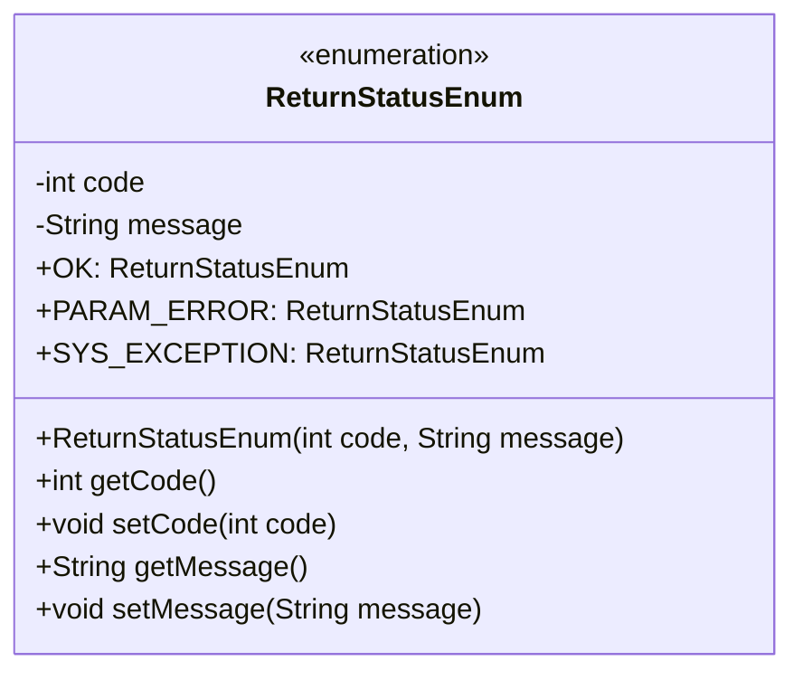
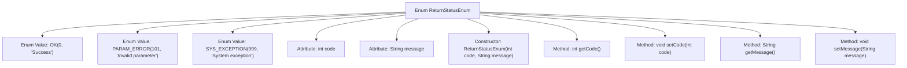

# Basic Information

|      |      |
|------|------|
| Name | ReturnStatusEnum |
| Language | .java |
| Code Path | WeFe/gateway/src/main/java/com/welab/wefe/gateway/common/ReturnStatusEnum.java |
| Package Name | com.welab.wefe.gateway.common |
| Dependencies | [] |
| Brief Description | The enumeration class ReturnStatusEnum defines three states: Success (0), Parameter Error (101), and System Exception (999), containing status codes and description information, and provides getter and setter methods. |

# Description

This is an enumeration class named ReturnStatusEnum, which defines three return statuses: OK indicates success with a status code of 0; PARAM_ERROR indicates a parameter error with a status code of 101; SYS_EXCEPTION indicates a system exception with a status code of 999. Each enumeration item includes an integer status code and a string-type description. The class provides a constructor to initialize these two fields and generates getter and setter methods for them to allow external access and modification.

# Class Summary

| Name   | Type  | Description |
|-------|------|-------------|
| ReturnStatusEnum | enum | The enumeration ReturnStatusEnum defines three states: success (0), parameter error (101), and system exception (999), including status codes and description information. |

## Class ReturnStatusEnum

|      |      |
|------|------|
| Access Modifier | public |
| Type | enum |
| Name | ReturnStatusEnum |
| Description | The enumeration ReturnStatusEnum defines three states: success (0), parameter error (101), and system exception (999), including status codes and description information. |

### UML Class Diagram

This code defines an enumeration class ReturnStatusEnum, which represents different return statuses. The enumeration includes three instances: OK (success), PARAM_ERROR (parameter error), and SYS_EXCEPTION (system exception). Each instance has a corresponding status code and description message, initialized via the constructor, and provides getter and setter methods. Enumeration classes are commonly used to define a fixed set of constants, suitable for scenarios such as status codes and error types.

### Internal Method Call Graph

This flowchart illustrates the structure of the ReturnStatusEnum, which includes three enum values (OK, PARAM_ERROR, SYS_EXCEPTION), two attributes (code and message), a constructor, and four accessor methods (getCode, setCode, getMessage, setMessage). The enum initializes status codes and descriptive messages through its constructor and provides getter/setter methods for access and modification, facilitating standardized management of system status codes.

### Field List

| Name  | Type  | Description |
|-------|-------|------|

### Method List

| Name  | Type  | Description |
|-------|-------|------|

