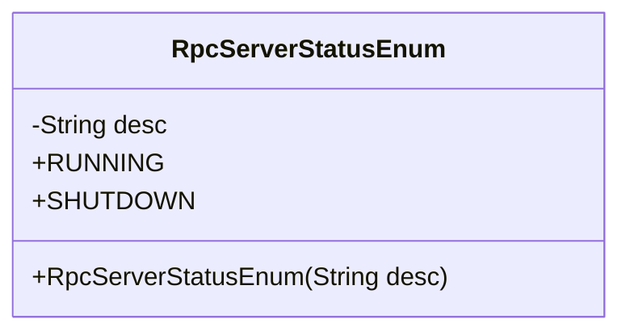
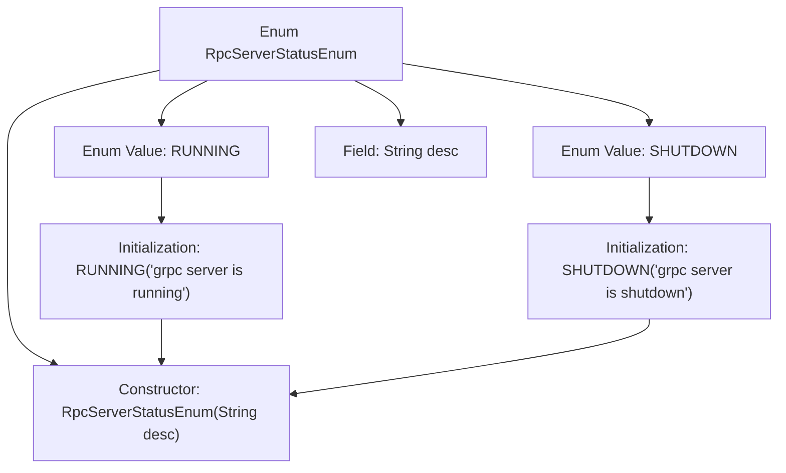

# Basic Information

|      |      |
|------|------|
| Name | RpcServerStatusEnum |
| Language | .java |
| Code Path | WeFe/gateway/src/main/java/com/welab/wefe/gateway/common/RpcServerStatusEnum.java |
| Package Name | com.welab.wefe.gateway.common |
| Dependencies | [] |
| Brief Description | The enumeration RpcServerStatusEnum defines the status of a gRPC server: RUNNING indicates it is operational, SHUTDOWN indicates it has been shut down, and includes a description field desc. |

# Description

This enumeration class defines two states of a gRPC server: RUNNING and SHUTDOWN. Each state includes corresponding descriptive information, initialized via the constructor. The description for the enum item RUNNING is "grpc server is running," and for SHUTDOWN, it is "grpc server is shutdown." This design is used to clearly identify and manage the operational state of a gRPC server.

# Class Summary

| Name   | Type  | Description |
|-------|------|-------------|
| RpcServerStatusEnum | enum | The enumeration RpcServerStatusEnum defines the status of a gRPC server: RUNNING indicates it is operational, SHUTDOWN indicates it is shut down, and includes a description field desc. |

## Class RpcServerStatusEnum

|      |      |
|------|------|
| Access Modifier | public |
| Type | enum |
| Name | RpcServerStatusEnum |
| Description | The enumeration RpcServerStatusEnum defines the status of a gRPC server: RUNNING indicates it is operational, SHUTDOWN indicates it is shut down, and includes a description field desc. |

### UML Class Diagram

This code defines an enum class `RpcServerStatusEnum` to represent the operational states of a gRPC server. The enum contains two constants: `RUNNING` indicates the server is active, while `SHUTDOWN` signifies the server is terminated. Each enum constant has a description field `desc` initialized via the constructor. This enum class succinctly encapsulates server status information, facilitating clear distinction between states in code.

### Internal Method Call Graph

This code defines an enum type `RpcServerStatusEnum` containing two enum values `RUNNING` and `SHUTDOWN`, representing the operational states of a gRPC server. Each enum value initializes a description field `desc` through a constructor to store specific state descriptions. The flowchart illustrates the structure of the enum class, its fields, constructor, and the initialization process of enum values, clearly reflecting the code's organizational relationships and data flow.

### Field List

| Name  | Type  | Description |
|-------|-------|------|

### Method List

| Name  | Type  | Description |
|-------|-------|------|

