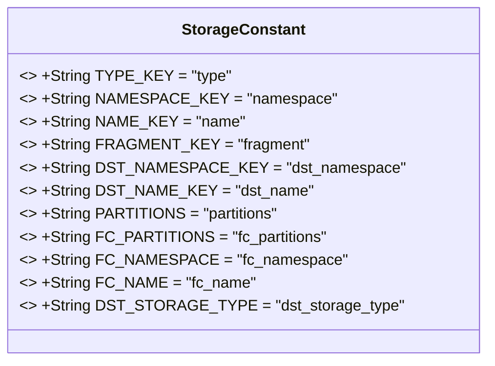

# Basic Information

|      |      |
|------|------|
| Name | StorageConstant |
| Language | .java |
| Code Path | WeFe/gateway/src/main/java/com/welab/wefe/gateway/common/StorageConstant.java |
| Package Name | com.welab.wefe.gateway.common |
| Dependencies | [] |
| Brief Description | The StorageConstant class defines constant key names related to storage, including fields such as type, namespace, name, fragment, target namespace, target name, partition, etc. |

# Description

This is a Java public class named StorageConstant, which defines multiple static constant string fields used to represent storage-related key names. It includes type key, namespace key, name key, fragment key, target namespace key, target name key, partition key, FC partition key, FC namespace key, FC name key, and target storage type key. These constants may be used as parameter identifiers when configuring or operating a storage system.

# Class Summary

| Name   | Type  | Description |
|-------|------|-------------|
| StorageConstant | class | Storage constant class defines key name constants, including type, namespace, name, fragment, target namespace, target name, partition, FC partition, FC namespace, FC name, and target storage type. |

## Class StorageConstant

|      |      |
|------|------|
| Access Modifier | public |
| Type | class |
| Name | StorageConstant |
| Description | Storage constant class defines key name constants, including type, namespace, name, fragment, target namespace, target name, partition, FC partition, FC namespace, FC name, and target storage type. |

### UML Class Diagram

This class diagram illustrates a utility class named StorageConstant, which solely contains 12 public static constant string fields for storing various key names related to the storage system. All constant fields are marked as final, indicating their values are determined at compile time and cannot be modified. Designed as a non-instantiable constant container, this class provides unified references to storage-related configuration key names for applications, avoiding hard-coded strings scattered throughout the codebase. The constants follow a naming convention of all uppercase letters with underscore separators, clearly expressing the purpose of each key.

### Internal Method Call Graph

```mermaid
graph TD
    A["Class StorageConstant"]
    B["Constant: TYPE_KEY = 'type'"]
    C["Constant: NAMESPACE_KEY = 'namespace'"]
    D["Constant: NAME_KEY = 'name'"]
    E["Constant: FRAGMENT_KEY = 'fragment'"]
    F["Constant: DST_NAMESPACE_KEY = 'dst_namespace'"]
    G["Constant: DST_NAME_KEY = 'dst_name'"]
    H["Constant: PARTITIONS = 'partitions'"]
    I["Constant: FC_PARTITIONS = 'fc_partitions'"]
    J["Constant: FC_NAMESPACE = 'fc_namespace'"]
    K["Constant: FC_NAME = 'fc_name'"]
    L["Constant: DST_STORAGE_TYPE = 'dst_storage_type'"]

    A --> B
    A --> C
    A --> D
    A --> E
    A --> F
    A --> G
    A --> H
    A --> I
    A --> J
    A --> K
    A --> L
```

This code defines a class named StorageConstant containing 12 static constant string fields, all declared as public static final, indicating they are public, immutable class-level constants. These constants primarily serve as key names in the storage system, such as type, namespace, name, etc., along with special-purpose keys like destination storage type (dst_storage_type) and partition-related keys (partitions, fc_partitions). These constants may be referenced elsewhere in the system to centrally manage storage-related key names, avoiding hard-coded strings scattered throughout the codebase.

### Field List

| Name  | Type  | Description |
|-------|-------|------|
| PARTITIONS = "partitions" | String | Define a static constant PARTITIONS with the value of the string "partitions". |
| DST_NAME_KEY = "dst_name" | String | Define the constant DST_NAME_KEY with the value being the string "dst_name". |
| FC_NAME = "fc_name" | String | Defined a public static constant string FC_NAME with the value "fc_name". |
| DST_STORAGE_TYPE = "dst_storage_type" | String | Defined a public static constant string DST_STORAGE_TYPE with the value "dst_storage_type". |
| NAMESPACE_KEY = "namespace" | String | Define a static constant NAMESPACE_KEY with the value "namespace". |
| NAME_KEY = "name" | String | Define a static constant string NAME_KEY with the value "name". |
| TYPE_KEY = "type" | String | Define a static constant string TYPE_KEY with the value "type". |
| FC_NAMESPACE = "fc_namespace" | String | Define a static constant string FC_NAMESPACE with the value "fc_namespace". |
| DST_NAMESPACE_KEY = "dst_namespace" | String | Define a static constant string DST_NAMESPACE_KEY with the value "dst_namespace". |
| FC_PARTITIONS = "fc_partitions" | String | Define a static constant string FC_PARTITIONS with the value "fc_partitions". |
| FRAGMENT_KEY = "fragment" | String | Define a static constant string FRAGMENT_KEY with the value "fragment". |

### Method List

| Name  | Type  | Description |
|-------|-------|------|

