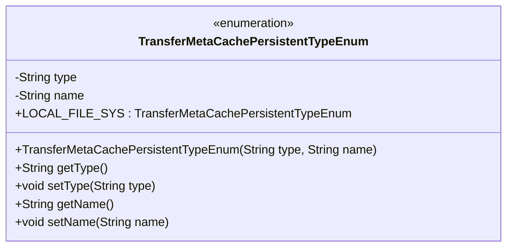
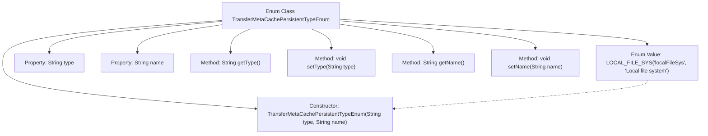

# Basic Information

|      |      |
|------|------|
| Name | TransferMetaCachePersistentTypeEnum |
| Language | .java |
| Code Path | WeFe/gateway/src/main/java/com/welab/wefe/gateway/common/TransferMetaCachePersistentTypeEnum.java |
| Package Name | com.welab.wefe.gateway.common |
| Dependencies | [] |
| Brief Description | The enumeration class defines the persistence type of transmission metadata cache, including local file system type and name attributes, providing constructors and accessors. |

# Description

The code defines an enumeration class `TransferMetaCachePersistentTypeEnum`, which represents the persistence types of transfer metadata cache. Currently, it only includes one enumeration value `LOCAL_FILE_SYS`, indicating the use of a local file system for persistence. The enumeration class contains two private attributes, `type` and `name`, representing the type and description respectively, initialized via a constructor. Getter and setter methods are provided to access and modify these two attributes. This enumeration class can be used to manage and identify different persistence storage methods.

# Class Summary

| Name   | Type  | Description |
|-------|------|-------------|
| TransferMetaCachePersistentTypeEnum | enum | Enumeration class defines the metadata cache persistence types for transmission, including local file system type, with attributes `type` and `name` along with corresponding getter/setter methods. |

## Class TransferMetaCachePersistentTypeEnum

|      |      |
|------|------|
| Access Modifier | public |
| Type | enum |
| Name | TransferMetaCachePersistentTypeEnum |
| Description | Enumeration class defines the metadata cache persistence types for transmission, including local file system type, with attributes `type` and `name` along with corresponding getter/setter methods. |

### UML Class Diagram

This enumeration class defines the persistence types for transfer metadata caching, including the LOCAL_FILE_SYS enum value representing the local file system type. The class contains two private attributes, type and name, which indicate the type and descriptive name respectively, along with corresponding getter and setter methods. The enumeration constructor is used to initialize these two attributes, with the overall structure clearly demonstrating the encapsulation relationship between enum constants and their associated properties.

### Internal Method Call Graph

This flowchart illustrates the structure of the enum class TransferMetaCachePersistentTypeEnum, which includes one enum value LOCAL_FILE_SYS, two private properties type and name, a constructor, and four accessor methods. The enum value initializes the properties through the constructor, while the class provides getter and setter methods for the properties. This design pattern is commonly used to define enum types with fixed options and additional attributes, suitable for scenarios requiring type-safe configuration.

### Field List

| Name  | Type  | Description |
|-------|-------|------|

### Method List

| Name  | Type  | Description |
|-------|-------|------|

