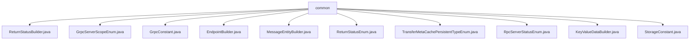

# Basic Information

|      |      |
|------|------|
| Name | common |
| Language | .java |
| Code Path | WeFe/gateway/src/main/java/com/welab/wefe/gateway/common |
| Package Name | docs.gateway.src.main.java.com.welab.wefe.gateway.common |
| Brief Description | The `ReturnStatusBuilder` class provides methods for constructing return statuses. `GrpcServerScopeEnum` defines the gRPC service scope enumeration. `GrpcConstant` contains gRPC communication constants. `EndpointBuilder` handles network endpoint creation and conversion. `MessageEntityBuilder` creates message entities. `ReturnStatusEnum` defines the return status enumeration. `TransferMetaCachePersistentTypeEnum` represents the persistence type. `RpcServerStatusEnum` identifies the gRPC server status. `KeyValueDataBuilder` constructs key-value data. `StorageConstant` defines storage-related constants. |

# Description

## Overview  
This module serves as the core toolkit for the gateway system, primarily responsible for gRPC communication state management, endpoint conversion, and message entity construction. It uniformly encapsulates return status construction (e.g., enumerations like OK/PARAM_ERROR) through the Builder pattern, supporting custom message levels and key-value data. It defines gRPC service scope enumerations (INTERNAL/EXTERNAL/BOTH) and runtime states (RUNNING/SHUTDOWN), akin to metadata identifiers for service governance.  

Key data structures include BasicMetaProto.ReturnStatus, MessageEntity, and KeyValueData, with ByteString used for handling binary data. External dependencies are limited to Protocol Buffers serialization. For example, TransferMetaCachePersistentTypeEnum defines persistence methods like LOCAL_FILE_SYS, while StorageConstant provides identifiers for storage system parameters.  

## Key Business Scenarios  
The module supports the entire gateway communication workflow: GrpcConstant manages security rules such as signature verification and timestamp validation (e.g., allowing a 300-second time difference), while EndpointBuilder converts endpoint URIs in the "IP:Port" format. During exceptions, MessageEntityBuilder rapidly generates error messages (e.g., OnGatewayError events), and ReturnStatusBuilder combines status codes with session IDs for responses.  

Typical applications include:  
- Internal/external service routing (relying on GrpcServerScopeEnum)  
- Transmission metadata caching (specifying storage methods via TransferMetaCachePersistentTypeEnum)  
- Key-value data encapsulation (e.g., KeyValueDataBuilder processing byte arrays)  
All APIs adopt a static method design, following a utility-class aggregation pattern, supporting the gateway's three core functions: message delivery, status feedback, and endpoint management.

### Package Internal Structure View

This flowchart illustrates the file structure relationships within the common directory of the WeFe Gateway project. All Java class files are directly subordinate to the common directory, including 11 files such as ReturnStatusBuilder, GrpcServerScopeEnum, and other enum classes, constant classes, and builder class files. These files collectively form the common utilities and constant definition module of the gateway project.

# File List

| Name   | Type  | Description |
|-------|------|-------------|
| [ReturnStatusBuilder.java](ReturnStatusBuilder.md) | file | The `ReturnStatusBuilder` class provides multiple static methods to create `BasicMetaProto.ReturnStatus` objects, supporting the configuration of status codes, messages, session IDs, and data. It includes common statuses such as success, parameter errors, and system exceptions. |
| [GrpcServerScopeEnum.java](GrpcServerScopeEnum.md) | file | GrpcServerScopeEnum defines the scope of gRPC services: INTERNAL for intranet-only calls, EXTERNAL for public network calls, and BOTH supporting both intranet and public network calls. |
| [GrpcConstant.java](GrpcConstant.md) | file | The `GrpcConstant` class defines gRPC header constants, exception keywords, and signature JSON structure keys, including headers for signature verification, system timestamp, request data hash, as well as maximum time difference limits and various permission exception prompts. |
| [EndpointBuilder.java](EndpointBuilder.md) | file | The EndpointBuilder class provides static methods to create and transform Endpoint objects, supporting input in the form of IP-port combinations or URI strings, and can convert Endpoint objects into URI format. |
| [MessageEntityBuilder.java](MessageEntityBuilder.md) | file | The MessageEntityBuilder class provides static methods to create message entities, with default settings including producer type as gateway, event as OnGatewayError, level as info, unread status, and no update time. It supports customizing levels, titles, and content, as well as quickly creating success or error messages. |
| [ReturnStatusEnum.java](ReturnStatusEnum.md) | file | The enumeration class ReturnStatusEnum defines three states: success (0), parameter error (101), and system exception (999), containing status codes and description information, and provides getter and setter methods. |
| [TransferMetaCachePersistentTypeEnum.java](TransferMetaCachePersistentTypeEnum.md) | file | Enum class defines the transmission metadata cache persistence types, including local file system type and name attributes, providing constructors and accessors. |
| [RpcServerStatusEnum.java](RpcServerStatusEnum.md) | file | The enumeration RpcServerStatusEnum defines the gRPC server status: RUNNING indicates the server is operational, SHUTDOWN indicates it is shut down, and includes a description field `desc`. |
| [KeyValueDataBuilder.java](KeyValueDataBuilder.md) | file | The KeyValueDataBuilder class provides a static method create, which constructs a KeyValueData object using key and value byte arrays, with the value being nullable. |
| [StorageConstant.java](StorageConstant.md) | file | The `StorageConstant` class defines constant key names related to storage, including fields such as type, namespace, name, fragment, target namespace, target name, partition, etc. |

